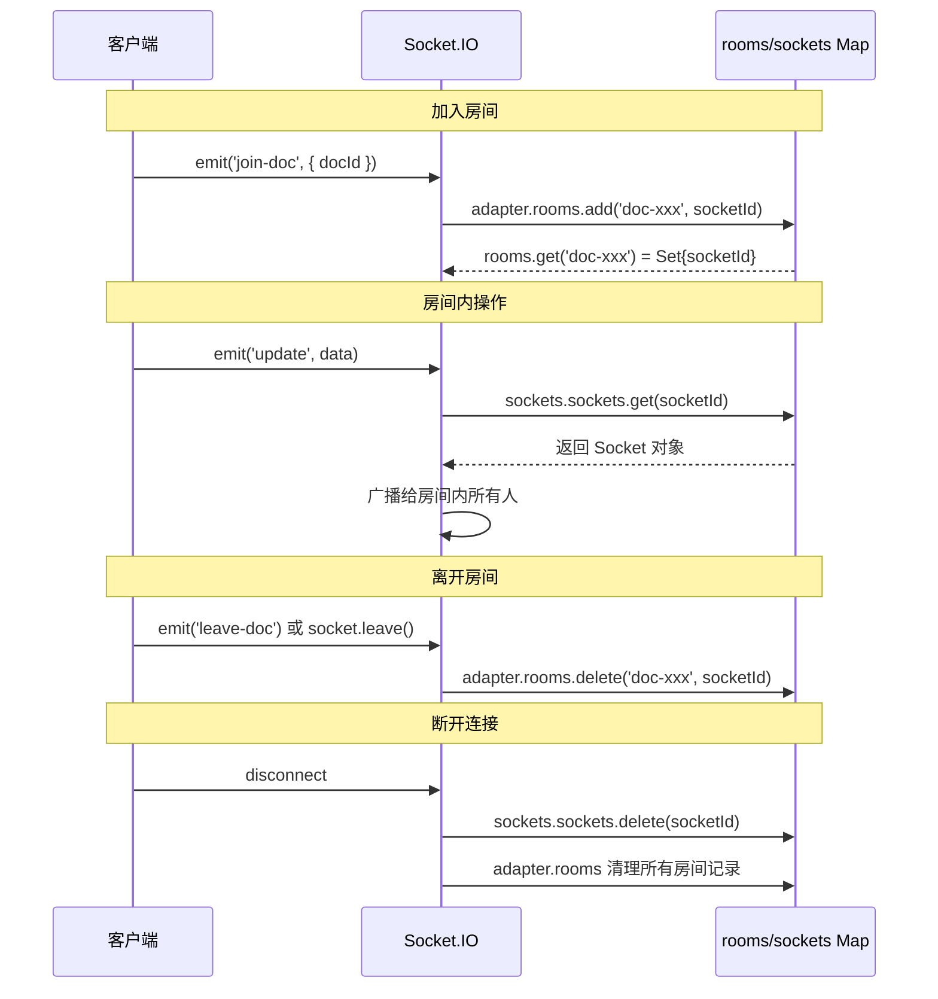

> 笔记 #3：Socket.IO 房间管理与权限回收。本笔记关联项目代码 `apps/server/src/modules/sync/sync.gateway.ts`（evictFromDocRoom 实现）、`apps/server/src/modules/documents/documents.service.ts`（删除时调用踢出）。

## 笔记 #3：Socket.IO 房间管理与权限回收

**日期**：2026-08-13
**触发场景**：修复文档删除后 WebSocket 房间权限回收问题时，深入理解 Socket.IO 的内部架构和房间管理机制。

---

### 一、Socket.IO 核心架构

```
Socket.IO Server (this.server)
  │
  ├── namespaces (命名空间)
  │   └── /sync (项目的文档同步命名空间)
  │       │
  │       ├── adapter (适配器)
  │       │   └── rooms: Map<string, Set<string>>
  │       │       └── Map<roomName, Set<socketId>>
  │       │           key: "doc-xxx"
  │       │           value: Set { "socket-aaa", "socket-bbb" }
  │       │
  │       └── sockets (活跃客户端)
  │           └── sockets: Map<string, Socket>
  │               └── Map<socketId, Socket>
  │                   key: "socket-aaa"
  │                   value: Socket 对象
  │
  └── 其他内置对象...
```

### 二、两个关键 Map 的区别

| Map | 结构 | 用途 | 清理时机 |
|-----|------|------|----------|
| `adapter.rooms` | `Map<roomName, Set<socketId>>` | 记录房间包含的 socket ID | socket 加入/离开房间时更新 |
| `sockets.sockets` | `Map<socketId, Socket>` | 记录当前活跃的 Socket 对象 | socket 断开连接时删除 |

**为什么要分两层？**
- 房间成员用 ID 存储（轻量），Socket 对象可能已断开
- 活跃 socket 用对象存储（重量级），只包含当前在线的客户端

### 三、房间操作的两种方式

#### 方式 1：底层 API（手动遍历）

```typescript
async evictFromDocRoom(docId: string): Promise<void> {
  if (!this.server) return;
  const roomName = `doc-${docId}`;
  
  // Step 1: 从 rooms Map 获取 socket ID 集合
  const room = this.server.sockets.adapter.rooms.get(roomName);
  if (!room || room.size === 0) return;
  
  // Step 2: 遍历每个 socket ID，从 sockets Map 获取活跃 Socket
  const socketIds = Array.from(room);
  for (const socketId of socketIds) {
    const socket = this.server.sockets.sockets.get(socketId);
    if (socket) {
      socket.leave(roomName);
    }
  }
}
```

**优点**：逻辑清晰，可扩展性强（可在遍历时加过滤条件）
**缺点**：代码较长

#### 方式 2：高级 API（fetchSockets）

```typescript
async evictFromDocRoom(docId: string): Promise<void> {
  if (!this.server) return;
  const roomName = `doc-${docId}`;
  
  // 一行获取房间内所有活跃 socket
  const sockets = await this.server.in(roomName).fetchSockets();
  
  for (const socket of sockets) {
    socket.leave(roomName);
  }
}
```

**`fetchSockets()` 内部实现**（简化）：
```typescript
async fetchSockets() {
  const ids = Array.from(this.adapter.rooms.get(this.roomName) ?? new Set());
  const result = [];
  for (const id of ids) {
    const socket = this.sockets.sockets.get(id);
    if (socket) result.push(socket);  // 自动过滤已断开的
  }
  return result;
}
```

**优点**：代码简洁
**缺点**：需要 `await`（异步 IO），不方便在不需要 Promise 的场景使用

### 四、Socket.IO 房间生命周期



### 五、权限回收的最佳实践

#### 当前实现（权限回收方案）

```typescript
// sync.gateway.ts — 踢出方法
evictFromDocRoom(docId: string): void {
  // 底层 API 实现
}

// documents.service.ts — 删除时调用
async softDeleteDocument(docId: string, userId: string): Promise<void> {
  const document = await this.getDocument(docId, userId);
  await this.applySoftDelete(document);
  this.storageUsageService.scheduleRecalculate(userId);
  // 主动踢出房间
  this.syncGateway.evictFromDocRoom(docId);
}
```

#### 调用时机

| 操作 | 调用位置 | 说明 |
|------|----------|------|
| 软删单个文档 | `softDeleteDocument` | 用户删除文档 |
| 批量删除文件夹 | `softDeleteDocumentsInFolder` | 清空文件夹 |
| 永久删除 | `hardDeleteDocument` | 回收站清理 |

### 六、性能考量

**遍历成本**：`evictFromDocRoom` 遍历房间内所有 socket，复杂度 O(n)。对于文档协作场景（通常 < 20 人/文档），耗时可忽略不计。

**异步 vs 同步**：当前实现用同步方式（无 `await`），`fetchSockets()` 需要异步。同步方式在不需要等待结果的场景下更简洁。

**大规模场景**：如果单个文档可能有上千并发用户，建议改用 Redis Adapter + 异步批量操作。

---

### 教训

1. **WebSocket 房间需要"加入"和"踢出"对称操作**：不能只加不减，否则会导致权限漏洞
2. **Socket.IO 的两层 Map 设计**：`rooms` 存 ID、`sockets` 存对象，是"轻量索引 + 重量级对象"的经典设计
3. **`fetchSockets()` 是底层逻辑的封装**：理解底层实现有助于在需要时进行优化
4. **权限回收应在业务操作时触发**：文档删除 → 踢出房间，形成"数据一致性 + 会话一致性"
5. **防御性检查成本为零但价值高**：`if (socket)` 这样的 null 检查，即使理论上不会触发，也是良好的编码习惯

---
