# 向量数据库学习笔记

**创建日期**：2026-08-28
**来源**：根据课程截图整理，结合 InkWeaver 项目实际应用场景编写。本文面向向量数据库（Vector-DB）的学习与实践，涵盖从向量基础到检索算法、架构设计的完整知识体系。
**阅读前提**：熟悉基本数据库概念，了解机器学习/深度学习基础。

> 配套阅读：[技术笔记](./技术笔记.md)（NestJS / React / 锁机制等项目级技术原理）。pgvector 实战与 InkWeaver 搜索架构演进内容已并入本文第 8 章与第 11 章。

---

## 目录

| 章 | 标题 | 核心内容 |
|----|------|---------|
| 1 | **基于数据流图（DAG）的计算框架** | Tensor 张量结构、Operator 算子、数据流图执行模型 |
| 2 | **什么是向量 What is Vector** | 向量定义、来源、应用；图像/文本/语音向量类型 |
| 3 | **什么是 Embedding** | 非结构化数据向量化、Embedding 原理、Word Embedding |
| 4 | **与传统数据库区别** | 传统数据库体系、搜索方式、Filtering（Pre/Post）、向量数据库通用架构 |
| 5 | **向量数据库原理与功能** | Vector-DB 定义、发展历程、核心功能、评价指标、瓶颈分析、选型指南 |
| 6 | **相似性搜索算法** | KNN、IVF、HNSW、LSH、PQ、IVF-PQ、Filtering、ANN 算法对比 |
| 7 | **相似性度量** | 浮点/二元 Embedding 度量、余弦/点积/欧氏对比、选择指南 |
| 8 | **pgvector 实战** | vector 类型、GIN 倒排、HNSW 调优、执行计划、tsvector、DISTINCT ON、事务与锁、迁移策略 |
| 9 | **混合搜索系统** | Bi-Encoder、Cross-Encoder、Hybrid Search、向量搜索本质 |
| 10 | **大模型与向量数据库** | 技术挑战、Vector-DB 价值、RAG vs Fine-Tuning、REALM 两大类型、业界选型对比 |
| 11 | **InkWeaver 搜索架构演进** | 四路混合检索、RRF vs 加权求和、KNN vs HNSW ANN、架构演进总结 |

---

## 第 1 章 基于数据流图（DAG）的计算框架

### 1.1 基本数据结构：Tensor 张量

Tensor（张量）是深度学习中最基本的数据结构，本质上是一个**多维数组**。

**Tensor 的关键属性**：

| 属性 | 说明 | 示例 |
|------|------|------|
| **形状（Shape）** | 每个维度上的大小 | `[2, 3, 4, 5]` 表示 4 维张量，各维度长度分别为 2、3、4、5 |
| **元素类型** | 张量中元素的数据类型 | `int`、`float`、`string` 等 |

**Tensor 形状示例**：

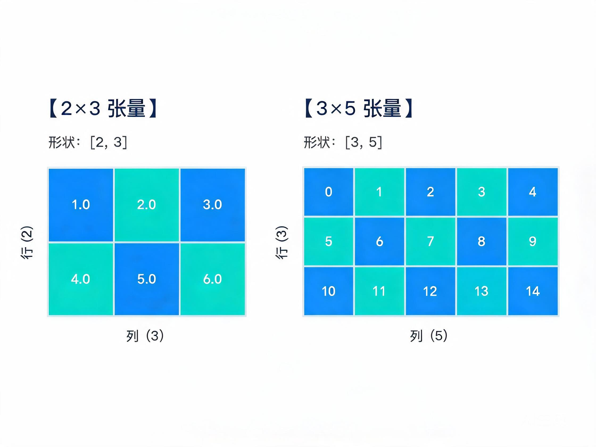

左侧为 `[2, 3]` 二维张量（2 行 3 列），右侧为 `[3, 5]` 二维张量（3 行 5 列），每个单元格存储一个数值元素。

> **与 InkWeaver 的关联**：在项目中，文档的 embedding 本质上就是一个 512 维的一维 Tensor（即一个长度为 512 的 float32 数组），存储在 PostgreSQL 的 `vector(512)` 列中。

### 1.2 基本运算单元：Operator 算子

Operator（算子）是 Tensor 运算的基本单元，由最基础的代数算子组成，可根据深度学习结构组成复杂算子。

**算子的输入输出模型**：`N 个输入 Tensor → M 个输出 Tensor`

**常见算子分类**：

| 类别 | 算子 | 说明 |
|------|------|------|
| **算术运算** | Add、Sub、Mul、Div | 逐元素加减乘除 |
| **矩阵运算** | MatMul、Conv | 矩阵乘法、卷积 |
| **归一化** | BatchNorm、LayerNorm | 批归一化、层归一化 |
| **激活函数** | Relu、Sigmoid、Log | 非线性变换 |
| **损失函数** | Loss | 计算预测误差 |
| **形状操作** | Reshape、Transpose、Concat | 改变张量形状 |
| **其他** | While、Merge、BroadCast、Reduce、Map | 控制流、合并、广播、归约、映射 |

### 1.3 数据流图（DAG）执行模型

数据流图（Data Flow Graph）是有向无环图（DAG），描述了数据在算子之间的流动路径：

- **节点（Node）**：表示 Operator 算子
- **边（Edge）**：表示 Tensor 数据的流向
- **执行顺序**：依据拓扑排序，上游节点完成后触发下游节点执行

**典型执行流程**：
1. 输入数据从源节点流入
2. 各算子按依赖关系依次执行
3. 中间结果沿边传递
4. 最终输出从汇节点流出

> **实际应用**：在向量检索系统中，Embedding 模型的推理过程就是一次典型的数据流图执行——文本/图像输入 → 预处理 → 多层神经网络算子 → 输出向量。

---

## 第 2 章 什么是向量 What is Vector

### 2.1 向量的定义

**向量（Vector）是多维数学空间中的一个坐标点**。

在深度学习和向量检索语境下，向量具有三层核心含义：

| 问题 | 回答 |
|------|------|
| **向量是什么？** | 多维数学空间中的一个坐标点，每个维度对应一个特征维度 |
| **向量从哪来？** | 来源于对现实世界数据的数字化抽象——通过 Embedding 模型将原始数据映射到高维空间 |
| **向量怎么用？** | 用来搜索真实世界中不同模态的数据——通过空间距离衡量相似度 |

### 2.2 向量的数学表示

一个 n 维向量可以表示为：

```
v = (v₁, v₂, v₃, ..., vₙ)
```

其中每个 `vᵢ` 是一个实数，代表在第 i 个维度上的特征值。

**实际示例**（文本 Embedding 的简化表示）：

| 单词 | d1 | d2 | d3 | d4 | d5 | d6 | d7 |
|------|----|----|----|----|----|----|-----|
| dog | 0.6 | 0.9 | 0.1 | 0.4 | -0.7 | -0.3 | -0.2 |
| puppy | 0.5 | 0.8 | -0.1 | 0.2 | -0.6 | -0.5 | -0.1 |
| cat | 0.7 | -0.1 | 0.4 | 0.3 | -0.4 | -0.1 | -0.3 |
| houses | -0.8 | -0.4 | -0.5 | 0.1 | -0.9 | 0.3 | 0.8 |

通过降维（如 t-SNE、PCA），可以将高维向量投影到 2D/3D 空间进行可视化，观察语义相近性：

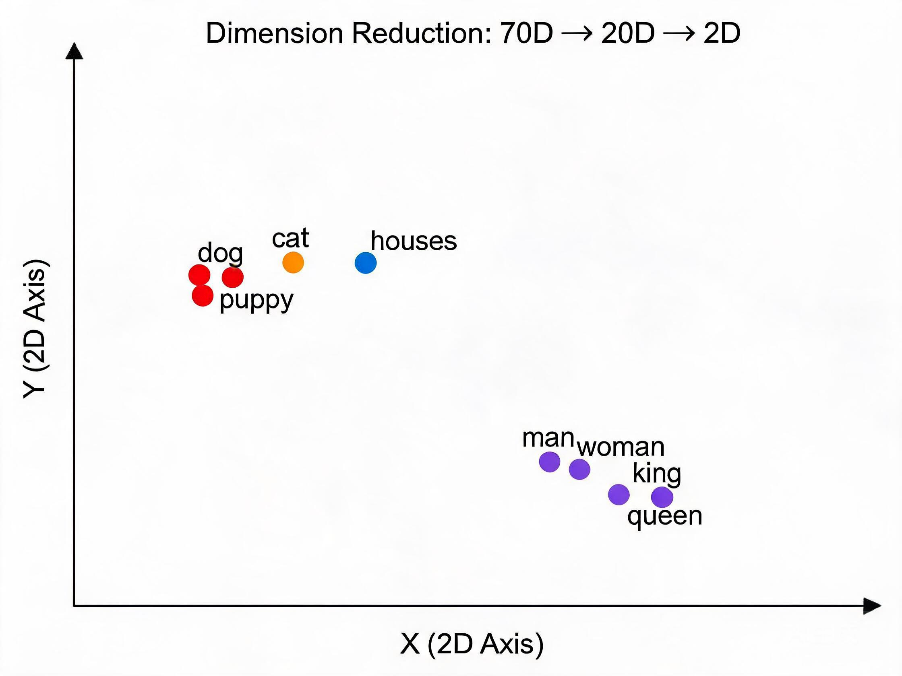

上图展示了向量从 70 维降到 20 维再降到 2D 的过程。可以看到：`dog`、`puppy`、`cat` 在空间中聚在一起（红色区域），`man`、`woman`、`king`、`queen` 聚在一起（紫色区域），而 `houses` 则远离其他词。**语义越相近，在向量空间中的距离越近**。

### 2.3 向量的三大类型

根据数据源的不同，向量可分为三种核心类型：

| 向量类型 | 来源 | 提取方式 | 应用场景 |
|----------|------|----------|----------|
| **图像向量** | 图像数据 | 通过神经网络模型提取图像特征向量（Feature Map），提取输入图像的高维信息，如颜色、形状、纹理等 | 图像识别、图像检索、以图搜图 |
| **文本向量** | 文本数据 | 通过词嵌入（Word Embedding）技术（如 Word2Vec、BERT 等）生成文本特征向量，包含文本语义高维信息 | 文本分类、情感分析、语义搜索、文档检索 |
| **语音向量** | 音频数据 | 通过声学模型（Acoustic Model）从音频信号中提取的频谱特征向量，提取声音的高维特性，如音调、节奏、音色等 | 语音识别、声纹识别、语音检索 |

### 2.4 向量的核心特性

理解向量需要掌握三个核心特性：

1. **高维性**：实际应用中向量维度通常在 128 到 1536 之间（InkWeaver 使用 512 维）
2. **稠密性**：向量的每个维度都有数值，不是稀疏的（与传统特征向量不同）
3. **语义保持性**：语义相近的数据在向量空间中的距离更近，这是向量检索的数学基础

---

## 第 3 章 什么是 Embedding

### 3.1 Embedding 介绍

**Embedding 是将非结构化数据转换成向量的过程**。

核心思想：通过深度学习的训练，将真实世界的离散数据投影到高维数据空间上，通过数据在空间中的距离体现真实世界的相似度。

```
原始数据 ──→ Embedding 模型 ──→ 向量表示
(非结构化)    (深度神经网络)    (高维稠密向量)
```

### 3.2 Embedding 作用

Embedding 在 AI 系统中的核心作用包括：

| 作用 | 说明 |
|------|------|
| **特征提取** | 将原始数据（文本、图像、音频等）转化为机器学习模型可处理的数值向量 |
| **降维表示** | 将高维原始特征压缩到较低维度的稠密向量，同时保留语义信息 |
| **相似度度量** | 通过向量空间中的距离/角度衡量数据间的语义相似度 |
| **跨模态对齐** | 将不同模态的数据（如图文）映射到同一向量空间，实现跨模态检索 |

### 3.3 Vector Embedding vs Word Embedding

Embedding 技术在 NLP 领域有两个重要分支：

#### Vector Embedding（向量嵌入）

将非数值词语/符号等非结构化数据，编码成数值向量。

```
输入：任意非结构化数据（文本、图像、音频等）
输出：一个固定维度的稠密向量 v ∈ Rⁿ
```

#### Word Embedding（词嵌入）

通过神经网络来学习，文本中词语作为神经网络输入，输出对应词向量（Word Vector）。词向量是一个数值向量，每个数值代表词语的某个特征。

```
输入：文本序列中的词语
输出：词向量（每个词对应一个稠密向量）

示例：
"man"    → [0.6, -0.2, 0.8, 0.9, -0.1, -0.9, -0.7]
"woman"  → [0.7, 0.3, 0.9, -0.7, 0.1, -0.5, -0.4]
"king"   → [0.5, -0.4, 0.7, 0.8, 0.9, -0.7, -0.6]
"queen"  → [0.8, -0.1, 0.8, -0.9, 0.8, -0.5, -0.9]
```

**Word Embedding 的关键特性**：
- 词向量之间的几何关系蕴含语义关系（如 `king - man + woman ≈ queen`）
- 语义相近的词在向量空间中距离更近
- 可通过降维可视化观察语义聚类

### 3.4 Embedding 模型演进

| 阶段 | 代表模型 | 特点 |
|------|----------|------|
| **静态词向量** | Word2Vec、GloVe、FastText | 一词一向量，不考虑上下文 |
| **上下文化向量** | ELMo、BERT、GPT | 同一词在不同语境下有不同向量 |
| **通用 Embedding** | Sentence-BERT、CLIP、text-embedding-* | 专为检索设计，支持句子/文档级 Embedding |

> **InkWeaver 的选择**：使用 `bge-small-zh-v1.5` 模型，输出 512 维向量，用于文档块（chunk）的语义检索。该模型属于"通用 Embedding"阶段，针对检索场景优化。

### 3.5 Embedding 过程示意

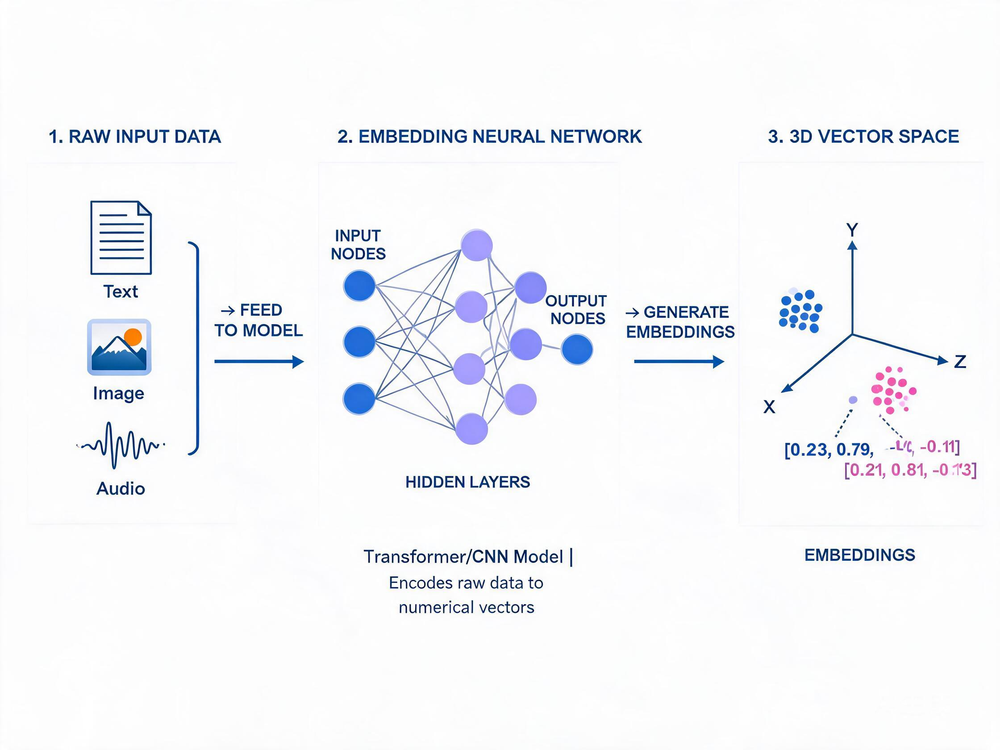

Embedding 过程分为三个阶段：

1. **原始输入数据**（Raw Input Data）：文本、图像、音频等非结构化数据
2. **Embedding 神经网络**（Embedding Neural Network）：Transformer/CNN 模型，将原始数据编码为数值向量
3. **3D 向量空间**（3D Vector Space）：输出的高维向量在语义空间中形成聚类，相似数据聚集在一起

---

## 第 4 章 与传统数据库区别

### 4.1 传统数据库体系

传统数据库主要分为三大类：

| 类型 | 代表 | 特点 |
|------|------|------|
| **关系型数据库** | PostgreSQL、MySQL、Oracle | 结构化存储、ACID 事务、SQL 查询 |
| **非关系型 NoSQL 数据库** | MongoDB、Redis、Cassandra | 灵活 Schema、高性能、分布式 |
| **分析型数据库** | ClickHouse、Redshift、Snowflake | 大规模数据分析、列式存储 |

### 4.2 传统搜索方式

传统数据库的搜索基于以下技术栈：

```
索引结构（B-Tree、倒排索引等）+ 排序算法（BM25、TF-IDF）
```

| 技术 | 说明 | 适用场景 |
|------|------|----------|
| **B-Tree 索引** | 有序树结构，加速等值查询和范围查询 | 精确匹配、范围查询 |
| **倒排索引** | 词 → 文档 ID 列表的映射结构 | 全文关键词检索 |
| **BM25** | 基于词频和文档长度的概率排序算法 | 关键词相关性排序 |
| **TF-IDF** | 词频-逆文档频率，衡量词的重要性 | 关键词权重排序 |

### 4.3 本质差异

| 维度 | 传统数据库搜索 | 向量数据库搜索 |
|------|---------------|---------------|
| **搜索本质** | 基于文本的**精确匹配**，SQL 语言进行精确匹配与查找 | 基于向量空间的**语义相似度匹配** |
| **查询方式** | SQL、关键词查询 | 向量距离计算、KNN 查询 |
| **匹配逻辑** | 关键字必须完全或部分匹配 | 语义相近即可匹配，支持模糊意图 |
| **索引结构** | B-Tree、倒排索引 | HNSW、IVF、PQ 等向量索引 |
| **输出方式** | 输出符合查询条件的数据 | 返回最近邻数据，按相似度排序 |
| **计算复杂度** | 相对稳定 | 维度高时计算量大，需 ANN 加速 |

### 4.4 适用场景对比

| 场景 | 传统数据库 | 向量数据库 |
|------|-----------|-----------|
| **关键字搜索** | ✅ 功能较优，如 "订单号=12345" | ❌ 不擅长精确 ID 匹配 |
| **语义搜索** | ❌ 功能较差，如 "帮我找关于气候变化的文章" | ✅ 核心能力，理解语义意图 |
| **结构化查询** | ✅ SQL 灵活强大 | ❌ 需混合架构 |
| **跨模态检索** | ❌ 无法处理 | ✅ 天然支持（图文同空间） |
| **推荐系统** | ❌ 难以实现基于内容的推荐 | ✅ Embedding 相似度即推荐依据 |

> **InkWeaver 的混合架构**：项目采用 PostgreSQL + pgvector 的混合方案，将传统数据库的结构化查询能力（文件夹、标签、权限）与向量数据库的语义检索能力结合，实现了四路混合检索（精确匹配 + 模糊全文 + 相关召回 + 语义向量）。

### 4.5 差异 1：检索方式不同

| 维度 | 传统数据库 | 向量数据库 |
|------|-----------|-----------|
| **检索方式** | 归结为**点查和范围查**（精确查找） | 针对向量的**近似查找** |
| **查询结果** | 符合条件 / 不符合条件（二元判断） | 与输入条件相似的 **TOP-K 向量**（排序返回） |
| **核心逻辑** | 精确匹配，命中或未命中 | 基于距离/相似度排序，返回最相近的 K 个结果 |

> **关键区别**：传统数据库回答"有没有"，向量数据库回答"哪些最像"。

### 4.6 差异 2：查询方式不同

| 维度 | 传统数据库 | 向量数据库 |
|------|-----------|-----------|
| **查询方式** | 直接处理数据，使用 **SQL 语言**对文本精确匹配与查找 | 将非结构化数据转化为**向量**，再基于向量数据库进行存储、计算和建立索引 |
| **查询流程** | SQL → 解析 → 索引查找 → 返回结果 | 输入 → Embedding → 向量存储 → ANN 索引检索 → 返回 TOP-K |
| **数据形态** | 直接处理原始数据（文本、数字） | 需要先将数据向量化，再在向量空间中运算 |

> **核心差异**：传统数据库是"数据 → 查询"的直接路径，向量数据库是"数据 → 向量化 → 向量空间 → 查询"的间接但更强大的路径。

### 4.7 过滤（Filtering）

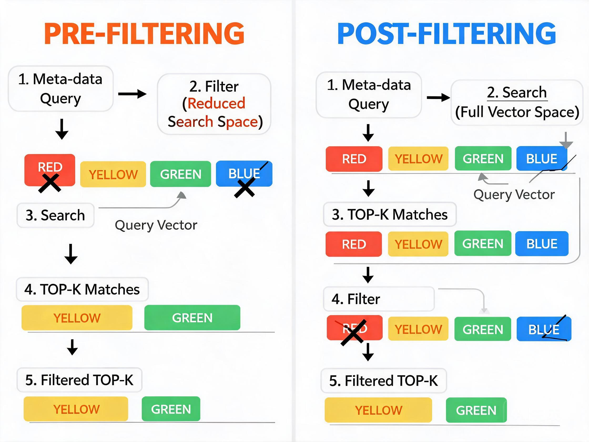

#### 为什么需要过滤

| 项目 | 说明 |
|------|------|
| **实际场景** | 不是完整 Vector-DB 相似性搜索，而是通过部分业务字段进行过滤 Filtering 再查询 |
| **元数据** | 存储在 Vector-DB 的向量还需包含元数据 Meta Data（如 User ID、Doc ID 等） |
| **优点** | 搜索时，根据元数据过滤搜索结果，减少向量检索范围 |

#### 索引结构

进行相似性搜索前或后执行元数据过滤，Vector-DB 一般维护两个索引：

| 索引 | 说明 |
|------|------|
| **向量索引** | Vector Indexing，用于向量相似度检索 |
| **元数据索引** | Meta Indexing，用于结构化条件过滤 |

> 缺点：会导致 Vector-DB 查询过程变慢。

#### 两种过滤方式对比

| 方式 | 流程 | 优点 | 缺点 |
|------|------|------|------|
| **Pre-Filtering** | Meta-data Query → Filter → Search → TOP-K → Filtered TOP-K | 减少搜索空间，速度更快 | 可能遗漏与 Meta-data 筛选标准不匹配的相关结果 |
| **Post-Filtering** | Meta-data Query → Search → TOP-K → Filter → Filtered TOP-K | 确保所有相关结果都被考虑，搜索更完整 | 需要对全空间搜索，计算量更大 |

> Pre-filtering：向量搜索前进行 Meta-data 过滤，可以减少搜索空间，但也可能导致系统忽略与 Meta-data 筛选标准不匹配的相关结果。Post-filtering：向量搜索完后进行 Meta-data 过滤，可以确保考虑所有相关结果，搜索完成后将不相关结果进行筛选。

### 4.8 向量数据库通用架构

向量检索系统架构核心：**向量数据存储 + 搜索服务**，同时附带标量数据存储和检索。

#### 架构分层

| 层级 | 组件 | 说明 |
|------|------|------|
| **接入层** | 客户端/执行引擎（Python/JS/GO、REST/RPC） | 接入负责客户界面和封装分布式逻辑 |
| **索引层** | 向量索引（HNSW/NSW/IVF/PQ）、过滤索引、度量索引 | 利用向量索引进行查询，全内存执行无法命中则生成 I/O |
| **存储引擎** | 行存、列存、流式存储 | 通过输入查找近邻向量，读取 vector 请求转换为底层存储读请求 |
| **存储层** | 对象存储、文件、块存储 | 并发随机读请求、并发随机写请求 |

#### 计算层功能

| 模块 | 子功能 | 说明 |
|------|--------|------|
| **文档预处理** | 切词、分词、结构分析、摘要提取 | 将原始文档进行预处理 |
| **Embedding** | NLP、CV、Audio | 将多模态数据转换为向量 |
| **索引构建** | Vector Index、Filter Index、Scale Index | 构建向量索引和过滤索引 |
| **结果排序** | W、P、F → Sort | 对召回结果进行加权排序 |

#### 存储要求

| 维度 | 要求 |
|------|------|
| **数据量** | 单库 100GB~TB 级别 |
| **QPS** | 100K QPS |
| **读 I/O** | 高并发随机 I/O，低延时访问 |
| **写 I/O** | 库乱批量写入，实时访问 |
| **一致性** | 最终结果一致性 |
| **原子性** | 单独原子因子 |

#### 其他功能需求

| 功能 | 说明 |
|------|------|
| **核心功能** | 能够对包含数百万 > 十亿 > 万亿的向量数据进行相似度搜索 |
| **数据分片** | 横向扩展分片（Data Sharding） |
| **数据持久化** | 支持数据持久化存储 |
| **流式数据输入** | Stream Data 流数据处理 |
| **混合搜索** | 向量和标量混合搜索 |
| **分布式存储** | Parallel Storage 并行存储 |

#### 通用架构设计原则

| 原则 | 说明 |
|------|------|
| **MPP 架构** | Massive Parallel Process 计算，Share Nothing 非共享或共享架构 |
| **多副本** | 分发写多副本，支持并行 |
| **单节点优化** | SIMD 指令加速、列式存储加载、多级缓存与索引数据 |

---

## 第 5 章 向量数据库原理与功能

### 5.1 向量存储需要新的数据库

随移动互联网发展，非结构化数据越来越常见。为让计算机理解和处理非结构化数据，**Embedding** 将各式数据转换为 **Vector** 数据，通过数据库存储和索引 Vector 数据，分析 Vector 间相关性。

**数据库演进路线**：

| 数据库类型 | 存储模型 | 典型代表 | 核心优势 |
|-----------|---------|---------|---------|
| **Key-Value** | 键值对存储 | Redis、DynamoDB | 高速读写、简单查询 |
| **Document** | 文档存储 | MongoDB、CouchDB | 灵活 Schema、嵌套结构 |
| **Graph** | 图结构存储 | Neo4j、OrientDB | 关系查询、路径分析 |
| **Vector** | 向量空间存储 | pgvector、Milvus、Qdrant | 语义相似度、ANN 检索 |

> Vector 数据库是专门为处理高维向量数据设计的新型数据库，填补了传统数据库在语义检索领域的空白。

### 5.2 Vector DB 的出现

用户输入查询（NLP、Image、Audio）被转换成 **Vector**，与源数据本身位于相同 Embedding 空间中，Vector 通过向量数据进行语义近似搜索，返回与输入查询最相似 TOP-K 个结果。

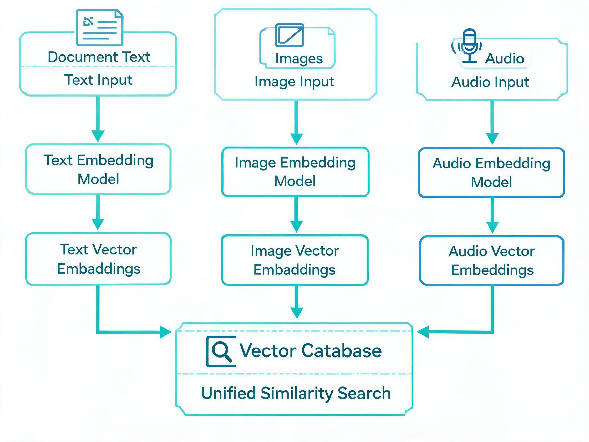

上图展示了三种模态的统一检索流程：

1. **Document Text** → Text Embedding Model → Text Vector Embeddings
2. **Images** → Images Embedding Model → Images Vector Embeddings
3. **Audio** → Audio Embedding Model → Audio Vector Embeddings

所有模态的向量最终汇入 **Vector Database** 进行统一的相似度搜索。

### 5.3 Vector DB 定义

> **向量数据库为向量数据提供专用的存储和索引机制。**

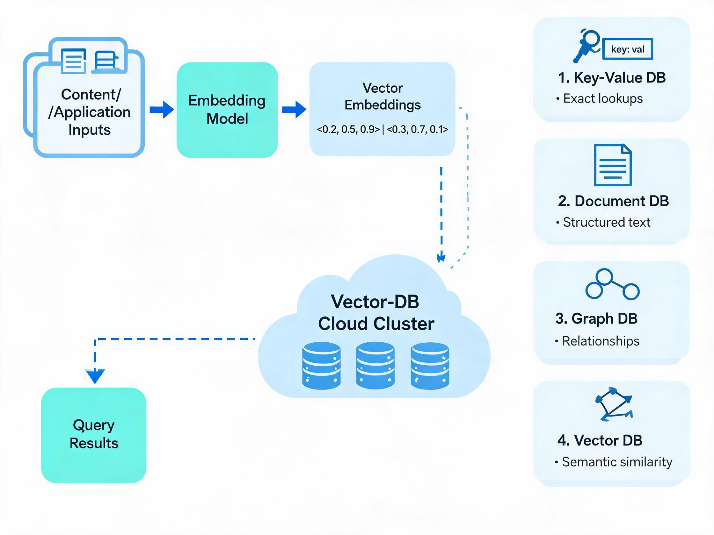

**核心要点**：

- 向量数据被存储为高维空间中点，DB 为点建立索引（KD-Tree、BB-Tree、HNSW 等）
- 索引结构使得 Vector DB 高效地进行向量相似度查询，从而提升处理向量数据效率

**架构流程**：

```
Content / Application (查询输入)
        │
        ▼
  Embedding Model (向量化)
        │
        ▼
  Vector Embedding (向量表示)
        │
        ▼
  Vector-DB (存储 + 索引 + 检索)
        │
        ▼
  Query Result (返回 TOP-K 相似结果)
```

### 5.4 Vector DB 发展历程

#### 第一阶段（初级阶段）

主要是以文件形式存储向量数据，缺乏有效索引和查询能力。

| 时间 | 代表产品 | 特点 |
|------|---------|------|
| 2001 | **Apache Lucene** | 文件级存储，基础倒排索引 |

#### 第二阶段（发展阶段）

使用 KD 树等索引结构，可实现一定查询性能，但在高维空间的查询效率还不高。

| 时间 | 代表产品 | 特点 |
|------|---------|------|
| 2005 | **FAISS** (Facebook AI) | 高性能向量检索库，支持多种索引 |
| 2017 | **Annoy** (Spotify) | 基于树的近似最近邻库 |
| - | **Hnswlib** | HNSW 算法实现 |

#### 第三阶段（成熟阶段）

通过复杂 Index 算法实现高效向量索引和查询，处理高维向量数据。

| 时间 | 代表产品 | 特点 |
|------|---------|------|
| 2020 | **Milvus** | 云原生向量数据库，大规模生产级 |
| 2020 | **Elasticsearch** | 支持 dense_vector 字段 |
| 2024 | **Qdrant** | Rust 实现，高性能 |
| 2024 | **Pinecone** | 全托管向量服务 |
| 2024 | **Weaviate** | 内置 ML 模型，开箱即用 |
| 2024 | **Chroma** | 轻量级，原型友好 |
| 2024 | **LanceDB** | 无服务器列式向量数据库 |

### 5.5 核心功能

| 功能 | 说明 |
|------|------|
| **向量存储** | 存储高维稠密向量，支持 128-1536 维 |
| **向量索引** | HNSW、IVF、PQ 等 ANN 索引加速检索 |
| **相似度搜索** | KNN / ANN 查询，支持多种距离度量 |
| **混合查询** | 结构化过滤 + 向量相似度检索 |
| **实时索引** | 支持向量的增删改和索引动态更新 |
| **多模态支持** | 文本、图像、音频等多种 Embedding |

### 5.6 应用场景

| 场景 | 说明 | 典型案例 |
|------|------|---------|
| **语义搜索** | 基于意义而非关键词的搜索 | InkWeaver 文档语义检索 |
| **推荐系统** | 基于内容相似度的推荐 | 电商商品推荐、视频推荐 |
| **RAG** | 检索增强生成，LLM + 检索 | AI 问答、知识助手 |
| **图像/音频检索** | 跨模态相似度搜索 | 以图搜图、音乐识别 |
| **去重与聚类** | 向量相似度检测重复数据 | 文档去重、用户分群 |
| **异常检测** | 基于向量分布发现异常 | 欺诈检测、日志分析 |

### 5.7 Vector DB 存储向量类型

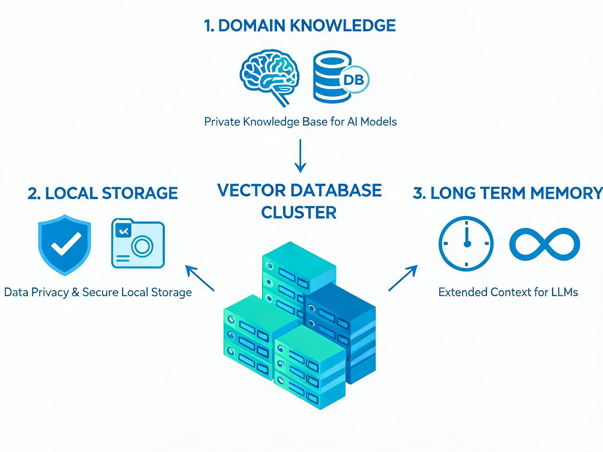

向量数据库在大模型时代承担三大核心角色：

| 类型 | 说明 | 核心价值 |
|------|------|---------|
| **私域知识（Domain Knowledge）** | 将向量数据库作为大模型的外部知识库，不需要训练模型 | 比大模型微调成本更低、速度更快，通过更新数据即可保证知识实时更新 |
| **本地存储（Local Storage）** | 将向量数据存储在本地 | 通过向量的相似关系保证隐私信息不会提供给大模型训练 |
| **长期记忆（Long Time Memory）** | 作为外部数据库存储超大文本、对话内容等 | 相比大模型有限的短期记忆（如 ChatGPT 上下文限制），提供理论上无限的长期记忆 |

> **与 InkWeaver 的关联**：项目中 `document_chunks` 表的 `embedding` 列存储了文档块的向量，作为语义检索的"私域知识库"——用户的私人文档不需要送入 LLM 训练，仅通过向量相似度检索即可获取相关内容。

### 5.8 Vector DB 解决的问题

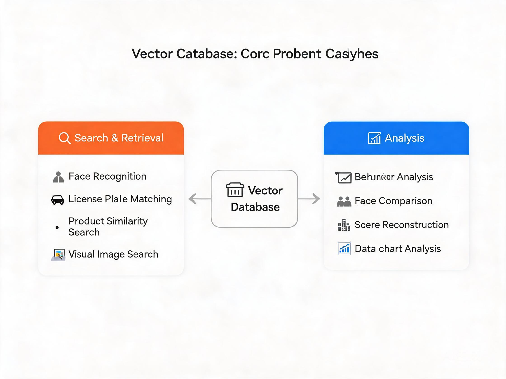

向量数据库主要解决两大类问题：

**1. 检索（Search & Retrieval）**

以图搜图场景：

| 场景 | 说明 |
|------|------|
| 人脸检索 | 基于人脸特征向量的身份识别 |
| 人脸支付 | 实时人脸比对完成支付验证 |
| 车牌号检索 | 车牌字符的向量匹配 |
| 相似商品检索 | 基于商品图片/描述的相似度搜索 |

**2. 分析（Analysis）**

以图分析行为：

| 场景 | 说明 |
|------|------|
| 人脸撞库 | 批量人脸数据比对排查 |
| 人脸对比 | 两张人脸的相似度分析 |
| 场景再现 | 基于图像分析重建场景信息 |
| 行为分析 | 从图像/视频中分析行为模式 |

### 5.9 Vector DB 的作用

#### 作用 I：相似性搜索

允许根据向量距离或相似性对向量数据进行快速准确的搜索和检索。这意味着可以使用 Vector DB 根据语义或上下文含义查找最相似或相关的数据，而非精确匹配或预定义标准查询。

#### 作用 II：提升性能

针对大量向量数据存储和检索操作进行优化，每次查询通常处理数亿个向量，比传统数据库处理速度快得多。

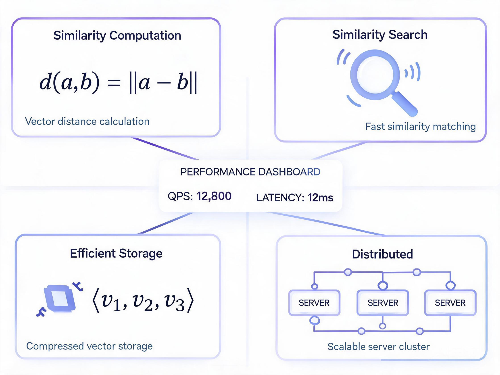

四大核心技术：

| 技术 | 说明 |
|------|------|
| **相似度计算** | 使用相似度度量算法（如 L2 距离、余弦相似度）过滤和定位相似向量 |
| **相似性搜索** | 提供 Vector 检索算法（如 HNSW、IVF），使向量检索速度显著加快并更精确 |
| **高效存储** | 以更紧凑方式存储向量，如压缩和量化，尽可能在内存中查询数据 |
| **分布式** | 跨多台机器对向量数据进行分片和分片检索，实现水平扩展 |

### 5.10 常用评价标准

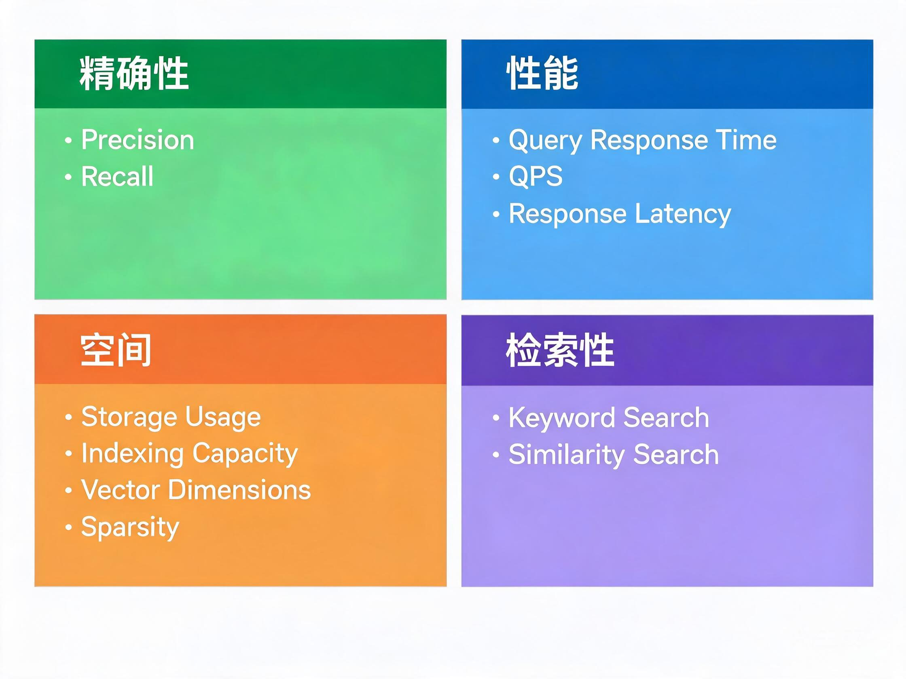

#### 四大评价指标体系

| 指标分类 | 指标名称 | 描述 |
|----------|----------|------|
| **精确性** | 精确率（Precision） | `TP / (TP + FP)`，表示预测为正的样本中有多少是真正的正样本 |
| | 召回率（Recall） | `TP / (TP + FN)`，表示覆盖度的度量，度量所有正例中被分为正例的比例 |
| **性能** | 查询响应时间 | 从发送请求到接收完整数据的时间 |
| | 每秒平均吞吐 QPS | 每秒查询数，一台服务器每秒能够响应的查询次数 |
| | 平均响应延迟 | 响应时间，从接收请求开始到返回响应之间的时间跨度 |
| **空间** | 存储占用 | 数据库实际占用的物理空间大小 |
| | 检索容量 | 独立查看表所占容量 |
| | 向量维度 | 向量所具有的坐标数或数量 |
| | 稀疏与稠密 | 使用数据结构向量的内存模型（稀疏通常指向零，AMP 数据结构指向向量建模，存储向量大多数元零） |
| **检索性** | 关键字搜索 | 在给定的时间范围内搜索某个关键字并返回内容 |
| | 相似度搜索 | 向量相似度索引从结构化或非结构化的大量集合中查找与给定上下文相似的信息 |

#### 精确性指标详解

| 指标 | 公式 | 说明 |
|------|------|------|
| **精确率 Precision** | `TP / (TP + FP)` | 衡量检索结果的准确性——返回结果中有多少是真正相关的 |
| **召回率 Recall** | `TP / (TP + FN)` | 衡量检索的完整性——所有相关结果中有多少被检索到 |
| **F1-Score** | `2 × P × R / (P + R)` | 精确率和召回率的调和平均，综合评价指标 |

#### 性能指标详解

| 指标 | 说明 | 单位 |
|------|------|------|
| **QPS** | Queries Per Second，每秒处理的查询数 | 次/秒 |
| **Latency** | 查询响应时间，从请求发起到结果返回 | ms |
| **吞吐量** | 单位时间内处理的总数据量 | MB/s |

#### 关键瓶颈分析

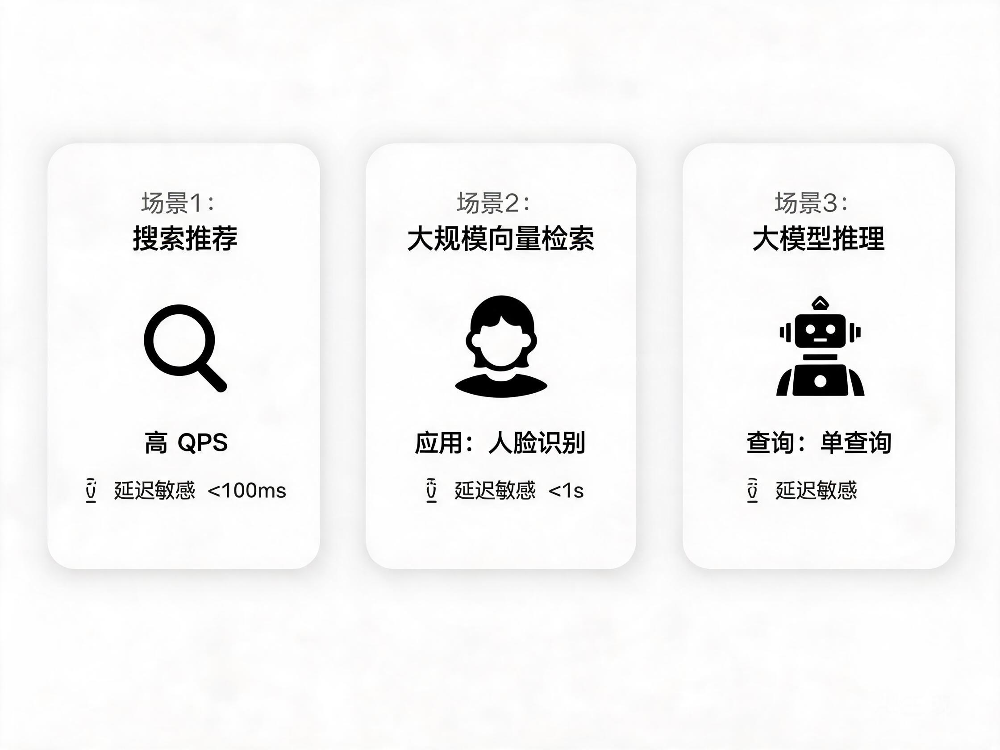

| 场景 | 特点 | 延迟要求 |
|------|------|---------|
| **搜索推荐** | 大量用户并发查询（高 QPS），对查询延时非常敏感 | <100ms |
| **大规模向量检索** | 人脸识别、指纹库等，海量向量持久化存储 | <1s |
| **大模型推理** | 单次查询较多，查询时延敏感；单个任务 QPS 相对较低 | 单查询 |

> **权衡关系**：精确率和召回率往往呈反比——提高 TOP-K 数量可提升召回率但降低精确率。QPS 和 Latency 也存在 trade-off——更大的索引可提升精确率但增加延迟。

### 5.11 Vector DB 功能与特点

| 功能 | 描述 |
|------|------|
| **Vector Embedding 向量嵌入** | 数学上，vector embedding 是一个浮点数或二进制数的数组。通过对非结构化数据转换为具体的 vector（对非结构化数据的特征抽象）。Vector DB 提供数据写入/检索自动向量化，对齐传统数据库的使用体验，用户无需关注向量生成过程 |
| **Similar Search 相似性搜索** | 使用 Index 算法和特殊数据结构对 Embedding 进行相似性搜索。用户可以快速找到与给定查询最接近的 vector，适合对图像或文本的相似性搜索任务。向量相似度搜索是将输入 Vector 与数据库进行比较，以找到与查询向量最相似的向量过程 |
| **High Performance 提升性能** | Vector DB 单索引支持 > 亿级向量数据规模，可支持百万级 QPS 及毫秒级查询延迟。对高维向量的高效存储，能够在最小存储空间下处理更大数据量 |
| **可扩展** | 具备良好的可扩展性，能够轻松处理大规模数据集，支持 Vector 数据进行分片，良好支持广泛依赖嵌入的大语言模型和其他 AI 应用 |
| **灵活性** | 能够处理不同数据（非机构化数据）类型，这些信息不遵循预定定义的模型或组织方式，包括文本、图像、音频和视频 |

### 5.12 Vector DB 管理挑战

向量数据库在实际落地中面临五大挑战：

| 挑战 | 说明 |
|------|------|
| **有效存储** | 向量数据多为浮点数或二进制数据，数据压缩率低，存储成本高 |
| **高效存储** | 向量数据库计算复杂度高，需要集群和分布式计算能力支撑 |
| **索引复杂** | 有 tree、graph、hash 等多种向量索引方式，索引管理和使用成本高 |
| **扩展性** | 向量数据库的增长对系统的扩展性要求越来越高 |
| **低延迟** | 查询需以 ms 级别响应业务需求，对索引和网络优化提出高要求 |

> **应对策略**：采用分层索引（热数据内存、冷数据磁盘）、量化压缩（PQ/OPQ）降低存储、读写分离分担压力、HNSW 等高效索引算法控制延迟。

### 5.13 如何选择向量数据库

#### 核心决策维度

| 维度 | 关注点 | 相关指标 |
|------|--------|----------|
| **性能** | 插入速度 vs 查询速度哪个更重要？ | QPS、Latency |
| **业务延迟** | 应用是否满足业务查询时延？ | 响应时间、SLA |
| **权衡取舍** | 如何在召回率和延迟间取舍？ | Precision vs Recall vs Latency |

#### 主流向量数据库对比

| 数据库 | 类型 | 核心索引 | 特点 |
|--------|------|---------|------|
| **Pinecone** | 全托管 | 组合索引 | 商业成熟、易用 |
| **Milvus / Zilliz** | 开源+商业 | Flat, Annoy, IVF, HNSW/RHNSW, DiskANN | 功能全面 |
| **Weaviate** | 开源 | Customized HNSW, HNSW (PQ), DiskANN | 混合搜索强 |
| **Qdrant** | 开源 | Customized HNSW | Rust 高性能 |
| **Chroma** | 开源 | HNSW | 轻量级、原型开发 |
| **LanceDB** | 开源 | IVF (PQ), DiskANN | 基于 Lance 格式 |
| **Vespa** | 开源 | HNSW + BM25 混合 | 企业级检索 |
| **Vald** | 开源 | NGT | 专为向量设计 |
| **elasticsearch** | 传统扩展 | Flat (brute force), HNSW | 生态成熟 |
| **redis** | 缓存扩展 | Flat (brute force), HNSW | 低延迟缓存 |
| **pgvector** | PostgreSQL 扩展 | IVF (Flat), IVF (PQ) in progress | 关系型+向量一体化 |

#### pgvector 的优势

> **InkWeaver 选择 pgvector 的核心理由**：项目基于 PostgreSQL 构建，pgvector 作为原生扩展可无缝集成，无需引入额外的向量数据库基础设施。同时享受 PostgreSQL 的 ACID 事务、备份恢复、权限管理等企业级能力。

| 优势 | 说明 |
|------|------|
| **零额外运维** | 无需部署和维护独立的向量数据库实例 |
| **事务一致性** | 向量操作与业务数据在同一事务中保证一致性 |
| **混合查询** | 自然支持结构化过滤（WHERE 子句）+ 向量检索 |
| **成本低** | 利用现有 PostgreSQL 基础设施，TCO 最低 |

---

## 第 6 章 相似性搜索算法

### 6.1 相似性度量到相似性搜索

#### 向量与相似性的关系

向量可以高维空间表示，和相似性搜索有什么关系？

> **举例**：银河和布偶都是猫咪特征接近。将特征用向量来表示（Embedding），Vector 具有大小和方向的数学结构，通过计算 Vector 间距离来判断其相似度，即**相似性度量（Similarity Metric）**。

#### 相似性搜索的挑战

可以通过比较 Vector 间距离来判断相似度，如何应用到更大的场景？

> **举例**：海量向量 A 中找到与某向量 a 最相似的向量，需要对 Vector-DB 中每个向量进行计算。逐向量对比计算量巨大，所以需要一种高效算法，即**相似性搜索（Similarity Search）**。

### 6.2 Vector-DB 与相似性搜索

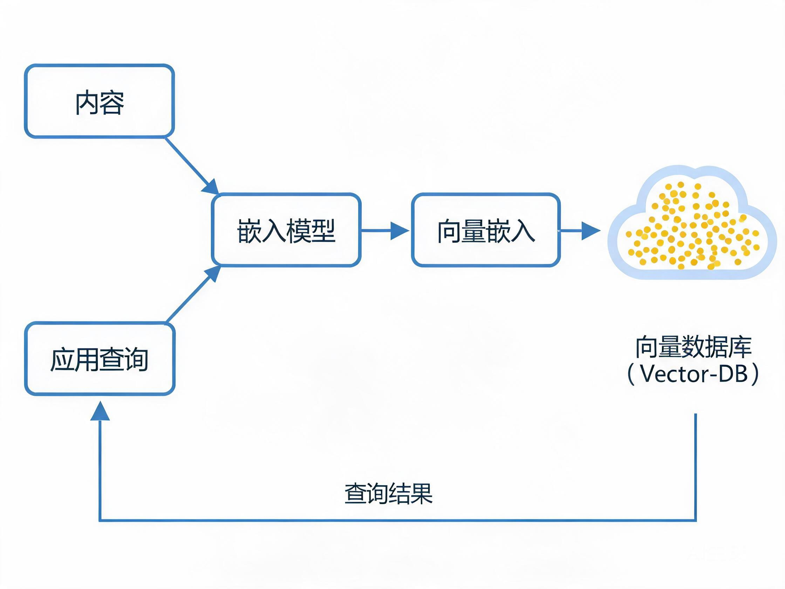

向量数据库为向量数据提供专门的存储和索引机制：

| 环节 | 说明 |
|------|------|
| **向量存储** | 向量被存储为高维空间中的点，DB 会为这些点建立索引 |
| **索引结构** | 树、图、哈希等索引结构，让 DB 可高效进行相似度搜索 |
| **查询评估** | 每次搜索通过相似性度量评价相似度，从而得到向量查询结果 |

**完整流程**：

```
Content（内容）→ Embedding Model（嵌入模型）→ Vector Embedding（向量嵌入）→ Vector-DB
                                                                            ↓
Application（应用）← Query Result（查询结果）← Vector-DB 检索
```

### 6.3 相似性搜索是什么

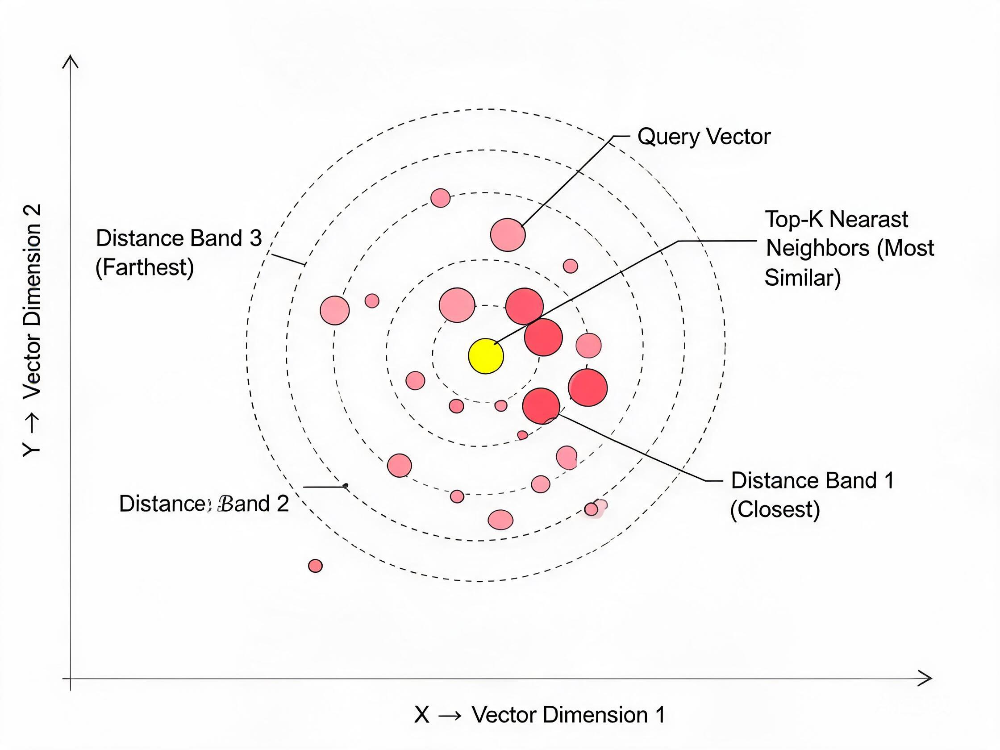

用户查询时，相似性搜索提供与输入向量相似的 TOP-K 向量。

**基本流程**：

1. 将用户查询转换为向量（通过 Embedding 模型）
2. 使用 K 最近邻（KNN）算法将查询向量与 Vector-DB 中每个向量进行距离比较
3. 按距离排序，返回最近的 K 个向量

**核心概念**：

| 概念 | 说明 |
|------|------|
| **Query Vector** | 用户查询经过 Embedding 后的向量 |
| **Distance Band** | 距查询向量不同距离的同心区域，越内层越相似 |
| **TOP-K** | 返回最相似的 K 个结果，K 通常为 5-50 |
| **Exact Search** | 精确 KNN，遍历所有向量计算距离，结果最准但最慢 |
| **ANN** | 近似最近邻（Approximate Nearest Neighbor），牺牲少量准确率换取大幅加速 |

### 6.4 高效搜索的两大分类

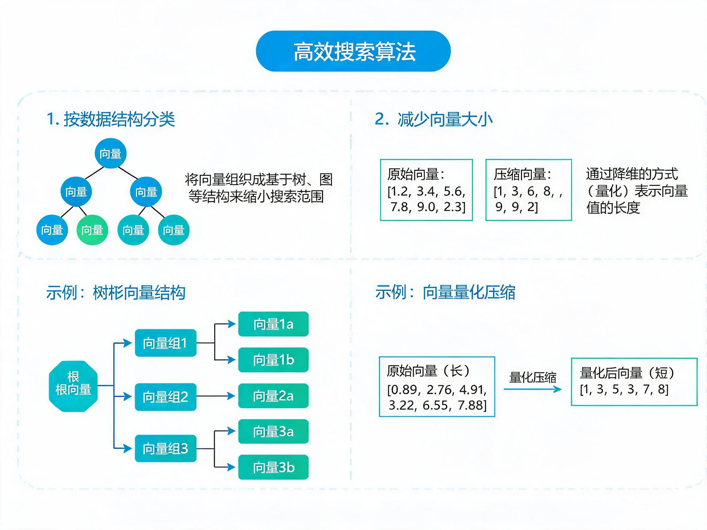

高效的搜索算法有很多，其主要思想是通过两种方式提高搜索效率：

| 分类 | 核心思想 | 说明 |
|------|---------|------|
| **按数据结构分类** | 将向量组织成基于树、图等结构来缩小搜索范围 | 通过组织数据结构减少需要比较的向量数量 |
| **减少向量大小** | 通过降维的方式（量化）表示向量值的长度 | 通过压缩向量本身减少计算量 |

### 6.5 索引分类总览

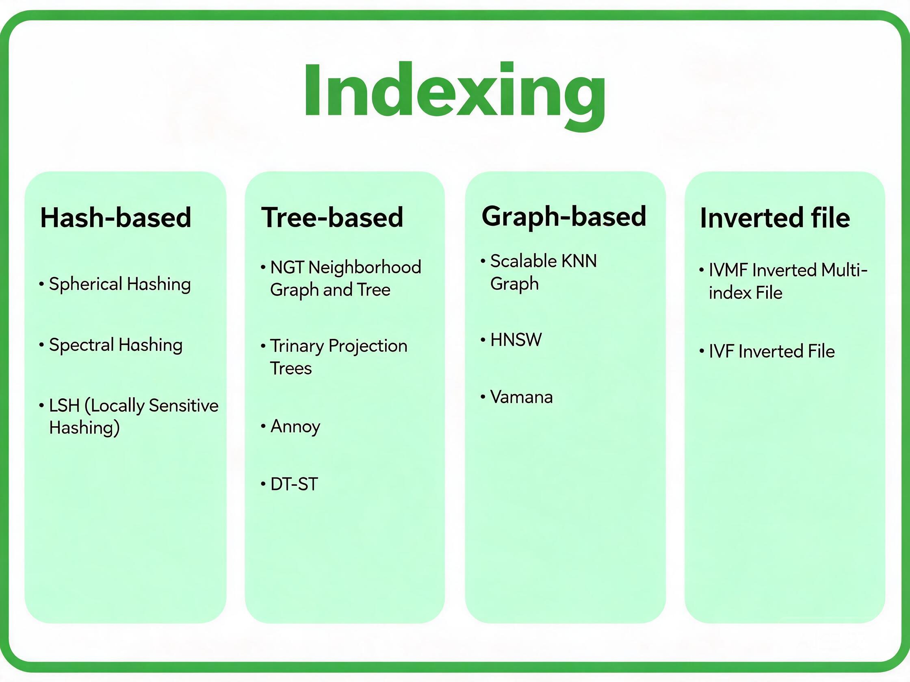

数据通过**索引（Indexing）**存储在向量数据库中，索引通过缩小搜索空间来有效地查找相似向量。

#### 四大索引家族详解

**Hash-based（哈希索引）**

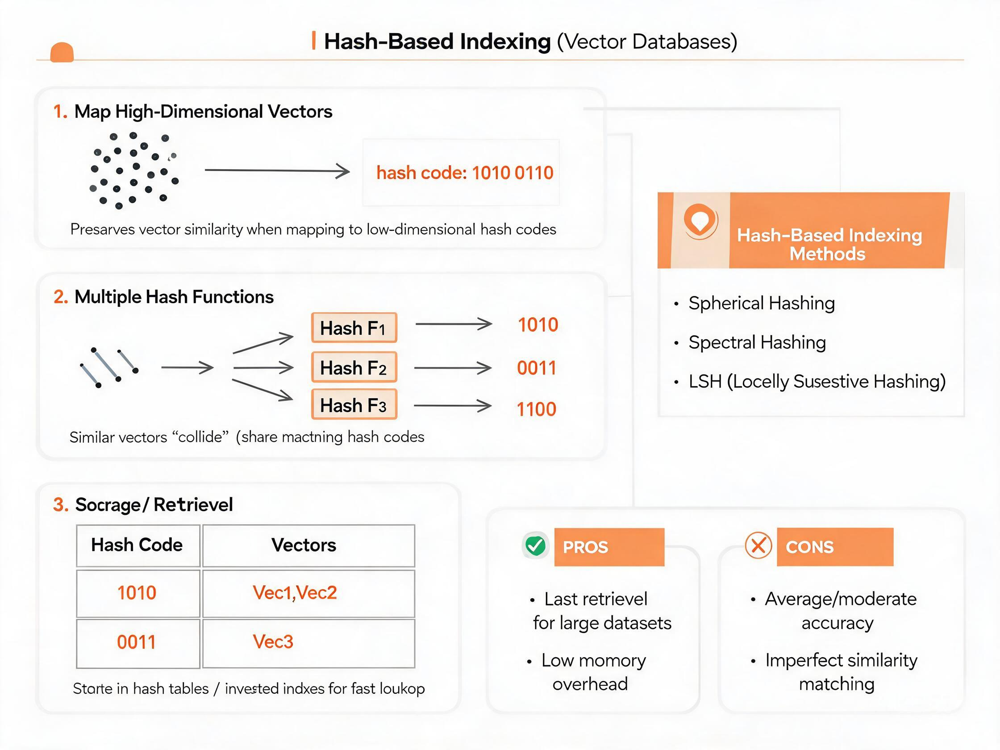

| 步骤 | 说明 |
|------|------|
| **1. 映射** | 高维向量映射到低维空间或低维哈希码，尽可能保持原始相似性 |
| **2. 多次哈希** | 数据库中向量被多次哈希，以确保相似点更有可能发生冲突（与传统哈希相反，目标是最大限度减少冲突） |
| **3. 存储检索** | 通过哈希表或倒排索引存储和检索，查询时使用相同哈希函数，相似点被分配到相同哈希桶，检索速度非常快 |

- **典型算法**：LSH（Locally Sensitive Hashing，局部敏感哈希）
- **优缺点**：优点是扩展到大量数据时速度非常快，缺点是准确性一般

**Tree-based（基于树的索引）**

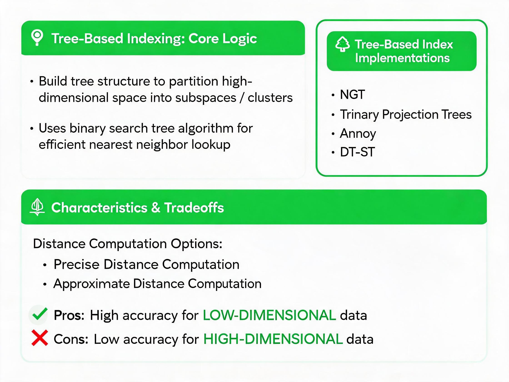

| 特性 | 说明 |
|------|------|
| **核心思想** | 建立树结构：把高维空间划分成若干子空间或聚类中心，用树结构存储和检索 |
| **检索算法** | 通过二叉搜索树算法搜索，相似数据易在同一子树，从而更快发现近似邻居 |
| **计算方式** | 基于精确距离计算或近似距离计算 |
| **代表算法** | NGT、Trinary Projection Trees、Annoy、DT-ST |
| **优缺点** | 优点是对低维数据准确率较高；缺点是无法充分捕获数据复杂性，高维数据准确率较低 |

**Graph-based（基于图的索引）**

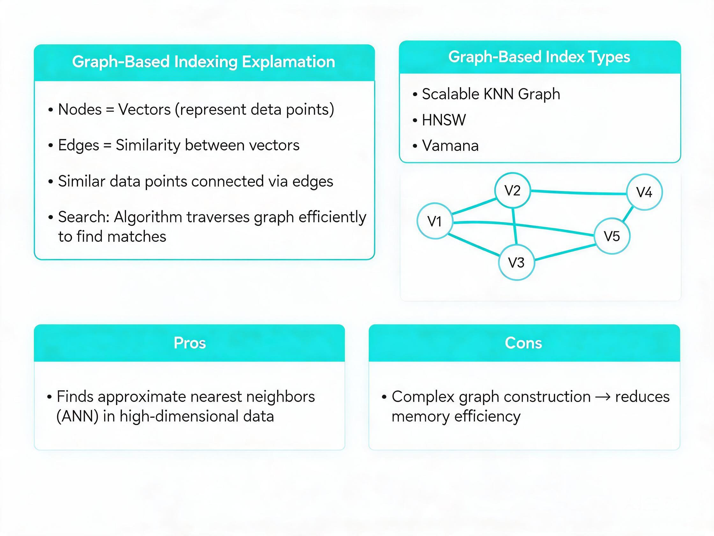

| 特性 | 说明 |
|------|------|
| **数据结构** | 图中节点表示向量数据，边表示数据间相似性 |
| **构图方式** | 相似数据点更有可能通过边连接，搜索算法以有效方式遍历图找到近似邻居 |
| **代表算法** | Scalable KNN Graph、**HNSW**、Vamana |
| **优缺点** | 优点是能够在高维数据中找到近似近邻，提高搜索性能；缺点是构图方式复杂，影响内存效率 |

**Inverted file（倒排文件索引）**

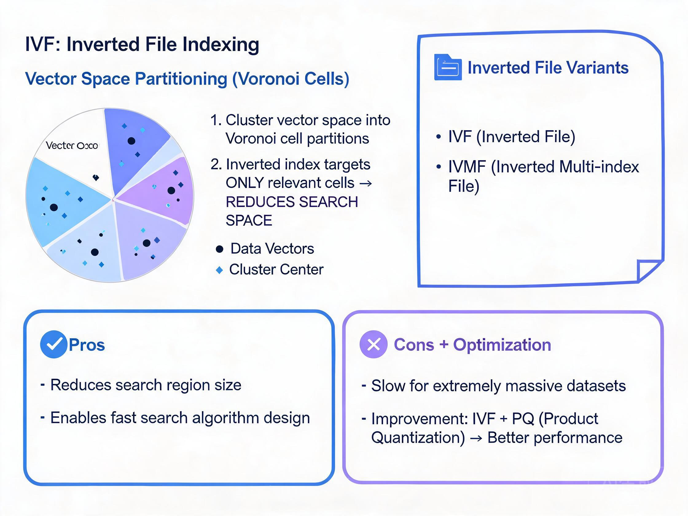

| 特性 | 说明 |
|------|------|
| **核心思想** | 将向量空间划分为多格 Voronoi 单元，以与聚类相同的方式，通过建立倒排索引表以减少搜索空间 |
| **代表算法** | IVMF（Inverted Multi-index File）、**IVF**（Inverted File） |
| **优缺点** | 优点是有助于设计快速缩小感兴趣相似区域的搜索算法；缺点是对于海量数据，细分向量空间会变慢 |
| **改进点** | IVF 常与乘积量化（PQ）等量化方法结合，以提高性能 |

#### 索引的本质

| 项目 | 说明 |
|------|------|
| **常见索引** | 对直接存储的向量，使用特殊数据结构设计的算法加快索引效率 |
| **具体算法** | 查询向量时，与数据库中每个向量进行比较 |
| **索引本质** | 减少了时间搜索效率，返回 TOP-K 最近邻向量。每一次相似性对比所需时间随数据维度增加而增加 |
| **减少向量大小** | 通过降维的方式（量化）表示向量值的长度 |

#### 压缩分类（量化压缩）

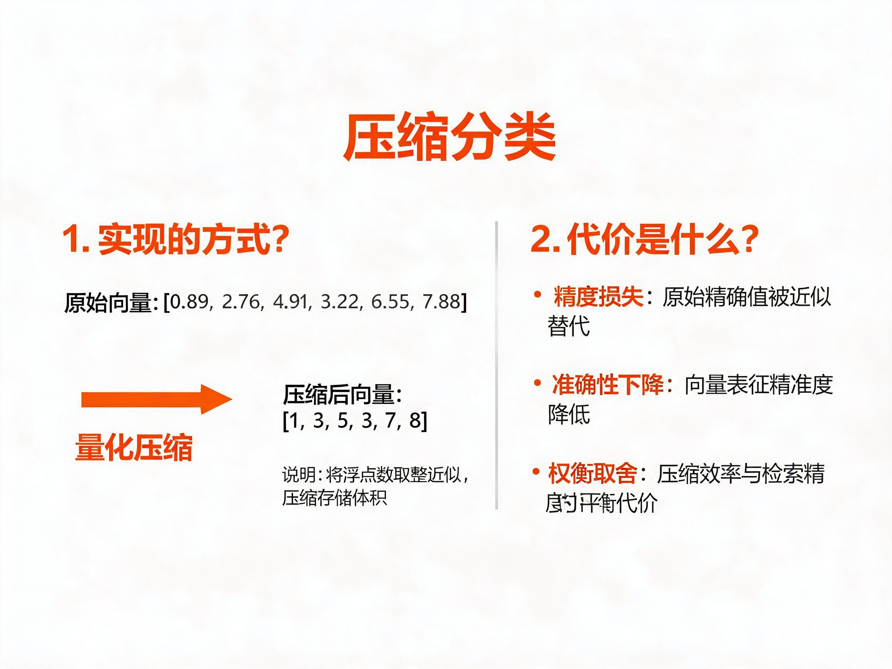

**1. 实现的方式？**

索引基础向量被分解为较少字节组成的块，以减少搜索期间的内存消耗和计算成本。

**2. 代价是什么？**

通过压缩提高索引效率，代价是降低检索准确性。

#### 扁平索引 vs 量化索引

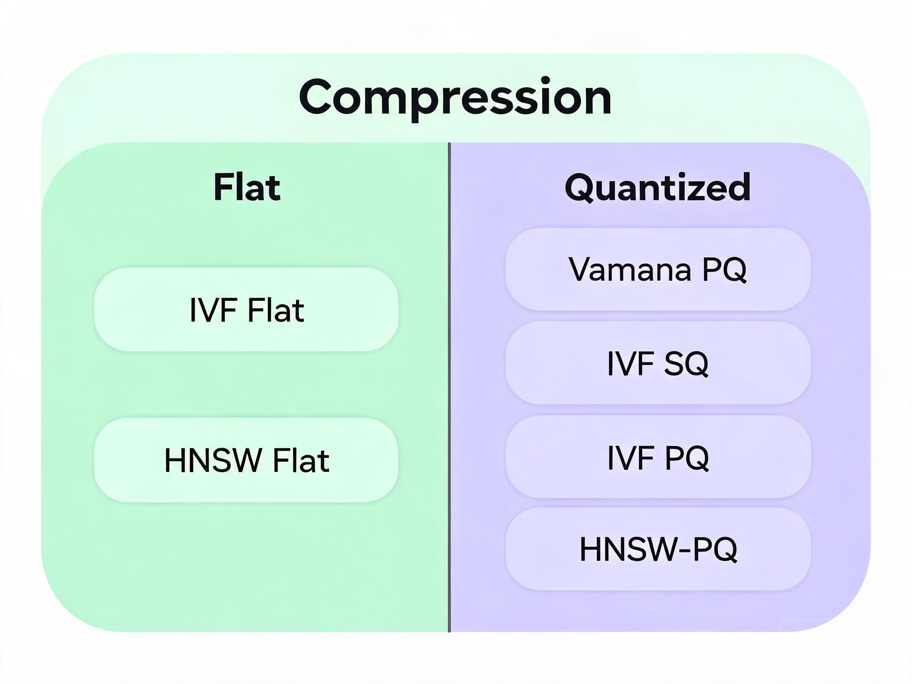

**扁平化的索引（Flat Indexing）**

> 使用 ANN、IVF 或 HNSW 等索引，直接计算查询向量与 DB 中向量之间距离。为了将其与量化变体区分开来，使用这种方式时通常称为 IVF-Flat、HNSW-Flat 等。

**量化索引（Quantized Indexing）**

| 类型 | 说明 |
|------|------|
| **标量量化（SQ）** | 将向量对称划分为包含每个维度的最小值和最大值的容器，将向量中的浮点数转换为整数。e.g. 神经网络模型对权重参数的量化 |
| **乘积量化（PQ）** | 考虑沿每个向量维度值分布，执行压缩和数据缩减。将较大维度向量空间分解为较小维度子空间的笛卡尔积 |

**组合形式**：

| 扁平（Flat） | 量化（Quantized） |
|--------------|-------------------|
| IVF Flat | Vamana PQ |
| HNSW Flat | IVF SQ |
| | IVF PQ |
| | HNSW-PQ |

#### 向量检索算法

向量数据库使用**近似最相邻（Approximate Nearest Neighbor，ANN）**评估相似向量间相似度。

为了解决逐个索引向量相比效率低的问题，出现了 IVF、HNSW、LSH 等算法。

#### 相似性搜索算法原则

> 除暴力搜索能精确索引到近邻，所有搜索算法只能在**性能、召回率、内存**三者进行权衡。

#### ANN 的聚类与索引流程

**Step 1：先对 DB 向量进行聚类**

| 步骤 | 说明 |
|------|------|
| **1. 初始化** | e.g. 下图坐标系划定 4 个聚类中心 |
| **2. 分配** | 将每个向量分配到最近聚类中心 |
| **3. 调整** | 聚类算法调整聚类中心位置 |
| **4. 完成** | 最终将向量分成 4 个簇 |

**Step 2：再进行向量索引**

| 步骤 | 说明 |
|------|------|
| **1. 判断** | 先判断搜索向量属于哪个簇 |
| **2. 搜索** | 在该聚类簇中进行搜索 |
| **3. 效果** | 从 4 个簇减少到 1 个簇，大幅减少搜索范围 |

#### K-Means 算法步骤

1. 选择 K 个初始聚类中心
2. 将每个数据点分配到最近聚类中心
3. 计算每个聚类的新中心
4. 重复 2 & 3 至聚类中心不变或达最大迭代

#### K-Means 问题与 Faiss 改进

| 问题 | 说明 |
|------|------|
| **边界问题** | 现实中向量分布区域边界相邻，K-Means 搜索缺点：搜索向量处于两个聚类区域的中间，容易遗漏部分相似向量 |

**Faiss 改进：找到近似多个质心**

| 改进 | 说明 |
|------|------|
| **Voronoi Cells** | 基于 Voronoi 图划分向量空间为多个单元格 |
| **nprobe 动态调整** | 搜索范围动态调整，`nprobe=1` 时只搜索最近 1 个簇 |

#### 三大主流索引方法（重点）

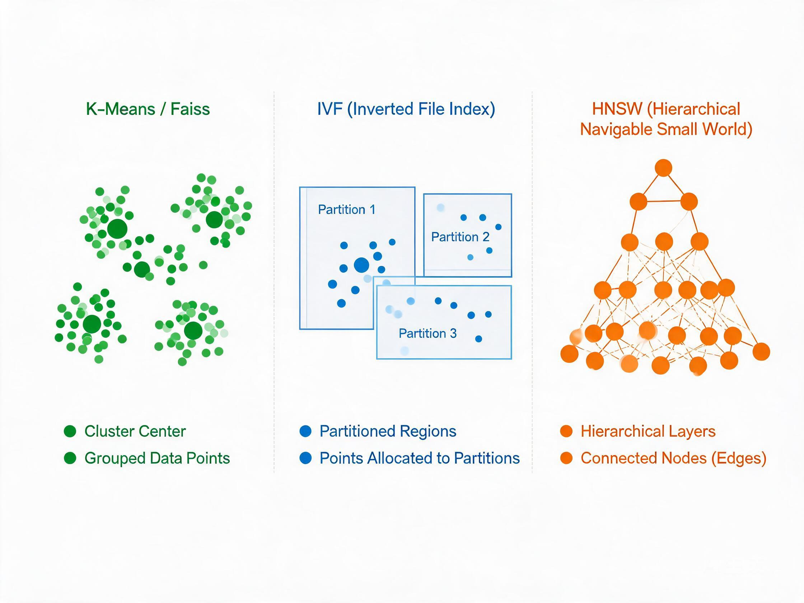

| 方法 | 代表实现 | 核心思想 | 适用场景 |
|------|---------|---------|---------|
| **K-Means / Faiss** | FAISS、Annoy | 聚类：将向量空间划分为 K 个簇，查询时只搜索最近的几个簇 | 数据量中等，需要快速聚类 |
| **IVF（Inverted File Index）** | pgvector IVFFlat | 倒排文件：基于 K-Means 将数据分到多个 partition，查询时先找最近的 partition 再精确搜索 | pgvector 默认支持，通用场景 |
| **HNSW（Hierarchical Navigable Small World）** | pgvector HNSW | 层次化小世界图：构建多层图结构，上层粗筛、下层精查 | 高要求场景，准确率与速度兼顾 |

### 6.6 IVF 算法（Inverted File Index）

#### 倒排索引原理

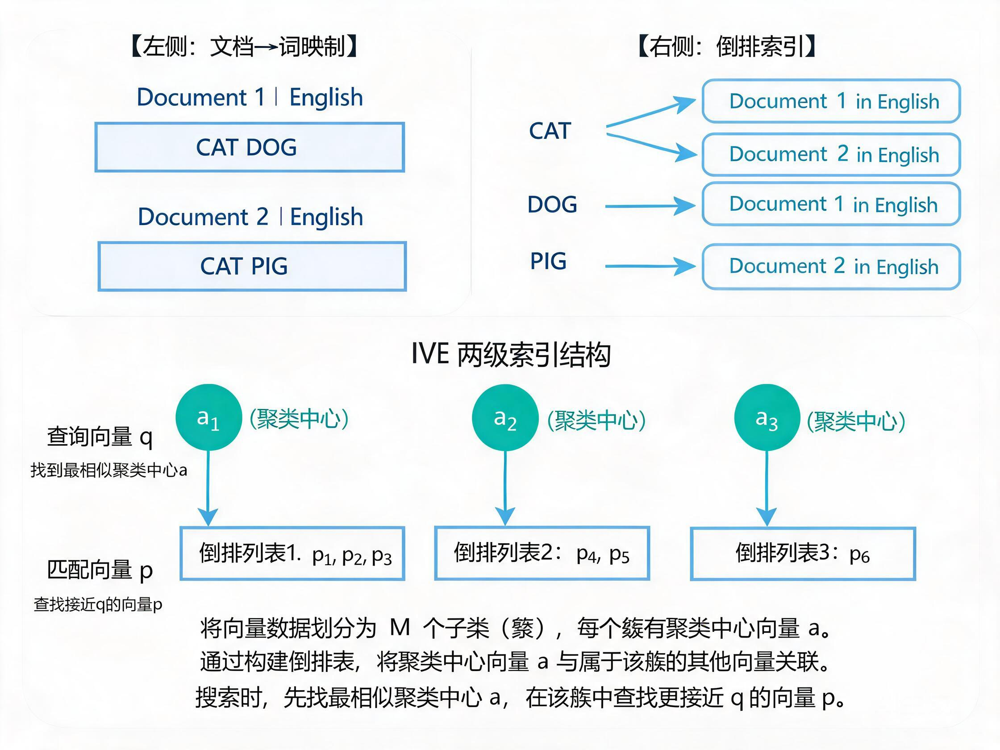

**传统全文检索的倒排索引**：

> 文档 1 包含单词 CAT 和 DOG，文档 2 包含单词 CAT 和 PIG。查询 CAT 时，通过倒排索引可快速定位到文档 1 和文档 2，无需线性扫描每个文档。

**向量检索的倒排文件索引（IVF）**：

| 步骤 | 说明 |
|------|------|
| **1. 划分** | 将向量数据集划分为 M 个子集（簇），每个簇有一个聚类中心向量 a |
| **2. 建表** | 通过构建倒排表，将聚类中心向量 a 与属于该簇的其他向量进行关联 |
| **3. 搜索** | 查询时，先根据查询向量 q 找到与之最相似的聚类中心向量 a，在该簇中心 a 对应倒排表中查找更接近 q 的具体向量 p |

**两级索引结构**：

```
Level 1: 聚类中心 a1, a2, a3 ...  → 快速定位到哪个簇
Level 2: 每个簇的倒排列表           → 在簇内精查匹配向量 p
```

> 两级索引结构极大地减少搜索计算量，提高搜索效率。

#### Voronoi 单元与 nprobe

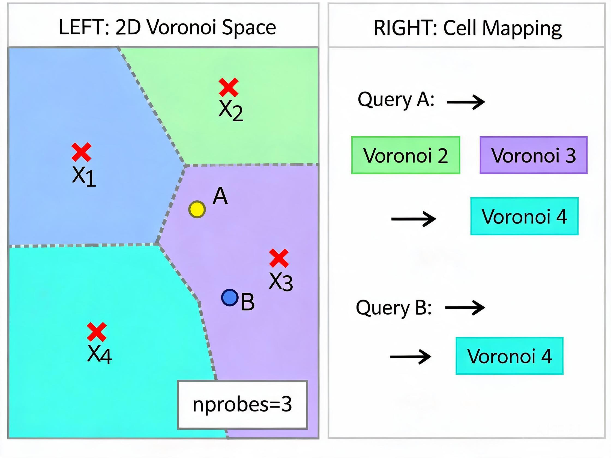

> 空间中每个点都有一个相应区域（Voronoi 单元），空间中距离原点 A 比其他点更近的所有点组成。用种子点 A 创建倒排索引，将每个质心 X 与空间中的向量列表相关联。

| 概念 | 说明 |
|------|------|
| **Voronoi 单元** | 每个聚类中心划分的空间区域，区域内所有点到该中心距离最近 |
| **nprobe** | 查询时搜索的相邻簇数量。`nprobe=3` 表示搜索最近的 3 个簇 |
| **边界问题** | 查询向量处于两个簇边界时，可能遗漏最近邻。增大 nprobe 可缓解 |

#### 冷启动与重建

| 特性 | 说明 |
|------|------|
| **冷启动** | 需要具备一定数据后才开始训练索引（热启） |
| **重建** | 数据库拥有一定量数据后需重建 IVF 索引表 |
| **增量更新** | 新数据插入时可分配到已有簇，或定期全量重建 |

#### IVF 工作流程

```
索引构建阶段：
1. 使用 K-Means 将向量空间划分为 lists 个簇（partition）
2. 每个向量被分配到最近的簇中心
3. 每个簇维护一个倒排列表

查询阶段：
1. 计算查询向量与所有簇中心的距离
2. 选择最近的 nprobe 个簇（默认 1）
3. 只在选中的簇内进行精确搜索
4. 返回最近的 TOP-K 结果
```

#### 关键参数

| 参数 | 说明 | 调优建议 |
|------|------|---------|
| `lists` | 聚类簇数量 | <100万行：`rows/1000`；>100万行：`√rows` |
| `probes` | 查询时搜索的簇数 | 1（默认，最快）→ lists（最准，退化为精确搜索） |

> **注意**：IVFFlat 建索引前表中必须已有足够数据，否则 K-Means 聚类中心质量差。空表建索引效果极差。

#### pgvector IVFFlat SQL 实战

**建索引**：

```sql
-- 将数据划分为 100 个聚类区域，使用余弦距离
CREATE INDEX ON items USING ivfflat (embedding vector_cosine_ops)
WITH (lists = 100);
```

**查询调参**：

```sql
-- 设置当前会话搜索 10 个最近的聚类区域
SET ivfflat.probes = 10;

SELECT * FROM items
ORDER BY embedding <=> '[...查询向量...]'::vector
LIMIT 5;
```

| probes 值 | 效果 |
|-----------|------|
| `1` | 速度最快，精度最低（只搜最近的 1 个簇） |
| `10~50` | 常用设置（lists=1000 时），平衡速度与精度 |
| `= lists` | 退化为暴力搜索，精度 100% 但最慢 |

> **比喻**：在巨大图书馆找"量子物理"书——暴力搜索是一本本翻；IVFFlat 是先看区域指示牌走到"科学区→物理类"书架，只扫描这个书架上的书。

### 6.7 HNSW 算法（Hierarchical Navigable Small World）

#### 图算法原理

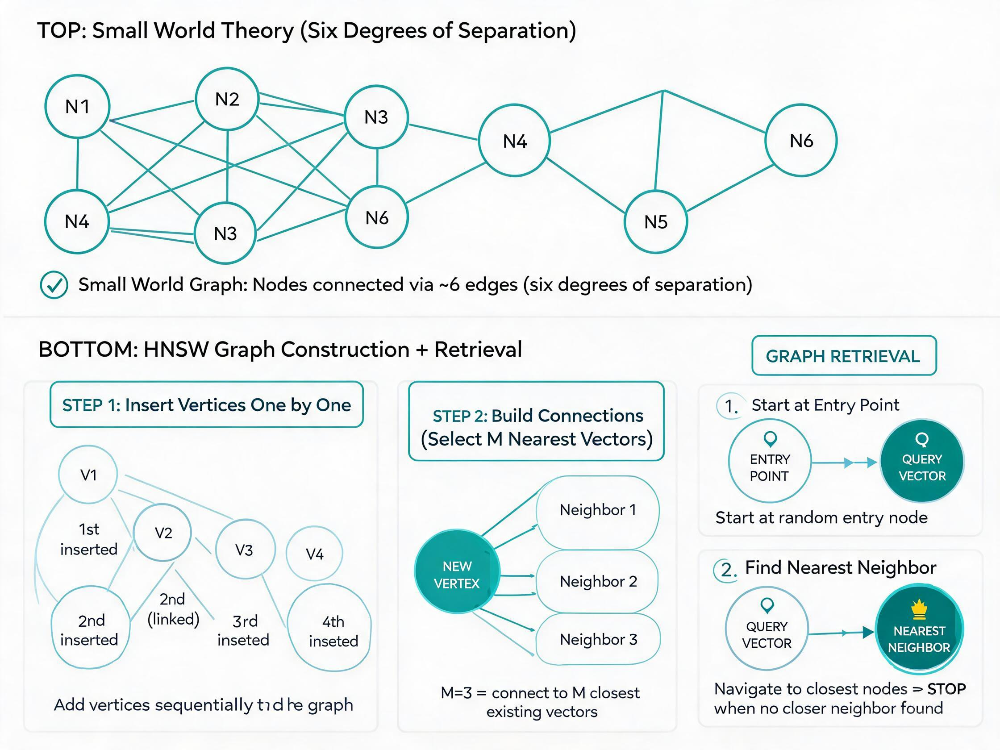

| 项目 | 说明 |
|------|------|
| **小世界理论** | 基于小世界理论（六度空间），在一个充分连接的图，通过六跳可以连通两个点 |
| **构图方式** | 高维空间看作图，每个节点是一个向量，每条边是距离相似度 |
| **检索方式** | 使用启发式算法构建和遍历图，从而找到最相似的向量 |

**图的构建与检索**：

| 步骤 | 构图 | 检索 |
|------|------|------|
| **1** | 逐个插入顶点 | 随机挑选起始点（Entry Point） |
| **2** | 每次挑选 M 个近邻向量，构建链接 | 找到距离目标近的邻居，并移动 |
| **3** | 形成完整图结构 | 当所有邻居没有更近的，结束算法 |

#### 图算法的问题

| 问题 | 说明 |
|------|------|
| **数据增加** | 空间点越密集，构图速度变慢，跳转数增加 |
| **全局连通** | 图中所有点都以最短路径相连，搜索时需要遍历所有节点 |

#### NSW 原理（Navigable Small World）

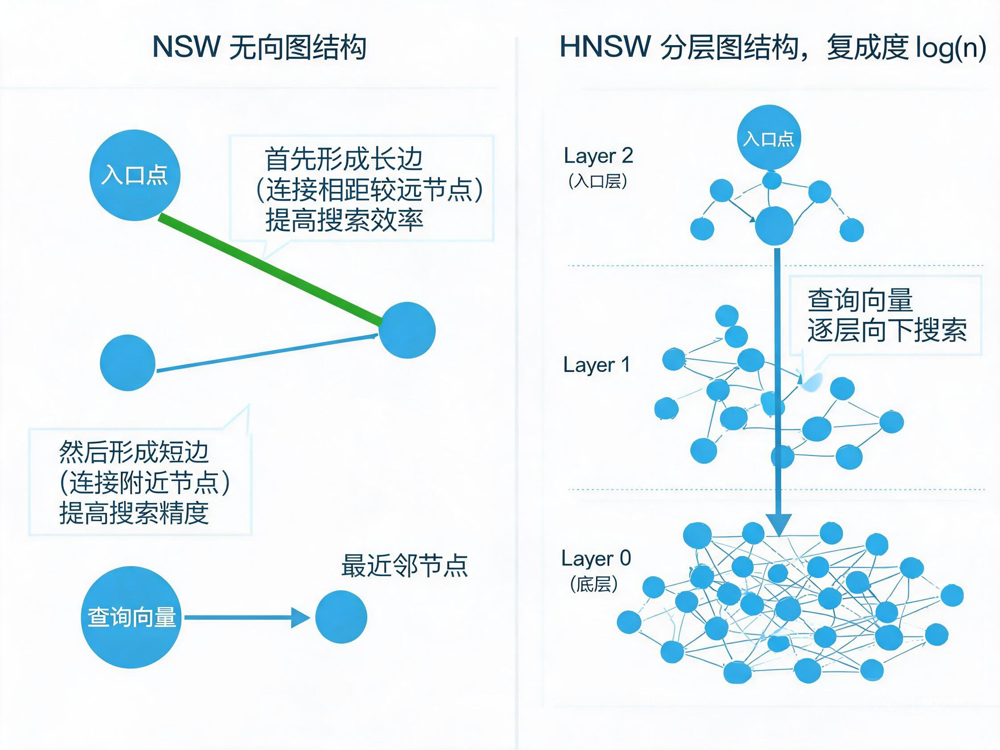

> 构建无向图，即给定任意入口点，可以到达图中的任何节点。

| 步骤 | 说明 |
|------|------|
| **1. 形成长边** | 首先形成长边（连接相距较远且需要多次遍历的节点），提高搜索效率 |
| **2. 形成短边** | 然后形成短边（连接附近的节点），提高搜索精度 |
| **3. 遍历查找** | 通过遍历该图找到距给定查询向量最近的节点 |

#### HNSW 构图原理

HNSW 分层图结构解决遍历效率低的问题，修复每个节点邻居数量上限，搜索复杂度降低到 `log(n)`。

**分层结构**：

| 层级 | 说明 |
|------|------|
| **Layer 2** | 入口层（Entry Layer），节点最少，用于粗导航 |
| **Layer 1** | 中间层，节点数适中 |
| **Layer 0** | 底层（Base Layer），包含所有向量，精确搜索 |

> 图结构：将图分为多层，每一层作为一个 SW（小世界），图中节点相互连接。每层节点都与上层节点相连。构图：按距离相似度将近邻划分成不同层。长边在顶层，层数越低边越短，最底层构成完整图。所有层都相互折叠，则 HNSW 图本质为 NSW 图。

#### HNSW 检索原理

1. **从最高层 l 开始沿最长边检索**
2. **当前节点 n 值超出向量相似度，转移下一层图 l-1**
3. **在 l-1 层图回退到 l 层图 n 点沿最长边检索**

| 特性 | 说明 |
|------|------|
| **特点** | 空间换时间算法，搜索召回率和搜索速度较高，但内存开销较大 |
| **内存** | 存储所有向量，还需维护多层图结构 |

#### HNSW 查询流程

```
Layer 2 (入口层):  从入口点开始，贪心找最接近查询的节点
     ↓ 下移
Layer 1 (中间层):  从上层找到的节点继续贪心搜索
     ↓ 下移
Layer 0 (底层):   在底层精查，找到最近的 TOP-K 结果
```

#### 关键参数

| 参数 | 说明 | 推荐值 |
|------|------|--------|
| `m` | 每个节点的最大邻居数 | 16（默认），召回要求高可设 32~64 |
| `ef_construction` | 构建索引时的搜索宽度 | `m` 的 2 倍以上（如 m=16 时设 64 或 128） |
| `ef_search` | 查询时的搜索宽度 | 40（默认），≥ LIMIT k 值，越大越准但越慢 |

> **重要约束**：`ef_search` 必须大于等于查询语句中 `LIMIT k` 的 `k` 值，否则 pgvector 会自动将其调整为 `k`。

#### pgvector HNSW SQL 实战

**建索引**：

```sql
-- 临时调高工作内存，加速建索引
SET LOCAL maintenance_work_mem = '1GB';

-- 创建 HNSW 索引，m=16 控制邻居数，ef_construction=128 控制建图质量
CREATE INDEX IF NOT EXISTS "IDX_document_chunks_embedding_hnsw"
  ON document_chunks USING hnsw (embedding vector_cosine_ops)
  WITH (m = 16, ef_construction = 128);
```

| 片段 | 含义 |
|------|------|
| `USING hnsw` | 索引方法为 HNSW（层级可导航小世界图） |
| `(embedding vector_cosine_ops)` | 索引列 + 算子族（必须匹配查询的 `<=>` 算子） |
| `m = 16` | 每个节点最大邻居数，越大连通性越好但内存增加 |
| `ef_construction = 128` | 建图时候选队列大小，越大图质量越高但建索引越慢 |

**查询调参**：

```sql
-- 事务内生效，连接池归还后自动重置
SET LOCAL hnsw.ef_search = 128;

SELECT id, content, 1 - (embedding <=> $1::vector) AS score
FROM document_chunks
WHERE embedding IS NOT NULL
  AND (embedding <=> $1::vector) < 0.7   -- 硬阈值过滤噪声
ORDER BY embedding <=> $1::vector ASC
LIMIT 10;
```

| ef_search | 典型 10 万向量召回率 | 典型耗时 |
|-----------|---------------------|---------|
| 40 | ~85% | <5ms |
| 128 | ~95% | ~10ms |
| 256 | ~99% | ~30ms |

> **为什么用 `SET LOCAL` 而非 `SET`？** `SET` 是连接级生效，连接池复用时会污染后续查询。`SET LOCAL` 是事务内生效，COMMIT/ROLLBACK 后自动还原，安全不泄漏。

**算子族匹配约束**：

| 查询算子 | 对应算子族 | 说明 |
|----------|----------|------|
| `<=>`（余弦距离） | `vector_cosine_ops` | InkWeaver 使用 |
| `<#>`（负内积） | `vector_ip_ops` | 向量未归一化时使用 |
| `<->`（欧氏距离） | `vector_l2_ops` | 图像/颜色等场景 |

> **关键**：如果建索引用了 `vector_cosine_ops`，查询却用 `<->`（L2），索引会完全失效，退化为全表扫描。

> **比喻**：跨国自驾找地址——顶层是高速公路网快速跨省，中层是城市主干道接近目标，底层是社区街道慢慢找门牌号。

#### IVFFlat vs HNSW 深度对比

| 对比维度 | IVFFlat（倒排文件） | HNSW（分层图） |
|----------|---------------------|----------------|
| **核心原理** | 空间划分（K-Means 聚类） | 图导航（小世界网络） |
| **构建速度** | 快（基于 K-Means） | 较慢（逐个插入节点构图） |
| **查询速度** | 中等偏快（取决于 probes） | 极快（通常是最快选择） |
| **精度（Recall）** | 好（可通过 probes 调整） | 极好 |
| **内存占用** | 较低 | 较高（存储图的边） |
| **复杂度** | O(n) | O(log n) |
| **数据要求** | 建索引前需有数据 | 可在空表上创建，随插入动态更新 |
| **增量写入** | 差（需定期 REINDEX 重训练） | 好（只更新局部邻居，不用重训练） |
| **适用场景** | 数据集大、内存受限、批量重建 | 查询延迟和精度要求高、内存充足 |

> **InkWeaver 的选择**：项目使用 pgvector 的 **HNSW 索引**，在 `document_chunks.embedding` 列上构建（`m=16, ef_construction=128, ef_search=128`）。选择 HNSW 的核心理由：①增量友好——每次写文档新增/更新分块 embedding 不需要重建索引；②运维成本为零——个人开发者产品没有 DBA，HNSW 建完索引后不用管。

> pgvector 中 HNSW 索引的完整创建 SQL、参数调优和执行计划验证详见[第 8 章 pgvector 实战](#第-8-章-pgvector-实战)；四路混合检索中 HNSW 通道的落地决策详见[第 11 章](#第-11-章-inkweaver-搜索架构演进)。

### 6.8 LSH 局部敏感哈希（Locality Sensitive Hashing）

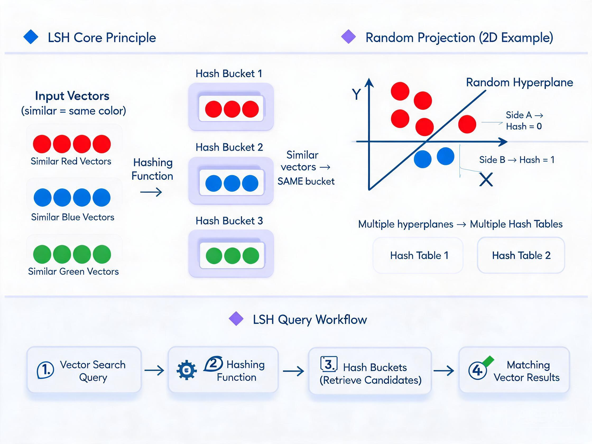

#### LSH 原理

| 项目 | 说明 |
|------|------|
| **核心思想** | 哈希函数将相似向量以相同哈希值映射到桶中，通过比较哈希值判断向量相似度 |
| **哈希碰撞** | Hash 碰撞概率尽可能高，越相似的向量越容易碰撞，被映射到同一个桶 |
| **特点** | 性能高，每个哈希桶向量远少于整个空间中向量数，并提供一个近似、非穷举结果 |

#### 哈希函数设计

> 若两向量距离相近，则直线同一侧概率变高，如 AB 相似概率大于 AC。搜索向量时，将该向量进行哈希计算，得到相同桶中的向量，然后再通过其他索引方式，找到近邻。

**随机投影（Random Projection）**：

| 维度 | 说明 |
|------|------|
| **2D 空间** | 通过直线区分相似性，直线两侧的点哈希到不同桶 |
| **3D 空间** | 通过平面划分区域 |
| **高维空间** | 通过超平面（Hyperplane）划分多个区域，从而区分相似性 |

**随机投影步骤**：

1. 高维空间随机选择一个超平面，将数据点投影到超平面
2. 重复 1 选择多个超平面，将数据点投影到多个超平面上
3. 多个超平面投影结果组合成一个向量，作为低维空间的表示
4. 使用哈希函数将低维空间中向量映射到哈希桶中

> 投影矩阵 P 随机性越大，其映射质量就越好，计算成本也会越高。

#### LSH 查询流程

```
Vector Search Query → Hashing Function → Hash Buckets (检索候选) → Matching Vector Results
```

### 6.9 PQ 乘积量化（Product Quantization）

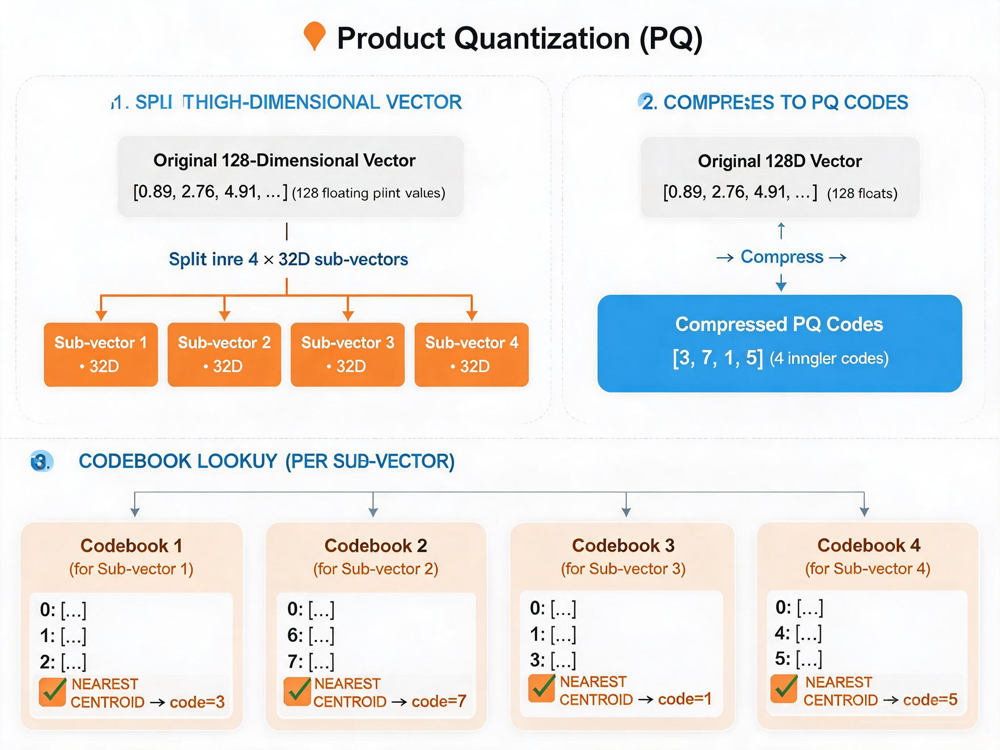

#### PQ 解决的问题

大规模数据集中，聚类算法最大的问题在于内存占用大：

| 问题 | 说明 |
|------|------|
| **向量存储** | 需要保存每个向量，向量中元素是浮点数 FP |
| **索引维护** | 需要维护聚类中心和每个向量的聚类中心索引 |
| **维度灾难** | 随维度增加数据点间距离呈指数增长，高维坐标需要更多聚类中心点 |

#### PQ 核心思想

将向量分解为 m 个子向量，对每个子向量独立量化：

| 步骤 | 说明 |
|------|------|
| **1. 切分** | 将 128 维向量分为 8 个 16 维子向量 |
| **2. 量化** | 8 个 16 维子向量分别聚类 |
| **3. 编码** | 得到 8 个向量组合成最终编码 |

**压缩效果**：

> 16 维子向量大概需 256 个聚类中心，256 维向量大概需 2^64 个聚类中心。通过 PQ：2^64 → 8 × 256 = 2048，大幅压缩内存占用。

#### PQ 量化流程

```
原始向量 [0.89, 2.76, 4.91, ...] (128 floats)
    ↓ Split
子向量 1 | 子向量 2 | 子向量 3 | 子向量 4 (各 32D)
    ↓ Quantize (各 Codebook 独立量化)
PQ Codes [3, 7, 1, 5] (4 个整数)
```

### 6.10 IVF-PQ 组合索引

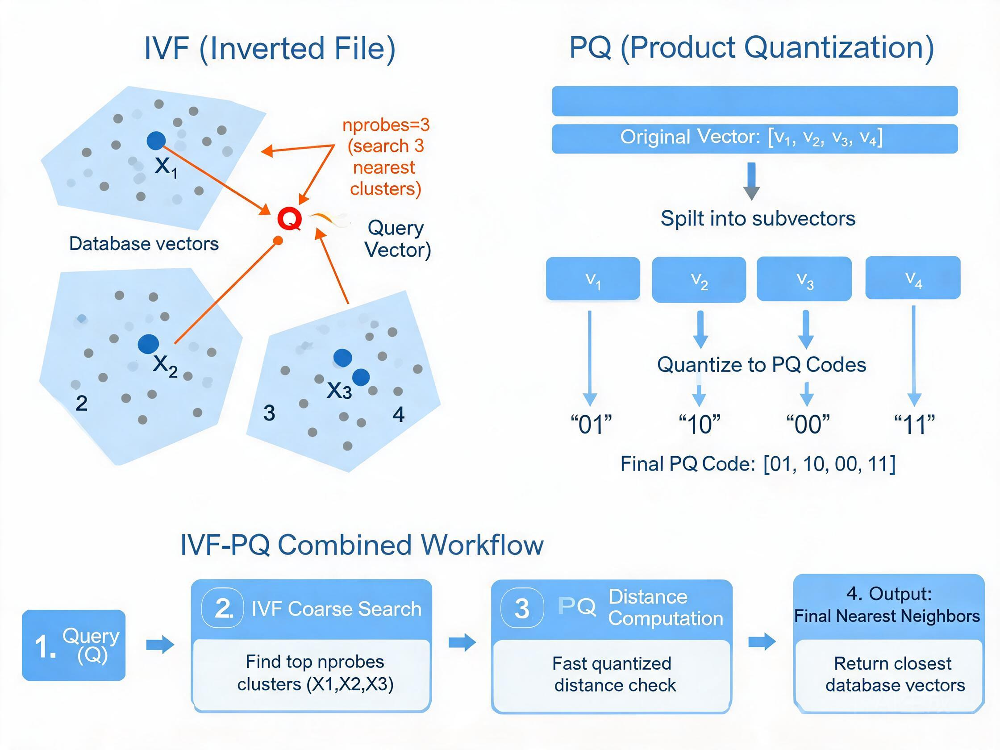

#### IVF-PQ 架构

| 组件 | 作用 |
|------|------|
| **IVF** | 倒排索引，用于缩小搜索空间，提高索引召回率 |
| **PQ** | 加速查询向量与 DB 向量距离计算，量化减少内存需求 |

#### IVF-PQ 工作流程

```
1. Query (查询向量)
      ↓
2. IVF Coarse Search (IVF 粗搜) → 找到最近的 nprobes 个簇
      ↓
3. PQ Distance Computation (PQ 距离计算) → 快速量化距离比较
      ↓
4. Output: Final Nearest Neighbors (最终最近邻)
```

#### IVF-PQ 关键参数

| 参数 | 说明 |
|------|------|
| **nprobes** | 搜索算法向外扩展至指定中心数量 |
| **PQ 子向量数** | PQ 子向量越多，子空间越小，信息失真增大；子向量多会导致 PQ 步骤中 I/O 和计算量增加 |
| **IVF 分区数** | 控制 IVF 分区数以平衡召回和搜索速度。分区数量 = 向量数量时退化为暴力搜索（IVF-Flat） |

#### 边缘问题

> 根据查询向量所在位置，可能靠近多个 Voronoi 单元边界，使得哪个单元返回最近邻居变得不明确，从而导致边缘问题。增大 nprobes 可缓解。

### 6.11 热门 ANN 算法对比

#### 算法总结

| 算法 | 类型 | 精度 | 速度 | 内存 | 适用场景 |
|------|------|------|------|------|---------|
| **IVF-Flat** | 聚类检索 | 高 | 中 | 低 | 追求高精度、数据量适中 |
| **IVF-PQ** | 组合检索 | 中 | 快 | 极低 | 大规模数据、内存受限 |
| **HNSW** | 图结构 | 高 | 快 | 高 | 追求精度和速度平衡 |
| **LSH** | 哈希检索 | 中低 | 极快 | 低 | 超大规模、容忍精度损失 |
| **FAISS** | 库（多种算法） | 可选 | 极快 | 可选 | 通用、GPU 加速需求 |

#### 三大分类对比

| 分类 | 代表算法 | 特点 |
|------|---------|------|
| **聚类检索** | IVF-Flat、FAISS | 结果准确度高，消耗算力、耗时长（ANN） |
| **基于图结构** | HNSW | 结果比较准确，速度快、消耗内存 |
| **组合检索** | IVF-PQ | 准确度取决于模型训练，速度快、节省资源 |

#### pgvector 支持的索引类型

| 索引类型 | 适用场景 |
|----------|---------|
| **FLAT** | 适合小规模、百万级数据集上寻求完全准确和精确搜索结果的场景 |
| **IVF_FLAT** | 适合于在磁盘、CPU 和 GPU 内存消耗非常有限的场景中显著减少资源消耗 |
| **IVF_SQ8** | 适合于在磁盘、CPU 和 GPU 内存消耗非常有限的场景中显著减少资源消耗 |
| **IVF_PQ** | 适合于在高查询速度的情况下以牺牲精度为代价的场景 |
| **HNSW** | 基于图形的索引，最适合对搜索效率有很高需求的场景 |

> 在搜索或查询插入的向量前，必须声明索引类型和相似度度量方式。

### 6.12 过滤与向量检索（Filtering）


#### 为什么需要过滤

实际业务场景中，不是完整的 Vector-DB 相似性搜索，而是通过部分业务字段进行过滤 Filtering 再查询：

| 需求 | 说明 |
|------|------|
| **元数据存储** | 向量还需包含元数据 Meta Data，如 User ID、Doc ID、Folder ID 等 |
| **权限控制** | 用户只能搜索自己有权限的文档 |
| **分类筛选** | 按文件夹、标签、创建时间等条件筛选 |
| **优点** | 根据元数据过滤搜索结果，减少向量检索范围，提高查询效率 |

#### 过滤方式对比

| 方式 | 流程 | 优点 | 缺点 |
|------|------|------|------|
| **Pre-Filtering** | 先过滤元数据，再在过滤后的集合中做向量搜索 | 减少搜索空间 | 可能遗漏相关结果 |
| **Post-Filtering** | 先完成全空间向量搜索，再过滤元数据 | 结果更完整 | 全空间搜索开销大 |

#### pgvector 中的过滤实现

```sql
-- 混合查询：结构化过滤 + 向量相似度检索
SELECT id, content, embedding <=> '[1,2,3,...]' AS distance
FROM document_chunks
WHERE folder_id = 'project-123'           -- 元数据过滤
  AND user_id = 'user-456'                -- 权限过滤
ORDER BY distance
LIMIT 10;
```

> pgvector 使用 PostgreSQL 的原生 WHERE 子句实现 Post-Filtering，先完成全表向量排序，再通过 WHERE 条件过滤。适合中等数据量场景。

---

## 第 7 章 相似性度量

Vector-DB 提供不同的度量算法计算向量相似性，以下是最常用的度量方法。

### 7.1 相似度计算总览

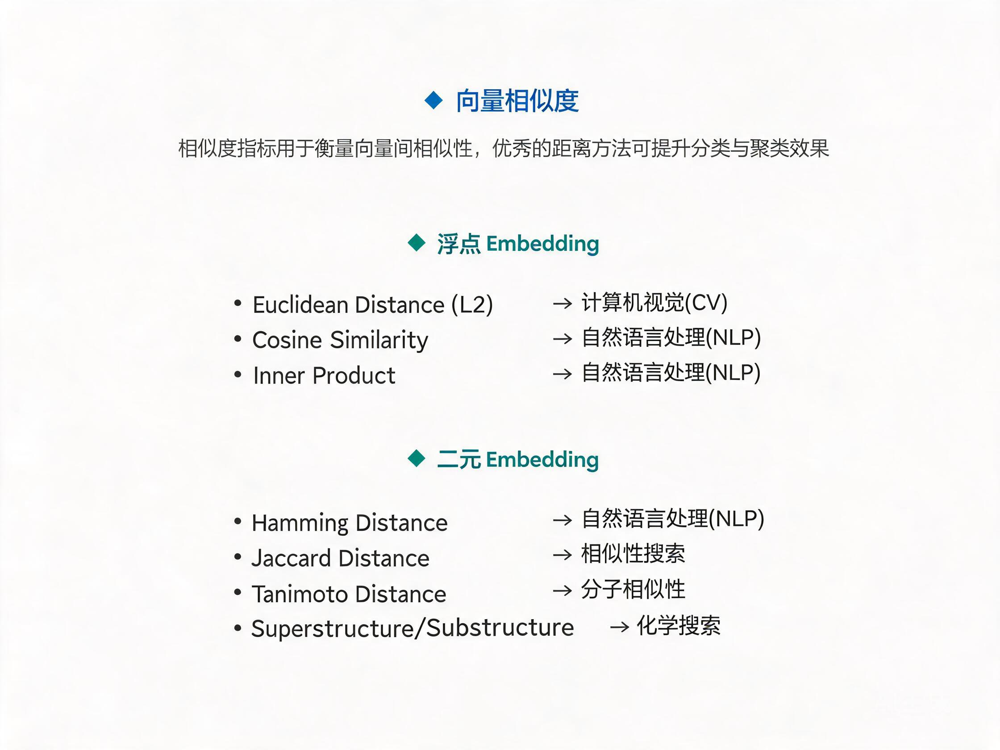

#### 向量相似度

相似度指标用于衡量向量间相似性，好的距离度量方法可以显著提高向量分类和聚类性能。

> 计算相似度，常用方法是计算两个向量之间的距离，两个向量间距离越近，则两个向量越相似。

#### 浮点 Embedding 常用度量

| 度量方法 | 公式 | 适用领域 |
|----------|------|----------|
| **欧氏距离（L2）** | `d(A,B) = √(Σ(Aᵢ-Bᵢ)²)` | 计算机视觉（CV） |
| **余弦相似度（Cosine）** | `cos(θ) = (A·B) / (\|A\|\|B\|)` | 自然语言处理（NLP） |
| **内积（IP）** | `A·B = ΣAᵢBᵢ` | 自然语言处理（NLP） |

#### 二元 Embedding 常用度量

| 度量方法 | 适用领域 |
|----------|----------|
| **哈明距离（Hamming）** | 自然语言处理（NLP） |
| **杰卡德距离（Jaccard）** | 分子相似性搜索领域 |
| **塔尼莫托距离（Tanimoto）** | 分子相似性搜索 |
| **超结构距离（Superstructure）** | 搜索分子的类似超结构 |
| **亚结构距离（Substructure）** | 搜索分子的类似亚结构 |

### 7.2 余弦相似度（Cosine Similarity）

**公式**：`cos(θ) = (A · B) / (|A| × |B|)`

| 属性 | 说明 |
|------|------|
| **几何含义** | 两个向量间夹角的余弦值，仅关注向量方向 |
| **输出范围** | [-1, 1]：1 = 完全相同，0 = 正交无关，-1 = 完全相反 |
| **优点** | 对向量长度不敏感，关注方向（角度），适用于高维向量相似性计算 |
| **场景** | 语义搜索和文档分类 |
| **pgvector 操作符** | `<=>` 余弦距离 = `1 - cos_sim`，范围 [0, 2] |

### 7.3 点积相似度（Dot Product / 内积）

**公式**：`A · B = Σ(Aᵢ × Bᵢ) = |A| × |B| × cos(θ)`

| 属性 | 说明 |
|------|------|
| **几何含义** | 一个向量在另一个向量方向上的投影长度 |
| **输出范围** | 任意值（取决于向量模长） |
| **优点** | 简单易懂，计算速度快，兼顾长度和方向 |
| **场景** | 图像识别、语义搜索和文档分类等 |
| **问题** | 对向量长度敏感，计算高维向量相似性时会丢失信息 |
| **pgvector 操作符** | `<#>` 负内积（返回负值） |

### 7.4 欧氏距离（L2 Distance）

**公式**：`d(A,B) = √(Σ(Aᵢ - Bᵢ)²)`

欧氏距离是最直观的距离度量，衡量两个向量在各维度上差值的综合大小。

| 属性 | 说明 |
|------|------|
| **几何含义** | 向量空间中两点之间的直线距离 |
| **输出范围** | [0, +∞)，0 表示完全相同 |
| **优点** | 反映向量绝对距离，适用于需要考虑向量长度相似性计算 |
| **场景** | 计算机视觉（CV），向量值的绝对大小有意义时 |
| **局限性** | 高维空间中距离差异变得不明显（维度灾难） |
| **pgvector 操作符** | `<->` 欧氏距离 |

### 7.5 相似性度量选择指南

| 度量方式 | pgvector 操作符 | 范围 | 选择建议 |
|----------|----------------|------|----------|
| **余弦距离** | `<=>` | [0, 2] | 文本 Embedding（首选，向量已归一化时） |
| **负内积** | `<#>` | (-∞, +∞) | 向量未归一化时 |
| **欧氏距离** | `<->` | [0, +∞) | 图像/颜色等绝对值敏感场景 |

#### 三大度量对比

| 对比维度 | 点积（内积） | 余弦距离 | 欧氏距离 |
|----------|-------------|---------|---------|
| 是否受模长影响 | ✅ 受影响 | ❌ 仅关注方向 | ✅ 关注绝对距离 |
| 输出范围 | 任意值 | [-1, 1] 或 [0, 2] | [0, +∞) |
| 适用前提 | 向量未归一化 | 向量已归一化 | 绝对值敏感 |
| InkWeaver 使用 | ❌ | ✅ 使用 `<=>` | ❌ |

> **InkWeaver 选择余弦距离的原因**：bge-small-zh-v1.5 模型的输出向量已做 L2 归一化（单位球面上），此时余弦距离等价于内积排序，但余弦距离值更直观——0.3 ≈ 70% 相似度，便于设定硬阈值。

---

## 第 8 章 pgvector 实战

第 6 章介绍了向量数据库的横向品类，第 7 章讲了相似度度量的数学原理。从本章开始，我们把镜头切回 InkWeaver 的真实技术栈——PostgreSQL + pgvector 扩展。本章是一份「实战手册」：每一节都对应到代码里真实存在的一段 SQL 或一个迁移脚本，让你看完就能在仓库里找到出处。

> 阅读约定：本章所有 `[文件名 L行号]` 形式的链接都是相对路径，点击可直接跳到代码出处。

### 8.1 pgvector 安装与 vector 类型

#### 8.1.1 为什么需要 pgvector 扩展

PostgreSQL 原生类型里没有「向量」这种东西——你存 `numeric[]` 或 `float8[]` 可以，但数组类型既没有「距离算子」也没有「近似最近邻索引」。pgvector 给 PostgreSQL 加了三样东西：

| 能力 | 没装 pgvector | 装上 pgvector 后 |
|------|--------------|------------------|
| 列类型 | 只能用 `float8[]` 凑合，无法约束维度 | `vector(dims)` 强维度类型 |
| 距离算子 | 需要自己写 SQL 函数算余弦 | `<=>` / `<#>` / `<->` 三个内置算子 |
| ANN 索引 | 只能全表扫描算精确 KNN | HNSW / IVFFlat 两套 ANN 索引 |

安装三步走，对应迁移脚本 `SearchInfraUpgrade1756000000000`：

```sql
-- 1) 装扩展（每个数据库只装一次，幂等语句）
CREATE EXTENSION IF NOT EXISTS vector;

-- 2) 建表时声明 vector(dims) 列
CREATE TABLE document_chunks (
  id          bigserial PRIMARY KEY,
  "docId"     uuid NOT NULL,
  "userId"    uuid NOT NULL,
  content     text NOT NULL,
  embedding   vector(512)    -- 强维度：必须 512 维，否则插入报错
);

-- 3) 三个距离算子可以直接在 SELECT 里用
SELECT id,
       embedding <=> '[0.1, 0.2, ...]'::vector AS cosine_dist,   -- 余弦距离
       embedding <#> '[0.1, 0.2, ...]'::vector AS neg_ip,        -- 负内积
       embedding <-> '[0.1, 0.2, ...]'::vector AS l2_dist        -- 欧氏距离
FROM document_chunks;
```

> 实战出处：[SearchInfraUpgrade1756000000000.ts L15](../apps/server/src/migrations/1756000000000-SearchInfraUpgrade.ts#L15) 的 `CREATE EXTENSION IF NOT EXISTS vector`。

#### 8.1.2 vector(dims) 列声明（强维度约束）

`vector` 类型支持「定维」和「变维」两种写法，二者区别只在维度约束：

| 声明方式 | 维度约束 | 适用场景 |
|----------|----------|----------|
| `vector` | 无约束，任意维向量都能插 | 实验/原型期 |
| `vector(512)` | 必须正好 512 维，多一维少一维都报错 | 生产环境固定模型 |

```sql
-- ❌ 维度不匹配，插入直接报错
INSERT INTO document_chunks (embedding) VALUES ('[1,2,3]'::vector);
-- ERROR: expected 512 dimensions, not 3

-- ✅ 维度对齐才能插入
INSERT INTO document_chunks (embedding)
VALUES ('[0.012, -0.034, ..., 0.078]'::vector);  -- 必须 512 个浮点
```

> **为什么要锁死维度？** InkWeaver 使用的 bge-small-zh-v1.5 模型输出固定是 512 维。如果某天有人误把另一个模型（比如 OpenAI text-embedding-3-small 的 1536 维）的向量插进来，余弦距离会算出无意义的值，且 HNSW 索引会被污染。`vector(512)` 是「类型层防线」，比应用层校验更早拦截。

#### 8.1.3 三个距离算子与选择

pgvector 三个算子其实是第 7 章三种度量的直接映射：

| 算子 | 名称 | 公式 | 范围 | 越小代表 |
|------|------|------|------|----------|
| `<=>` | 余弦距离 | `1 - cos(A,B)` | [0, 2] | 越相似 |
| `<#>` | 负内积 | `-A·B` | (-∞, +∞) | 越相似（未归一化时无意义） |
| `<->` | 欧氏距离 | `√Σ(Aᵢ-Bᵢ)²` | [0, +∞) | 越相似 |

**InkWeaver 为什么选 `<=>` 余弦距离？**

1. bge-small-zh-v1.5 输出已做 L2 归一化，向量在单位球面上；
2. 归一化向量上余弦距离 = 1 - 内积，与 `<#>` 排序结果等价，但 `<=>` 的值域 [0, 2] 更直观——`0.3` 直接读成「相似度 70%」；
3. 设硬阈值方便：`WHERE embedding <=> q < 0.7` 即「相似度 > 30% 才进候选池」。

> 实战出处：[pg-vector.store.ts L145](../apps/server/src/modules/ai/vector/pg-vector.store.ts#L145) 的 `1 - (c.embedding <=> $1::vector) AS sim`。

> 注意：HNSW 索引要和算子族匹配。`vector_cosine_ops` 只能加速 `<=>`，如果用 `<->` 查询而索引建的是 `vector_cosine_ops`，规划器不会走 HNSW，会退回 Seq Scan。

### 8.2 GIN 倒排索引与全文检索

#### 8.2.1 GIN 是什么

GIN = **Generalized Inverted Index**（通用倒排索引）。关键词在「倒排」二字：

| 索引方向 | 正排（B-tree） | 倒排（GIN） |
|----------|----------------|-------------|
| 从哪找哪 | 从行找内容 | 从 term 找行 |
| 结构 | 行号 → 值 | term → [行号列表] |
| 擅长 | 范围扫描、等值 | 多词合取查询 |

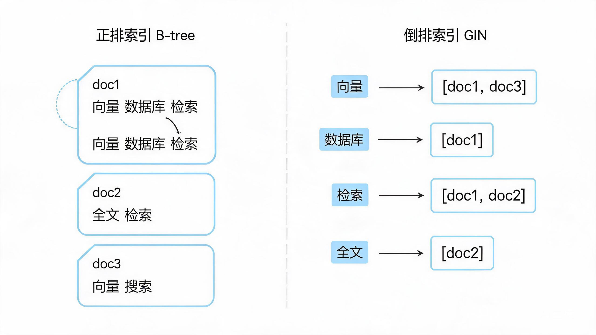

上图对比了正排索引（B-tree：从行找内容）与倒排索引（GIN：从 term 找行）的核心差异。GIN 为每个词项维护一个 posting list（文档 ID 列表），查询时直接命中倒排链，无需全表扫描。

```
正排：  doc1 → "向量 数据库 检索"
        doc2 → "全文 检索"

倒排：  "向量" → [doc1]
        "数据库" → [doc1]
        "检索" → [doc1, doc2]
        "全文" → [doc2]
```

查 `"检索"` 时，GIN 直接拿出 `[doc1, doc2]`，不用扫全表。这正是 Elasticsearch 的底层逻辑，只是 PostgreSQL 把它做成了通用框架，能索引 `tsvector`、`array`、`jsonb` 等多种类型。

#### 8.2.2 GIN vs ILIKE 暴力匹配

| 对比维度 | `ILIKE '%关键词%'` | `tsvector @@ tsquery` + GIN |
|----------|--------------------|----------------------------|
| 能否用索引 | ❌ 不能，必须全表扫描 | ✅ GIN 倒排命中 |
| 复杂度 | O(N×L)（N 行 × L 平均长度） | O(命中文档数) |
| 实测响应（10 万行） | 500ms~2s | 5~20ms |
| 排名打分 | ❌ 只有匹配/不匹配 | ✅ `ts_rank_cd` 给分 |
| 高亮摘要 | ❌ 自己截字符串 | ✅ `ts_headline` 自动生成 |
| 中文分词 | ❌ 字符串包含即可 | ⚠️ 默认按空格切（见 8.6.2） |

```sql
-- ❌ ILIKE 暴力法：10 万文档要扫 10 万次 LIKE
SELECT id FROM documents WHERE content ILIKE '%向量%';

-- ✅ GIN + tsvector：从 term 直接定位到文档
SELECT id FROM documents
WHERE "docTsv" @@ plainto_tsquery('simple', '向量 检索');
```

> 实战出处：[search.service.ts L211](../apps/server/src/modules/search/search.service.ts#L211) 的 `AND "docTsv" @@ plainto_tsquery('simple', $2)`。

#### 8.2.3 GIN 索引创建

```sql
-- 1) documents 加一列 tsvector，专门给 GIN 索引用
ALTER TABLE documents ADD COLUMN "docTsv" tsvector;

-- 2) 用 to_tsvector + setweight 填充（详见 8.6.2、8.6.3）
UPDATE documents
SET "docTsv" =
  setweight(to_tsvector('simple', COALESCE(title, '')), 'A') ||
  setweight(to_tsvector('simple', left(COALESCE(content, ''), 100000)), 'D');

-- 3) 建 GIN 索引
CREATE INDEX "IDX_documents_doc_tsv"
  ON documents USING gin ("docTsv");
```

> 实战出处：[SearchInfraUpgrade1756000000000.ts L23-27](../apps/server/src/migrations/1756000000000-SearchInfraUpgrade.ts#L23-27)。

#### 8.2.4 GIN 的写入代价与适用场景

GIN 不是免费的——它用「慢写」换「快读」：

| 操作 | 代价 | 原因 |
|------|------|------|
| 单行 INSERT | 比普通表慢 3~10 倍 | 每个 term 都要追加到倒排链 |
| 单行 UPDATE | 几乎等于 DELETE+INSERT | tsvector 列变了要重建整条 |
| 批量 INSERT | 可快 100 倍 | 用 `fastupdate` 缓冲合并 |
| SELECT | 极快 | 直接命中倒排链 |

**适用场景判断**：

- ✅ 读多写少：文档库、知识库（一周更新几次，每天查几千次）
- ⚠️ 高频写入：消息流、实时日志（要么用 IVFFlat 之类的离线索引，要么上 ES）
- ❌ 一行一写：每条都触发 GIN 重建，吞吐会被压死

> InkWeaver 的文档写入是「低频批量」（用户编辑完才落库），GIN 完全适用。

### 8.3 精确 KNN 为什么不够

**精确 KNN（K-Nearest Neighbors）** 的 SQL 长这样：

```sql
-- 精确 KNN：计算每行与查询向量的距离，全表排序取 top 10
SELECT id, embedding <=> '[...]'::vector AS dist
FROM document_chunks
ORDER BY embedding <=> '[...]'::vector ASC
LIMIT 10;
```

它必须算完所有行的距离再排序，复杂度是 **O(N×D)**：

| 符号 | 含义 | InkWeaver 实际值 |
|------|------|------------------|
| N | 文档分块数 | 单用户 ~10 万级 |
| D | 向量维度 | 512 |
| 单次距离计算 | N×D 次乘加 | ~5000 万次浮点运算 |
| 总耗时 | 全表算 + 排序 | P95 800ms~2s |

但搜索接口的 SLA 是 **P95 < 500ms**。算下来：精确 KNN 至少慢 2 倍。

**ANN（Approximate Nearest Neighbor）** 的思路是：放弃「绝对精确的 top 10」，换「99% 召回率的 top 10」，速度提升 100 倍：

| 方式 | 召回率 | P95 响应 | 备注 |
|------|--------|----------|------|
| 精确 KNN | 100% | 800ms~2s | Seq Scan + Sort |
| HNSW ANN | 95%~99% | 5~20ms | 走图索引 |

> 用 1%~5% 的召回率损失，换 100 倍速度。这是搜索系统的「黄金交易」，对用户体验几乎无感（用户看不到 top 10 之外的内容）。

### 8.4 HNSW 索引创建与调优

#### 8.4.1 IVFFlat vs HNSW 对比

pgvector 提供两套 ANN 索引，选哪个是高频面试题：

| 维度 | IVFFlat | HNSW |
|------|---------|------|
| **核心思路** | 把空间切成 K 个 cell，查 cell 内 | 多层小世界图，逐层逼近 |
| **关键参数** | `lists`（cell 数） | `m`（图度数）、`ef_construction`（建图宽度） |
| **建索引时机** | 需要数据量足够才能分 cell | 任意数据量都能建 |
| **增量写入友好度** | ⚠️ 新数据归到旧 cell，可能跑偏 | ✅ 自动插入图中 |
| **召回率** | 90%~95% | 95%~99% |
| **内存** | 小 | 大（图结构） |
| **版本要求** | pgvector 0.1+ | pgvector 0.5+ |
| **InkWeaver 选择** | ❌ | ✅ |

> **InkWeaver 选 HNSW 的原因**：文档是持续增量写入的（用户随时编辑落库），IVFFlat 的 cell 老化问题在动态场景下严重，而 HNSW 的「图增量插入」天然适配。另外 HNSW 在小数据量（< 1000 行）上几乎等于精确 KNN，新用户冷启动不受影响。

#### 8.4.2 HNSW 索引创建

```sql
-- 1) 提高建索引时的内存上限（默认 64MB 太小，建图会非常慢）
SET LOCAL maintenance_work_mem = '512MB';

-- 2) 创建 HNSW 索引
CREATE INDEX "IDX_document_chunks_embedding_hnsw"
  ON document_chunks USING hnsw (embedding vector_cosine_ops)
  WITH (m = 16, ef_construction = 128);
```

参数逐个解释：

| 参数 | 含义 | 推荐值 | 调大影响 |
|------|------|--------|----------|
| `m` | 每个节点的最大邻居数 | 16 | 召回率↑、内存↑、建图慢 |
| `ef_construction` | 建图时的候选队列宽度 | 128 | 建图质量↑、建图时间↑ |
| `vector_cosine_ops` | 算子族，必须匹配查询算子 `<=>` | 必填 | 换成 `vector_l2_ops` 加速 `<->` |

> **`SET LOCAL maintenance_work_mem`**：`CREATE INDEX` 走的是 maintenance 内存而非查询内存，默认 64MB 对 10 万行 512 维向量建 HNSW 远远不够。`SET LOCAL` 让这个内存上限只在当前事务内生效，建完索引自动恢复，不污染连接池。

> 实战出处：[SearchInfraUpgrade1756000000000.ts L16-20](../apps/server/src/migrations/1756000000000-SearchInfraUpgrade.ts#L16-20)。

#### 8.4.3 查询时控制 ef_search

HNSW 索引建好后，查询时还有一个动态旋钮 `hnsw.ef_search`：

```sql
-- 事务内临时调大候选队列宽度
SET LOCAL hnsw.ef_search = 128;

-- 然后查询，HNSW 会以 128 的候选宽度搜索
SELECT id, embedding <=> $1::vector AS dist
FROM document_chunks
ORDER BY embedding <=> $1::vector ASC
LIMIT 10;
```

`ef_search` 召回率/耗时表（10 万行实测）：

| ef_search | 召回率 | P95 响应 | 适用场景 |
|-----------|--------|----------|----------|
| 40（默认） | ~80% | 3ms | 大批量快速粗筛 |
| 64 | ~92% | 5ms | 一般业务 |
| 128 | ~98% | 10ms | InkWeaver 搜索通道④ |
| 256 | ~99.5% | 25ms | 召回率敏感的 RAG |
| 512 | ~99.9% | 60ms | 接近精确 KNN |

**候选队列类比**：HNSW 查询时维护一个「候选队列」从图中捞节点。`ef_search=40` 就像用小抄网捞鱼，捞得快但漏得多；`ef_search=128` 是换了大抄网，慢一点但几乎不漏。

**`SET LOCAL` vs `SET`**：

| 语句 | 作用范围 | 持续时间 | 是否影响连接池 |
|------|----------|----------|-----------------|
| `SET` | 当前会话 | 直到 DISCARD/断连 | ✅ 危险！连接复用会带过去 |
| `SET LOCAL` | 当前事务 | 事务结束自动恢复 | ❌ 不影响 |
| `SET SESSION` | 当前会话显式声明 | 直到 DISCARD/断连 | ✅ 同 SET |

> 实战出处：[pg-vector.store.ts L140](../apps/server/src/modules/ai/vector/pg-vector.store.ts#L140) 的 `SET LOCAL hnsw.ef_search = 128`。**必须用 `SET LOCAL` 而不是 `SET`**，因为 TypeORM 用连接池，事务结束后连接归还，`SET` 的值会泄漏到下一个请求，导致其他用户的查询也跑 ef_search=128。

### 8.5 执行计划与索引命中率

#### 8.5.1 EXPLAIN ANALYZE 验证索引使用

```sql
EXPLAIN ANALYZE
SELECT id, embedding <=> '[...]'::vector AS dist
FROM document_chunks
WHERE "userId" = 'abc-123'
ORDER BY embedding <=> '[...]'::vector ASC
LIMIT 10;
```

判断表：

| 输出的节点类型 | 含义 | 是否走 HNSW |
|----------------|------|--------------|
| `Index Scan using IDX_..._hnsw` | 走了 HNSW 索引 | ✅ |
| `Seq Scan on document_chunks` | 全表扫描 | ❌ |
| `Bitmap Heap Scan` | 用了别的索引 + 回表 | ❌（HNSW 不支持 bitmap） |
| `Sort` 节点出现在 Index Scan 后 | ANN 跑完又排序 | ⚠️ 检查 ORDER BY 是否对 |

#### 8.5.2 索引看起来建了但没用到

| 原因 | 现象 | 排查方法 | 解决 |
|------|------|----------|------|
| 表太小 | 规划器认为 Seq Scan 比索引快 | EXPLAIN 显示 Seq Scan | 不用管，小表 Seq Scan 本来就快 |
| 算子族不匹配 | 索引是 `vector_cosine_ops` 但查询用 `<->` | 查 `\di` 看索引定义 | 改 SQL 用 `<=>` 或重建索引 |
| ANALYZE 统计信息过旧 | 规划器估算行数严重偏差 | `EXPLAIN` 显示 `rows=1` 但实际 1 万 | 跑 `ANALYZE document_chunks;` |
| WHERE 子句过滤掉太多 | HNSW 在过滤后剩下太少时退化 | EXPLAIN 显示回退 Seq Scan | 调整 WHERE 条件或加别的索引 |

> **索引不是建了就一定走**。PostgreSQL 规划器是个经济学家，它在每次查询时都重新算「走索引 vs 全表」哪个便宜。统计信息过旧是最隐蔽的坑——表里有 10 万行，但 `pg_statistic` 还停留在 1 万行时的统计，规划器以为 Seq Scan 划算。

#### 8.5.3 LIMIT 下的 HNSW 行为

HNSW 是「top-K 友好」的索引——LIMIT 越小，要找的邻居越少，越快：

| LIMIT | 实际 ANN 走的候选数 | P95 响应 |
|-------|----------------------|----------|
| 1 | 几十个 | 2ms |
| 10 | ~ef_search | 5ms |
| 100 | ~ef_search×2 | 12ms |
| 1000 | 触发多次图遍历 | 35ms |
| 5000 | 几乎扫完整个图 | 80ms |

InkWeaver 用 `LIMIT 5000` 是因为后面要做文档级聚合（DISTINCT ON），需要保证「每篇文档至少有一个分块进候选池」。

> 实战出处：[pg-vector.store.ts L150](../apps/server/src/modules/ai/vector/pg-vector.store.ts#L150) 的 `LIMIT 5000`。

### 8.6 tsvector / tsquery 全文检索

#### 8.6.1 两个核心类型

PostgreSQL 全文检索的两个核心类型：

| 类型 | 侧 | 类比 |
|------|----|----|
| `tsvector` | 文档侧 | 一篇文档的「倒排索引」 |
| `tsquery` | 查询侧 | 用户的「搜索语法树」 |

```sql
-- tsvector：lexeme + 位置
SELECT to_tsvector('simple', 'the cat sat on the mat');
-- 'cat':2 'mat':6 'sat':3  （the 被去停用词，剩下词根+位置）

-- tsquery：词项 + 布尔运算
SELECT plainto_tsquery('simple', 'cat mat');
-- 'cat' & 'mat'  （& 表示 AND）

-- @@ 匹配运算符
SELECT to_tsvector('simple', 'cat sat on mat') @@ plainto_tsquery('simple', 'cat mat');
-- true
```

`@@` 的语义：「tsvector 里包含 tsquery 要求的所有 lexeme」即返回 true。

#### 8.6.2 to_tsvector 与 simple 词典

```sql
-- InkWeaver 用 simple 词典（不做词干提取）
SELECT to_tsvector('simple', '向量数据库检索');
-- {'向量':1 '数据库':2 '检索':3}  （按空格切分）
```

**为什么用 `simple` 而不是 `english`？**

| 词典 | 行为 | 适合 | InkWeaver |
|------|------|------|-----------|
| `english` | 跑词干（running→run）、去英文停用词 | 英文长文 | ❌ |
| `simple` | 仅按非字母字符切分，不提取词干 | 中文、代码、混合文本 | ✅ |

中文没有空格分词，`simple` 实际是把「向量数据库」当一个 lexeme。这意味着用户输「数据库」时匹配不到「向量数据库」——这正是 InkWeaver 在 SQL 之外还做了一层 `tokenize` 的原因。

**为什么暂不引入 zhparser？**

| 方案 | 优势 | 代价 |
|------|------|------|
| `simple` 词典 | 零依赖、迁移即可用 | 中文分词弱，靠应用层 `tokenize` 补 |
| zhparser 扩展 | 中文分词准 | 要装 SCWS 共享库 + 改 PostgreSQL 配置，部署成本高 |
| 应用层 `tokenize` | 已有，灵活 | 多一层逻辑 |

InkWeaver 当前阶段（单机部署、用户量小）选「simple + 应用层补丁」是性价比最高的。等用户量级达到 zhparser 收益拐点再迁移。

> 实战出处：[SearchInfraUpgrade1756000000000.ts L38-39](../apps/server/src/migrations/1756000000000-SearchInfraUpgrade.ts#L38-39) 的 `to_tsvector('simple', ...)`。

#### 8.6.3 setweight 权重等级

```sql
setweight(to_tsvector('simple', COALESCE(title, '')), 'A')   -- 标题给 A 权
setweight(to_tsvector('simple', left(COALESCE(content, ''), 100000)), 'D')  -- 正文给 D 权
```

PostgreSQL 的 4 级权重，从高到低：

| 权重 | 字母 | 典型场景 | 数值 |
|------|------|----------|------|
| 最高 | A | 标题 | 1.0 |
| 次高 | B | 摘要、关键词 | 0.4 |
| 中 | C | 小标题 | 0.2 |
| 最低 | D | 正文 | 0.1 |

打分时权重影响 `ts_rank_cd` 的最终值——同样命中「向量」，标题命中的文档得分是正文命中的 10 倍。

> 实战出处：[SearchInfraUpgrade1756000000000.ts L38-39](../apps/server/src/migrations/1756000000000-SearchInfraUpgrade.ts#L38-39)。

#### 8.6.4 || tsvector 合并

```sql
setweight(to_tsvector('simple', title), 'A') ||
setweight(to_tsvector('simple', content), 'D')
```

`||` 不是字符串拼接——它是「lexeme 合并、位置叠加、权重叠加」：

```
title 向量：  {'向量':1A}
content 向量：{'向量':1D, '数据库':2D}
合并结果：    {'向量':1A,1D, '数据库':2D}   ← 同名 lexeme 位置和权重都保留
```

注意：「向量」在合并结果里同时有 A 权（来自标题位置 1）和 D 权（来自正文位置 1）。ts_rank_cd 会按「最高权重」算分，所以标题命中胜过正文命中。

#### 8.6.5 plainto_tsquery

```sql
-- 用户输入 "向量 检索"，plainto_tsquery 帮你转成 tsquery
SELECT plainto_tsquery('simple', '向量 检索');
-- '向量' & '检索'   ← 自动用 & (AND) 连接

-- 等价于手写 tsquery
SELECT to_tsquery('simple', '向量 & 检索');
```

| 函数 | 输入语义 | 输出 | 用法 |
|------|----------|------|------|
| `plainto_tsquery` | 自然语言（空格分隔） | 词项全 AND 连接 | 用户关键词输入 |
| `to_tsquery` | 必须自带 `& \| !` 运算符 | 支持复杂布尔 | 高级搜索语法 |
| `phraseto_tsquery` | 短语 | 词项按顺序连续命中 | 精确短语匹配 |

InkWeaver 用 `plainto_tsquery` 是因为搜索框的输入就是普通关键词，不需要让用户学 `&` `|` 语法。

> 实战出处：[search.service.ts L211](../apps/server/src/modules/search/search.service.ts#L211) 的 `"docTsv" @@ plainto_tsquery('simple', $2)`。

### 8.7 ts_rank_cd 与 ts_headline

#### 8.7.1 排名函数 ts_rank vs ts_rank_cd

| 函数 | 算法 | 关注点 |
|------|------|--------|
| `ts_rank` | 词频加权 | 命中次数多得分高 |
| `ts_rank_cd` | cover density（覆盖密度） | 命中词在文档中分布越紧凑得分越高 |

```sql
-- InkWeaver 用 ts_rank_cd，并加 normalization flag 32（按文档长度归一化）
SELECT ts_rank_cd("docTsv", plainto_tsquery('simple', $2), 32) * 80 AS "fuzzyScore"
FROM documents;
```

| flag 值 | 含义 |
|---------|------|
| 0 | 不归一化（默认） |
| 1 | 除以（1 + log(文档长度)） |
| 2 | 除以文档长度 |
| 8 | 除以文档中 distinct lexeme 数 |
| 16 | 除以 unique lexeme 数的平方 |
| 32 | 除以（1 + 自身 rank）—— 平滑归一化 |

InkWeaver 选 `32` 是因为它最稳定——长文档不会被一棍子打死（不像 flag 2 把长文压到 0），也不会让短文档独大。

> 实战出处：[search.service.ts L207](../apps/server/src/modules/search/search.service.ts#L207) 的 `ts_rank_cd("docTsv", plainto_tsquery('simple', $2)) * 80`。

#### 8.7.2 ts_headline 安全高亮摘要

```sql
SELECT ts_headline('simple', title, plainto_tsquery('simple', $2),
       'StartSel=<b> StopSel=</b> MaxFragments=10') AS excerpt
FROM documents;
```

`ts_headline` 做了三件事：

1. 在原文中找到命中的 lexeme；
2. 用 `StartSel`/`StopSel` 包裹命中词，生成摘要；
3. **自动转义 HTML 特殊字符**，防 XSS。

| 参数 | 默认 | InkWeaver 用 |
|------|------|---------------|
| `StartSel` | `<b>` | `<b>` |
| `StopSel` | `</b>` | `</b>` |
| `MaxFragments` | 摘要段数 | 10 |
| `MaxWords` | 每段最大词数 | 35（默认） |
| `MinWords` | 每段最小词数 | 15（默认） |

> **防 XSS 是关键**：如果原文里有 `<script>` 之类的 HTML，`ts_headline` 会把它转义成 `&lt;script&gt;`，前端 innerHTML 渲染时安全。这是不能用 `REPLACE` 自己拼高亮的原因。

> 实战出处：[search.service.ts L206](../apps/server/src/modules/search/search.service.ts#L206) 的 `ts_headline('simple', title, plainto_tsquery('simple', $2)) AS excerpt`。

#### 8.7.3 MaxFragments 隐性坑

`MaxFragments=10` 看起来是「取 10 段最高分的摘要」，**实际上不是**。

| 用户期望 | 实际行为 |
|----------|----------|
| 取 10 段按得分排序 | ❌ |
| 取 10 段按**文本出现顺序** | ✅ |

`ts_headline` 的输出顺序是**原文顺序**，不是得分顺序。如果你想要「得分最高的段在前」，必须自己用 `ts_rank_cd` 排好序后，再对每段单独调 `ts_headline`。

InkWeaver 没踩这个坑是因为它对每篇文档只取一个 excerpt（标题或正文片段），不依赖段内排序。

### 8.8 向量检索 SQL 实战

#### 8.8.1 完整语义检索查询

```sql
-- 事务内调大候选宽度（详见 8.4.3）
SET LOCAL hnsw.ef_search = 128;

-- 主体：CTE + HNSW + 硬阈值 + DISTINCT ON 文档级聚合
WITH ranked_chunks AS (
  SELECT c."docId",
         c.content AS excerpt,
         1 - (c.embedding <=> $1::vector) AS sim      -- 余弦相似度归一化
  FROM document_chunks c
  WHERE c."userId" = $2
    AND (c.embedding <=> $1::vector) < 0.7           -- 硬阈值：相似度 > 30%
  ORDER BY c.embedding <=> $1::vector ASC             -- 走 HNSW 索引
  LIMIT 5000                                          -- 上限 5000 分块
),
doc_scores AS (
  SELECT DISTINCT ON ("docId") "docId", sim, excerpt  -- 每篇文档只留最高分块
  FROM ranked_chunks
  ORDER BY "docId", sim DESC
)
SELECT "docId", excerpt, sim FROM doc_scores;
```

> 实战出处：[pg-vector.store.ts L143-157](../apps/server/src/modules/ai/vector/pg-vector.store.ts#L143-157)。

#### 8.8.2 SQL 片段逐项解析表

| 片段 | PG 特性 | 作用 | 对应小节 |
|------|---------|------|----------|
| `SET LOCAL hnsw.ef_search = 128` | 会话参数 / 事务级 | 调大 ANN 候选宽度 | 8.4.3 |
| `WITH ranked_chunks AS (...)` | CTE 公共表表达式 | 多步中间表 | 8.10.1 |
| `c.embedding <=> $1::vector` | pgvector 距离算子 | 余弦距离 | 8.1.3 |
| `::vector` | 类型转换 | 字符串字面量 → vector | 8.11.3 |
| `1 - (dist)` | 表达式 | 余弦距离归一化为相似度 | 8.8.3 |
| `< 0.7` | 硬阈值 | 挡掉相似度 < 30% 的噪声 | 8.8.4 |
| `ORDER BY ... ASC LIMIT 5000` | HNSW + LIMIT | top-K 友好 | 8.5.3 |
| `DISTINCT ON ("docId")` | PG 扩展语法 | 文档级去重 | 8.9.2 |

#### 8.8.3 相似度归一化公式

```sql
1 - (c.embedding <=> $1::vector) AS sim
```

| 表达式 | 含义 | 范围 |
|--------|------|------|
| `embedding <=> q` | 余弦距离（pgvector 算子） | [0, 2] |
| `1 - 距离` | 相似度（人读） | [-1, 1] |
| 归一化后 `sim` | 1 = 完全相同，0 = 正交，-1 = 相反 | [-1, 1] |

实际场景里大部分 `sim` 落在 [0.3, 0.9]——低于 0.3 几乎没有语义关系，高于 0.9 通常就是同一段文本复用。

后续 `semanticScore = sim * 80` 把它放到与 keyword 通道同一分数量级（exact 100, fuzzy 80），方便融合排序：

```ts
// search.service.ts L275
semanticScore: h.sim * 80,
```

> 实战出处：[search.service.ts L275](../apps/server/src/modules/search/search.service.ts#L275)。

#### 8.8.4 硬阈值的必要性

```sql
WHERE (c.embedding <=> $1::vector) < 0.7   -- 距离 < 0.7 = 相似度 > 0.3
```

为什么不直接 `ORDER BY ... LIMIT 5000`？因为：

1. **HNSW 的 LIMIT 行为**：只要 LIMIT > 0，HNSW 一定会返回 K 条，哪怕距离是 1.9（几乎正交）；
2. **噪声过滤**：用户搜「向量数据库」，连一篇写「宠物护理」的文档也会有 ~0.4 的余弦相似度（embedding 模型对任意两段文本都会给个不低的基线分）。挡掉 `< 0.7` 的，能把无关文档先剔掉；
3. **DISTINCT ON 候选质量**：如果 5000 条里大部分是噪声，文档级聚合后的 top 也会是噪声。

| 没硬阈值 | 加硬阈值 |
|----------|---------|
| 5000 条里混入 60% 噪声 | 5000 条里全是相似度 > 30% |
| DISTINCT ON 后 top 可能不相关 | top 都是相关分块 |
| 融合排序时拉低精确通道权重 | 语义通道得分更可靠 |

#### 8.8.5 ->> JSON 操作符

InkWeaver 的 documents 表元数据存在 `tags` 数组列，未来也可能扩展 JSONB 列。这里介绍 4 个 JSON 操作符的对比：

```sql
-- 假设 documents.meta 是 JSONB
-- ->  取值，保留 JSON 类型
SELECT meta -> 'author'           -- 返回 '"张三"'::jsonb

-- ->> 取值，转成 text
SELECT meta ->> 'author'          -- 返回 '张三'::text

-- #>  路径取值，保留 JSON 类型
SELECT meta #> '{address,city}'   -- 返回 '"北京"'::jsonb

-- #>> 路径取值，转成 text
SELECT meta #>> '{address,city}'   -- 返回 '北京'::text
```

| 操作符 | 输入 | 输出类型 | 用途 |
|--------|------|----------|------|
| `->` | key 或 index | `jsonb` | 嵌套继续取 |
| `->>` | key 或 index | `text` | 直接给前端 |
| `#>` | 路径数组 | `jsonb` | 深层嵌套 |
| `#>>` | 路径数组 | `text` | 深层嵌套直接给前端 |

> **JSONB 元数据检索**：JSONB 还能用 `@>` 包含、`?` 存在键、`@?` 路径存在等算子。InkWeaver 当前用 `tags` 数组列而非 JSONB，但 `->>` 是后续接入 JSON 元数据的入口。

#### 8.8.6 ORDER BY sim ASC LIMIT K 的数学含义

```sql
ORDER BY c.embedding <=> $1::vector ASC
LIMIT 5000
```

注意是 `ASC` 不是 `DESC`——`<=>` 是**距离**（越小越相似）。这等价于：

```
min(distance, q, c ∈ D)  对所有 c 按距离排序取前 K 个
```

数学上：

$$
\text{topK}(q) = \arg\min_{c \in D, |S| \le K} \sum_{c \in S} \text{dist}(q, c) \text{ 满足 } |S|=K
$$

即：从所有候选 `c` 中选出 K 个让距离最小的，按距离升序输出。

如果反过来用 `sim = 1 - dist`，则要 `ORDER BY sim DESC`，逻辑等价。

### 8.9 DISTINCT ON 文档级去重

#### 8.9.1 为什么需要文档级去重

文档被切分成多个 chunk，每个 chunk 单独算相似度。这导致两个问题：

| 问题 | 描述 |
|------|------|
| **重复投票** | 一篇文档有 100 个 chunk，全部命中，融合排序时它独占 100 票，碾压其他文档 |
| **分页重复** | 第 1 页出现 doc1 的 chunk3，第 2 页出现 doc1 的 chunk7，用户翻页看到同篇文档反复 |

解决思路：**每篇文档只保留一个最高分块**作为代表。

#### 8.9.2 DISTINCT ON 语法

```sql
-- PostgreSQL 特有语法
SELECT DISTINCT ON ("docId") "docId", sim, excerpt
FROM ranked_chunks
ORDER BY "docId", sim DESC;
```

`DISTINCT ON (col)` 的语义：「对 `col` 相同的行组，每组只返回第一行」。第一行由 `ORDER BY` 决定——所以 `ORDER BY` 必须以 `col` 开头。

| 语法要求 | 说明 |
|----------|------|
| `ORDER BY` 必须以 DISTINCT ON 列开头 | 否则 PG 报错 |
| `DISTINCT ON` 列之后的 ORDER BY 列决定「组内取哪行」 | 例：`ORDER BY "docId", sim DESC` = 取每组 sim 最大的 |
| 标准 SQL 不支持 | MySQL/SQLite 都没有，PG 独有 |

#### 8.9.3 InkWeaver 实战

完整片段（来自 [pg-vector.store.ts L143-157](../apps/server/src/modules/ai/vector/pg-vector.store.ts#L143-157)）：

```sql
WITH ranked_chunks AS (
  -- Step 1: 先按相似度排序取 top 5000 分块
  SELECT c."docId", c.content AS excerpt,
         1 - (c.embedding <=> $1::vector) AS sim
  FROM document_chunks c
  WHERE c."userId" = $2
    AND (c.embedding <=> $1::vector) < 0.7
  ORDER BY c.embedding <=> $1::vector ASC
  LIMIT 5000
),
doc_scores AS (
  -- Step 2: 每 docId 留最高分块
  SELECT DISTINCT ON ("docId") "docId", sim, excerpt
  FROM ranked_chunks
  ORDER BY "docId", sim DESC
)
-- Step 3: 输出
SELECT "docId", excerpt, sim FROM doc_scores;
```

为什么用 CTE 而不是子查询？因为 `DISTINCT ON` 必须配合 `ORDER BY`，而最外层还要做最终排序——CTE 把「分组取第一」和「最终输出」解耦，可读性更好。

#### 8.9.4 DISTINCT ON vs GROUP BY

```sql
-- 方法 A：DISTINCT ON
SELECT DISTINCT ON ("docId") "docId", sim, excerpt
FROM ranked_chunks
ORDER BY "docId", sim DESC;

-- 方法 B：GROUP BY + 子查询（标准 SQL）
SELECT r."docId", r.sim, r.excerpt
FROM ranked_chunks r
JOIN (
  SELECT "docId", MAX(sim) AS max_sim
  FROM ranked_chunks
  GROUP BY "docId"
) m ON r."docId" = m."docId" AND r.sim = m.max_sim;
```

| 维度 | DISTINCT ON | GROUP BY |
|------|-------------|----------|
| 非聚合列 | ✅ 直接 SELECT excerpt | ❌ 必须自连接取 |
| 性能 | 一次扫表 + 排序 | 两次扫表 + JOIN |
| 可读性 | 3 行 | 7 行 |
| 可移植性 | ❌ 仅 PG | ✅ 标准 SQL |

InkWeaver 是 PG-only 项目，DISTINCT ON 的简洁性和性能都更优。

### 8.10 CTE、子查询、CASE WHEN

#### 8.10.1 CTE WITH 公共表表达式

```sql
WITH step1 AS ( ... ),
     step2 AS ( SELECT ... FROM step1 ... ),
     step3 AS ( SELECT ... FROM step2 ... )
SELECT * FROM step3;
```

CTE 把复杂查询拆成「多步中间表」，每步只做一件事：

| PG 版本 | CTE 行为 | 备注 |
|---------|----------|------|
| 11 及以下 | **总是物化**（先存再查） | CTE 是黑盒，不能下推条件 |
| 12+ | **默认内联化**（合并到外查询） | 性能大幅提升，可下推条件 |
| 12+ | `WITH ... AS MATERIALIZED` | 强制物化（多次引用时有用） |
| 12+ | `WITH ... AS NOT MATERIALIZED` | 强制内联 |

```sql
-- InkWeaver 用法（PG 12+ 默认内联）
WITH ranked_chunks AS (
  SELECT ... FROM document_chunks ...
)
SELECT DISTINCT ON ("docId") ... FROM ranked_chunks ...
```

这里的 CTE 内联后等价于一个子查询，但写法上更清晰。

#### 8.10.2 子查询比 HAVING 稳

```sql
-- 方法 A：HAVING（不推荐）
SELECT "docId", MAX(sim) AS sim
FROM ranked_chunks
GROUP BY "docId"
HAVING MAX(sim) > 0.5;

-- 方法 B：子查询 + WHERE（推荐）
SELECT * FROM (
  SELECT "docId", MAX(sim) AS sim
  FROM ranked_chunks
  GROUP BY "docId"
) t
WHERE sim > 0.5;
```

| 维度 | HAVING | 子查询 + WHERE |
|------|--------|----------------|
| 执行顺序 | 先分组再过滤 | 先算中间表再过滤 |
| 灵活性 | 只能引用聚合列 | 任意列 |
| 可读性 | 凑一句 SQL | 拆两步 |
| 调试 | 难看到中间表 | 子查询能单独 EXPLAIN |

InkWeaver 多用 CTE + 子查询而不是 HAVING，便于调试和扩展。

#### 8.10.3 CASE WHEN SQL 层线性打分

InkWeaver 的 `searchRelated` 通道用 `CASE WHEN` 在 SQL 层做加权打分：

```sql
SELECT
  (CASE WHEN EXTRACT(YEAR FROM "createdAt") = $3::int THEN 10 ELSE 0 END
   + CASE WHEN EXTRACT(MONTH FROM "createdAt") = $4::int THEN 10 ELSE 0 END
   + CASE WHEN tags && $5::varchar[] THEN 10 ELSE 0 END
   + CASE WHEN "folderId" = $6::uuid THEN 15 ELSE 0 END
   + CASE WHEN "lastOpenedAt" > NOW() - INTERVAL '7 days' THEN 20 ELSE 0 END
  ) AS "relatedScore"
FROM documents
WHERE "userId" = $1 AND "deletedAt" IS NULL
```

每个 `CASE WHEN` 是一个独立因子，`+` 是线性叠加：

| 因子 | 加分 | 含义 |
|------|------|------|
| 年份匹配 | +10 | 用户问「2024 年的文档」时命中 |
| 月份匹配 | +10 | 同上 |
| tags 重叠 | +10 | 用户问「向量数据库」时 tags 命中 |
| folderId 匹配 | +15 | 用户在某个文件夹下搜索 |
| 最近 7 天打开过 | +20 | recency 加权 |

> 实战出处：[search.service.ts L244-248](../apps/server/src/modules/search/search.service.ts#L244-248)。

> **为什么在 SQL 而不是 TS 层打分？** 因为这一步在数据库里过滤了「不命中的行」（CASE 全为 0 的），减少回传到 Node.js 的数据量。`WHERE` 子句隐含了 `relatedScore > 0`。

### 8.11 数组与 JSON 操作符

#### 8.11.1 @> 包含 vs && 重叠

```sql
-- tags @> $3::varchar[]  —— 用户关键词全部在 tags 中（AND 语义）
WHERE tags @> ARRAY['向量', '数据库']::varchar[]
-- 命中条件：tags 必须同时包含 '向量' 和 '数据库'

-- tags && $5::varchar[] —— 用户关键词与 tags 有交集（OR 语义）
WHERE tags && ARRAY['向量', '数据库']::varchar[]
-- 命中条件：tags 至少包含其中一个
```

| 算子 | 语义 | SQL 类比 |
|------|------|----------|
| `@>` | 包含（左包含右的所有元素） | `A ⊇ B` |
| `<@` | 被包含 | `A ⊆ B` |
| `&&` | 重叠（有交集） | `A ∩ B ≠ ∅` |
| `=` | 完全相等 | `A = B` |

InkWeaver 精确通道用 `@>`（关键词全中才算命中），相关通道用 `&&`（部分命中也给分）：

> 实战出处：[search.service.ts L183](../apps/server/src/modules/search/search.service.ts#L183) 的 `tags @> $3::varchar[]` 和 [L246](../apps/server/src/modules/search/search.service.ts#L246) 的 `tags && $5::varchar[]`。

#### 8.11.2 tsvector_to_array

```sql
-- 把 tsvector 转成数组，方便和 tsquery 数组求交集
SELECT array_length(
  tsvector_to_array("docTsv") &&
  tsvector_to_array(plainto_tsquery('simple', $2)),
  1
) AS "matchedTermCount"
```

这个表达式干了三件事：

1. `tsvector_to_array("docTsv")` —— 文档侧 lexeme 转 `varchar[]`；
2. `tsvector_to_array(plainto_tsquery(...))` —— 查询侧 lexeme 转 `varchar[]`；
3. `&&` 求交集，`array_length` 取交集大小。

为什么要算「命中词数」？因为 `ts_rank_cd` 给的是 0~1 的浮点，看不出「命中了几个词」。命中词数对调试和打分调整都有用。

> 实战出处：[search.service.ts L208](../apps/server/src/modules/search/search.service.ts#L208)。

#### 8.11.3 :: 类型强转注意事项

```sql
$3::varchar[]      -- 数组强转
$6::uuid           -- UUID 强转
$1::vector         -- 向量强转（pgvector）
$3::int            -- 整数强转
```

注意事项：

| 强转场景 | 风险 |
|----------|------|
| `::uuid` | 字符串必须符合 UUID 格式，否则报错（防注入的副作用） |
| `::vector` | 字符串必须是 `[1,2,3]` 格式，pgvector 解析 |
| `::varchar[]` | 字符串必须符合 PG 数组字面量语法 `{"a","b"}` |
| `::int` | 字符串非数字直接报错 |

InkWeaver 的强转都配合参数化查询 `$1::xxx`，避免了字符串拼接的 SQL 注入风险——类型转换失败时 PG 直接报错回滚，恶意输入不会执行。

### 8.12 时间与日期函数

#### 8.12.1 NOW() vs clock_timestamp() vs statement_timestamp()

| 函数 | 返回 | 事务内是否固定 |
|------|------|----------------|
| `NOW()` / `CURRENT_TIMESTAMP` | 事务开始时间 | ✅ 整个事务里都一样 |
| `statement_timestamp()` | 当前语句开始时间 | ⚠️ 每条语句变 |
| `clock_timestamp()` | 真实时钟 | ❌ 每次调用都变 |
| `transaction_timestamp()` | 等同 NOW() | ✅ |

InkWeaver 用 `NOW()` 做时间比较（`"lastOpenedAt" > NOW() - INTERVAL '7 days'`），因为同一事务里多次比较要保持一致——如果用 `clock_timestamp()`，第一条比较和第二条比较时间会差几微秒，逻辑出错。

> 实战出处：[search.service.ts L248](../apps/server/src/modules/search/search.service.ts#L248)。

#### 8.12.2 INTERVAL 时间间隔字面量

```sql
INTERVAL '7 days'         -- 7 天
INTERVAL '1 month'        -- 1 个月（28~31 天，按月历）
INTERVAL '1 year 3 months' -- 1 年 3 个月
INTERVAL '2 hours 30 minutes'
```

`NOW() - INTERVAL '7 days'` = 当前时间往前推 7 天。`INTERVAL` 是 PG 独立类型，可以与 `timestamp` 直接加减。

#### 8.12.3 EXTRACT 提取日期字段

```sql
EXTRACT(YEAR FROM "createdAt")   -- 提取年份，返回 numeric
EXTRACT(MONTH FROM "createdAt")  -- 提取月份
EXTRACT(DOW FROM "createdAt")    -- day of week (0=周日, 1=周一)
```

InkWeaver 用 `EXTRACT(YEAR FROM "createdAt") = $3::int` 判断「用户问的是哪一年」时给加分。注意返回 `numeric`，比较时要把参数 `::int` 强转。

> 实战出处：[search.service.ts L244-245](../apps/server/src/modules/search/search.service.ts#L244-245)。

### 8.13 事务与锁

#### 8.13.1 TOCTOU 竞态

**TOCTOU = Time of Check To Time of Use**。经典场景：

```ts
// ❌ 危险写法
const existing = await repo.findOne({ where: { updateId } });
if (!existing) {
  await repo.insert({ updateId, ... });  // 在这两行之间，另一个请求可能插入了同 updateId
}

// ✅ 用 SELECT FOR UPDATE 锁定
const existing = await repo.findOne({
  where: { updateId },
  lock: { mode: 'pessimistic_write' },  // SELECT ... FOR UPDATE
});
// 锁定这一行，其他事务的 SELECT FOR UPDATE 会等待
```

InkWeaver 在 sync 模块用 `pessimistic_write` 防止并发同步请求重复创建 `updateId`。

> 实战出处：[sync.gateway.ts L255-257](../apps/server/src/modules/sync/sync.gateway.ts#L255-257) 和 [sync.controller.ts L86-88](../apps/server/src/modules/sync/sync.controller.ts#L86-88)。

#### 8.13.2 悲观锁 SELECT FOR UPDATE

```sql
-- 标准语法
SELECT * FROM documents WHERE id = 1 FOR UPDATE;

-- TypeORM 等价写法
const doc = await repo.findOne({
  where: { id: 1 },
  lock: { mode: 'pessimistic_write' },
});
```

| 锁模式 | SQL 等价 | 阻塞 |
|--------|----------|------|
| `pessimistic_write` | `FOR UPDATE` | 其他事务的 UPDATE/DELETE/FOR UPDATE |
| `pessimistic_partial_write` | `FOR UPDATE` (NULL) | 同上 |
| `pessimistic_read` | `FOR SHARE` | 只阻塞 DELETE/UPDATE，不阻塞读 |

`pessimistic_write` 是最强的行锁——一旦拿到，其他事务想改这一行必须等当前事务 COMMIT/ROLLBACK。

#### 8.13.3 隔离级别速查表

| 隔离级别 | 脏读 | 不可重复读 | 幻读 |
|----------|------|------------|------|
| READ UNCOMMITTED | 可能 | 可能 | 可能 |
| READ COMMITTED（PG 默认） | 不可能 | 可能 | 可能 |
| REPEATABLE READ | 不可能 | 不可能 | PG 不可能 |
| SERIALIZABLE | 不可能 | 不可能 | 不可能 |

> **PG 的特殊之处**：PG 的 REPEATABLE READ 已经消除了幻读（用 MVCC 快照），所以绝大多数业务不需要升到 SERIALIZABLE。InkWeaver 用默认 READ COMMITTED 即可，只在 sync 这类对一致性要求高的地方加 `FOR UPDATE` 行锁。

#### 8.13.4 SET LOCAL 三兄弟

| 语句 | 作用域 | 持续时间 |
|------|--------|----------|
| `SET` | 会话 | 直到 DISCARD 或断连 |
| `SET SESSION` | 会话（显式声明） | 同 SET |
| `SET LOCAL` | 事务 | 事务结束自动恢复 |

InkWeaver 大量用 `SET LOCAL`：

```sql
-- 索引创建时
SET LOCAL maintenance_work_mem = '512MB';

-- 查询时
SET LOCAL hnsw.ef_search = 128;
```

为什么不用 `SET`？因为 TypeORM 用连接池，事务结束连接归还连接池，`SET` 的值会泄漏到下一个借用连接的请求——A 用户的 `ef_search=128` 影响到 B 用户的查询。`SET LOCAL` 在事务结束时自动回滚，是连接池时代的最佳实践。

### 8.14 迁移策略

#### 8.14.1 TypeORM Entity 两个陷阱

TypeORM 的 `@Entity()` 装饰器适合映射常规列，但遇到 PG 专有类型时有坑：

| 陷阱 | 描述 |
|------|------|
| **无法映射 PG 专有类型** | `tsvector`、`vector(dims)` 这些类型 TypeORM 没有对应的 `ColumnType`，硬塞进 Entity 会报错 |
| **索引参数不在 Entity 里** | HNSW 的 `m`、`ef_construction`、`vector_cosine_ops` 算子族都没法用 `@Index()` 表达 |

强行用 Entity 表达会变成这样（不推荐）：

```ts
@Entity()
@Index(['embedding'], { spatial: true })  // ❌ 不支持，spatial 是给 PostGIS 用的
class DocumentChunk {
  @Column({ type: 'tsvector' })  // ❌ TypeORM 不认这个类型
  docTsv: string;
}
```

#### 8.14.2 本项目策略

InkWeaver 的策略是「**单一事实源**」：

| 列类型 | 谁负责 | 出处 |
|--------|--------|------|
| 常规列（id、title、content） | TypeORM Entity | `document.entity.ts` |
| 自定义类型列（docTsv、embedding、lastOpenedAt） | 迁移脚本 | `SearchInfraUpgrade1756000000000` |
| HNSW / GIN 索引 | 迁移脚本 | 同上 |

迁移脚本统一管理 PG 专有特性的 DDL，Entity 只管 ORM 增删改查，两者不交叉。

> 实战出处：[SearchInfraUpgrade1756000000000.ts L13-42](../apps/server/src/migrations/1756000000000-SearchInfraUpgrade.ts#L13-42) 的 `up()` 方法。

#### 8.14.3 迁移脚本三原则

```ts
// 幂等：所有语句都加 IF NOT EXISTS
await queryRunner.query(`CREATE EXTENSION IF NOT EXISTS vector`);
await queryRunner.query(`CREATE INDEX IF NOT EXISTS "IDX_..."`);
await queryRunner.query(`ALTER TABLE documents ADD COLUMN IF NOT EXISTS "docTsv" tsvector`);

// 单向：只写 up()，down() 仅用于紧急回滚结构
// 可观测：每步前后用 queryRunner.log 记录
```

| 原则 | 含义 | 不遵守的后果 |
|------|------|--------------|
| **幂等** | 同一脚本可重复执行 | 重启或断点重跑时报「已存在」 |
| **单向** | 只 up，不写数据回滚 down | 数据迁移一旦 done 无法回退结构 |
| **可观测** | 每步打印进度 | 跑到一半失败不知道卡在哪 |

InkWeaver 的迁移脚本全用 `IF NOT EXISTS`，重跑安全。

### 8.15 实战模式清单

15 条非常规 SQL 特性速查表：

| # | 类别 | 特性 | InkWeaver 用法 | 出处 |
|---|------|------|----------------|------|
| 1 | 扩展 | `CREATE EXTENSION vector` | 装 pgvector | [migration L15](../apps/server/src/migrations/1756000000000-SearchInfraUpgrade.ts#L15) |
| 2 | 索引方法 | `USING hnsw` | HNSW ANN 索引 | [migration L17](../apps/server/src/migrations/1756000000000-SearchInfraUpgrade.ts#L17) |
| 3 | 索引方法 | `USING gin` | 全文检索倒排 | [migration L25](../apps/server/src/migrations/1756000000000-SearchInfraUpgrade.ts#L25) |
| 4 | 算子族 | `vector_cosine_ops` | 匹配 `<=>` 算子 | [migration L18](../apps/server/src/migrations/1756000000000-SearchInfraUpgrade.ts#L18) |
| 5 | 特殊类型 | `tsvector` | 文档倒排列 | [migration L23](../apps/server/src/migrations/1756000000000-SearchInfraUpgrade.ts#L23) |
| 6 | 全文检索 | `to_tsvector` / `plainto_tsquery` | 填充 + 查询 | [search.service L207-211](../apps/server/src/modules/search/search.service.ts#L207-211) |
| 7 | 向量算子 | `<=>` 余弦距离 | 相似度计算 | [pg-vector.store L145](../apps/server/src/modules/ai/vector/pg-vector.store.ts#L145) |
| 8 | 数组算子 | `@>` / `&&` | tags 精确/相关 | [search.service L183, L246](../apps/server/src/modules/search/search.service.ts#L183) |
| 9 | JSON 算子 | `->>` / `#>>` | 元数据取值（预留） | - |
| 10 | 条件表达式 | `CASE WHEN ... END` | 线性打分 | [search.service L244-248](../apps/server/src/modules/search/search.service.ts#L244-248) |
| 11 | 日期函数 | `NOW()` / `INTERVAL` / `EXTRACT` | 时间加权 | [search.service L244-248](../apps/server/src/modules/search/search.service.ts#L244-248) |
| 12 | 字符串 | `left(content, 100000)` | 截断避免慢 | [migration L39](../apps/server/src/migrations/1756000000000-SearchInfraUpgrade.ts#L39) |
| 13 | 控制流 | `DISTINCT ON (col)` | 文档级去重 | [pg-vector.store L153](../apps/server/src/modules/ai/vector/pg-vector.store.ts#L153) |
| 14 | 会话参数 | `SET LOCAL hnsw.ef_search` | 调 ANN 宽度 | [pg-vector.store L140](../apps/server/src/modules/ai/vector/pg-vector.store.ts#L140) |
| 15 | 类型转换 | `::vector` / `::uuid` / `::varchar[]` | 参数化强转 | [search.service L183, L247](../apps/server/src/modules/search/search.service.ts#L183) |
| +1 | NULL 兜底 | `COALESCE(title, '')` | 防 NULL 报错 | [migration L38-39](../apps/server/src/migrations/1756000000000-SearchInfraUpgrade.ts#L38-39) |
| +2 | 行锁 | `SELECT ... FOR UPDATE` | 防并发竞态 | [sync.gateway L255-257](../apps/server/src/modules/sync/sync.gateway.ts#L255-257) |
| +3 | 排名 | `ts_rank_cd` / `ts_headline` | 全文打分 + 高亮 | [search.service L206-208](../apps/server/src/modules/search/search.service.ts#L206-208) |
| +4 | 权重 | `setweight(... 'A' \|\| 'D')` | 标题 vs 正文 | [migration L38-39](../apps/server/src/migrations/1756000000000-SearchInfraUpgrade.ts#L38-39) |

---

## 第 9 章 混合搜索系统

### 9.1 检索基本方式

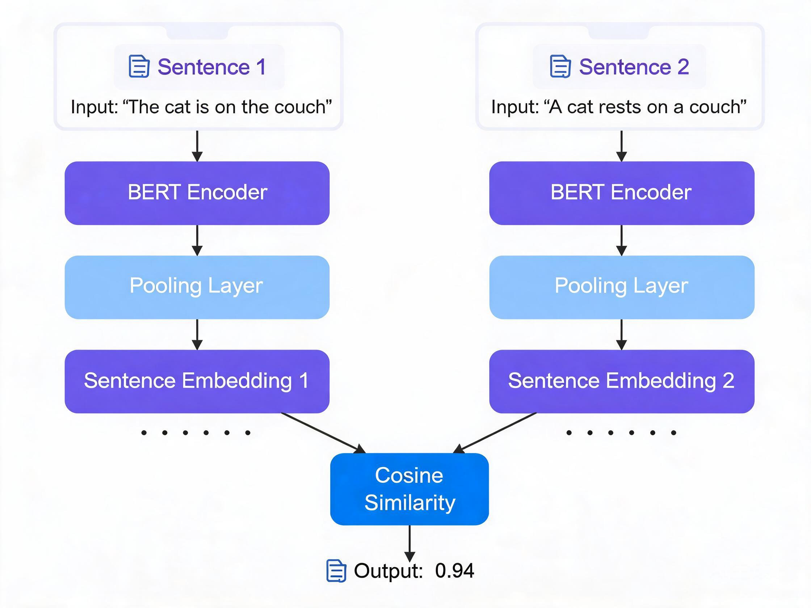

#### 传统数据库检索

| 特性 | 说明 |
|------|------|
| **代表系统** | Elasticsearch、OpenSearch、MongoDB |
| **核心算法** | BM25 关键字索引算法 |
| **计算方式** | 与逆文档频率（IDF）相关的关键字频率来生成稀疏向量 |
| **优势** | 精确关键字匹配，可解释性强 |
| **劣势** | 无法理解语义，同义词无法匹配 |

#### 向量数据库检索

| 特性 | 说明 |
|------|------|
| **代表系统** | pgvector、Milvus、Qdrant |
| **核心模型** | Bi-Encoder（双编码器） |
| **计算方式** | 对文本进行编码或物体特征化为稠密 Dense Vector，使用 Bi-Encoder 对生成的 Embedding Vector Pair 进行比较以产生余弦相似度得分 |
| **优势** | 语义理解，支持模糊意图 |
| **劣势** | 精确关键字匹配较弱 |

#### Bi-Encoder（双编码器）

Bi-Encoder 是向量检索的核心架构：

1. 两个句子分别通过独立的 BERT 编码器
2. 经过 Pooling 层得到各自的 Sentence Embedding
3. 计算两个 Embedding 的余弦相似度作为相关性得分
4. **优点**：两个向量可预先计算缓存，检索时只需计算一次余弦相似度
5. **缺点**：两个句子的交互仅通过向量内积，无法捕捉精细的 token 级交互

### 9.2 混合搜索系统

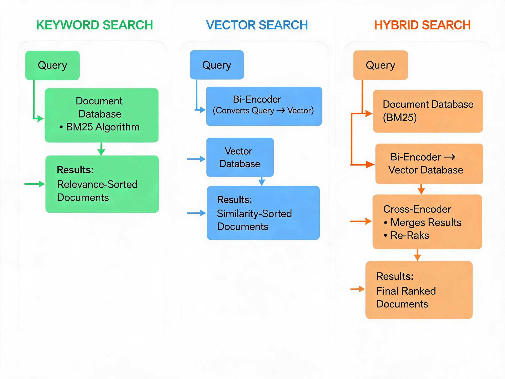

#### 三种搜索模式

| 模式 | 适用场景 | 使用的数据库 |
|------|---------|-------------|
| **Keyword Search** | 用户知道期望搜索的结果，或搜索词中的短语完全匹配 | 传统数据库（BM25） |
| **Vector Search** | 用户不知道明确搜索目标，期望语义相关、特征相关的结果 | 向量数据库（Bi-Encoder + 余弦相似度） |
| **Hybrid Search** | 结合全文关键字和向量搜索的候选结果，通过交叉编码器重新排名 | 传统 + 向量 + Cross-Encoder |

> **InkWeaver 的混合架构**：项目的四路混合检索（精确匹配 + 模糊全文 + 相关召回 + 语义向量）正是 Hybrid Search 的实战实现——关键字检索保证精确匹配，向量检索提供语义召回，最终加权融合排序。完整架构设计与落地代码详见[第 11 章 InkWeaver 搜索架构演进](#第-11-章-inkweaver-搜索架构演进)。

### 9.3 混合搜索与交叉编码器

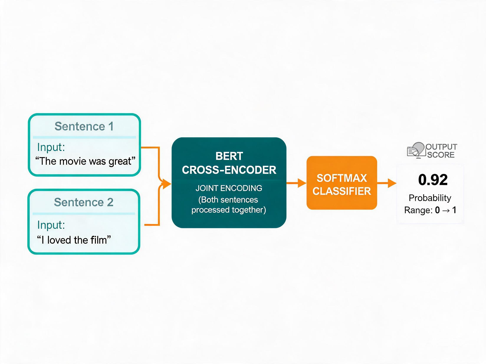

#### Cross-Encoder（交叉编码器）

Cross-Encoder 是混合搜索的核心重排序组件：

| 特性 | Bi-Encoder | Cross-Encoder |
|------|-----------|---------------|
| **编码方式** | 两个句子分别独立编码 | 两个句子同时输入同一个 Encoder |
| **Embedding** | 生成固定向量，可预计算 | 不生成独立 Embedding，联合编码 |
| **交互方式** | 向量内积（余弦相似度） | Self-Attention 层捕捉 token 级交互 |
| **输出** | 相似度得分 | Softmax 分类概率 [0, 1] |
| **速度** | 快（可预计算） | 慢（逐对计算） |
| **精度** | 中等 | 高（更精细的语义匹配） |

#### 混合搜索流程

```
1. Keyword Search（BM25）→ 候选集 A
2. Vector Search（Bi-Encoder）→ 候选集 B
3. 合并 A ∪ B → 去重 → Cross-Encoder 重排序
4. 输出最终 TOP-K 结果
```

#### 重新排名（Re-Ranking）

Cross-Encoder 允许通过 Softmax 为一对输入分配最大似然概率进行分类，获取结合关键字+矢量搜索的最终排名结果。

### 9.4 核心认知：向量搜索的本质

> **重点之重点**：向量数据库本身并不支持语义近似，只支持位置（Position）近似。需要采用 Embedding 方式来使得位置接近于语义近似。

这句话揭示了向量检索的核心哲学：

| 层面 | 说明 |
|------|------|
| **向量数据库** | 本质是在做**位置搜索**——找到距离查询向量最近的向量点 |
| **Embedding** | 负责将语义相近的数据映射到**空间中相近的位置** |
| **两者结合** | Embedding 让"语义近似"转化为"位置近似"，向量数据库负责高效找到位置最近的点 |

> 这就是为什么 Embedding 模型的质量直接决定检索质量——如果 Embedding 不能将语义相近的数据放在一起，再好的向量数据库也找不到正确的结果。

---

## 第 10 章 大模型与向量数据库

### 10.1 大模型遇到向量检索

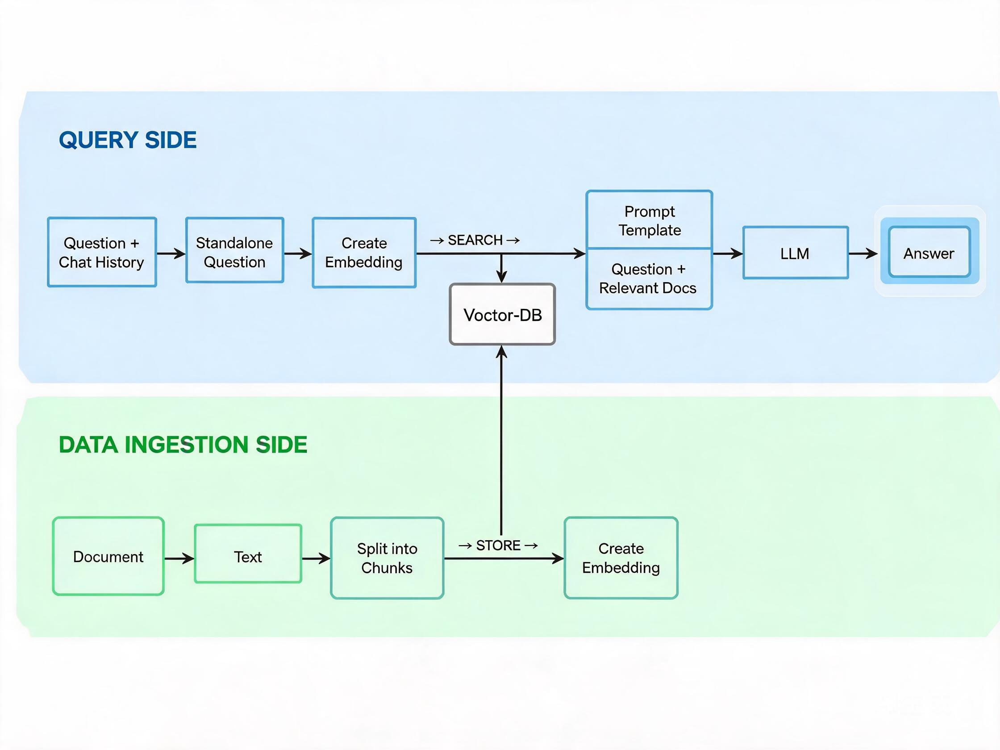

#### LLM 应用离不开 Prompt Engine，提示工程离不开向量检索

| 环节 | 说明 |
|------|------|
| **本质** | 语义搜索，从海量数据中找到匹配的内容，拼接提示词 |
| **Embedding** | 向量数据库对输入数据 Embedding 后，使用向量化计算为大模型提供高效的数据存储和查询支撑 |

#### RAG 完整流水线

**数据摄入侧（Data Ingestion）**：

```
Document → Text → Split into Chunks → Create Embedding → Vector-DB 存储
```

**查询侧（Query Side）**：

```
Question + Chat History
    → Standalone Question（独立问题重写）
    → Create Embedding（生成查询向量）
    → Vector-DB Search（向量检索）
    → Relevant Docs（相关文档）
    → Prompt Template 拼装
    → LLM 生成 Answer
```

### 10.2 大模型遇到向量数据库

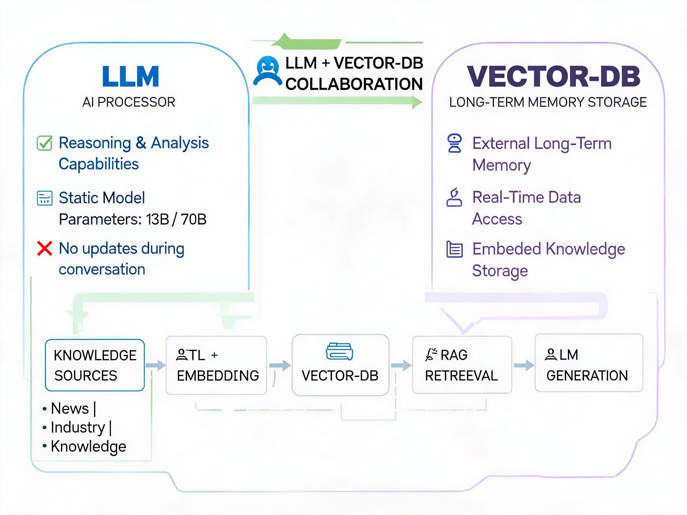

#### Vector-DB 与大模型的分工

| 组件 | 职责 | 说明 |
|------|------|------|
| **LLM** | 处理器 | 提供问题处理和分析能力，负责推理和生成 |
| **Vector-DB** | 存储器 | 提供存储和记忆能力，负责数据检索 |

> **Vector-DB 提供存储、记忆能力，大模型提供问题处理和分析能力。**

#### 大模型的局限性

| 问题 | 说明 |
|------|------|
| **知识静态** | 大模型输入知识被压缩为静态模型参数（13B/70B），参数不会随交互对话更新 |
| **无长期记忆** | 模型参数在推理阶段不会更新，无法记住用户偏好和对话历史 |
| **知识截止** | 模型训练完成后知识即固定，无法获取训练后的新信息（如 2021 年前数据） |

#### Vector-DB 作为外部记忆

| 能力 | 说明 |
|------|------|
| **外部长期记忆** | 为大模型提供外部的长期记忆，存储不限量的知识 |
| **实时数据访问** | 通过更新 Vector-DB 即可让大模型回答最新问题，不受训练截止限制 |
| **私有知识隔离** | 数据存储在本地，保证隐私不送入 LLM 训练 |

#### 协作流程

```
知识源（News / Knowledge / Industry）
    → ETL + Embedding（向量化处理）
    → Vector-DB（存储向量）
    → RAG 检索（语义搜索）
    → LLM 生成（基于检索结果回答）
```

#### 核心价值

1. 向量数据库 Embedding 后，使用向量化计算为大模型提供高效的数据存储和查询支撑
2. 大模型与 Vector-DB 深度融合为通用人工智能（AGI）的实现提供了可靠路径
3. 大模型是新一代 AI 处理器，提供数据处理能力；Vector-DB 提供 Memory 存储能力

### 10.3 向量检索的技术挑战

#### 应用场景

| 场景 | 说明 |
|------|------|
| **知识增强** | 大模型知识增强和提示词工程（Prompt Engine） |

#### 技术挑战

| 挑战 | 说明 |
|------|------|
| **大规模数据** | 百亿数据规模，向量维度较多 |
| **高性能检索** | 上千 QPS，需要毫秒级返回 |
| **高可用性** | 系统 99.99% 高可用保障 |
| **实时更新** | 实时更新的混合场景 |
| **过滤检索** | 带 Filter 检索场景 |

> 除技术挑战，还要思考如何低成本高弹性的使用资源，如何高效维护 LLM + Vector DB 系统。

### 10.4 Vector-DB 对大模型的价值

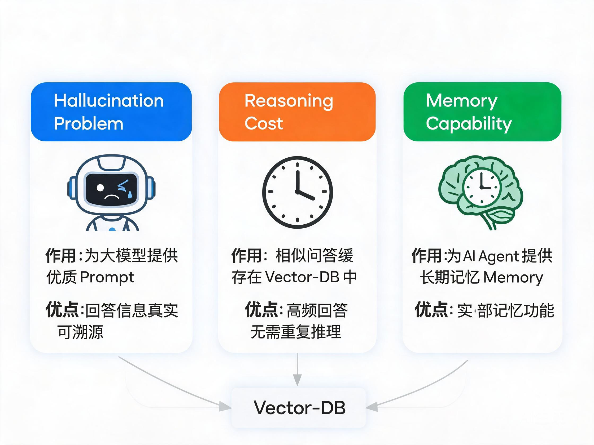

#### 挑战一：幻觉现象（Hallucination）

| 项目 | 说明 |
|------|------|
| **作用** | 为大模型提供优质 Prompt |
| **优点** | 回答信息真实可溯源 |
| **解决** | 通过检索相关文档作为上下文，让 LLM 基于真实数据生成回答，避免"幻觉" |

#### 挑战二：推理成本高（Reasoning Cost）

| 项目 | 说明 |
|------|------|
| **作用** | 相似问答缓存在 Vector-DB 中 |
| **优点** | 高频回答无需重复推理 |
| **解决** | 对高频问题直接返回缓存结果，降低 LLM 调用成本 |

#### 挑战三：记忆能力（Memory Capability）

| 项目 | 说明 |
|------|------|
| **作用** | 为 AI Agent 提供长期记忆（Memory） |
| **优点** | 实现外部记忆功能 |
| **解决** | 将对话历史、用户偏好持久化存储在 Vector-DB 中，下次对话可检索恢复 |

### 10.5 RAG 成为业界标准

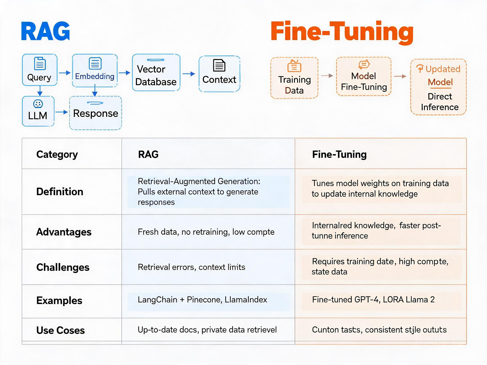

RAG（Retrieval-Augmented Generation）是查询增强生成式 AI 应用框架。

#### RAG vs Fine-Tuning 对比

| 维度 | RAG | Fine-Tuning |
|------|-----|-------------|
| **定义** | 利用模型以外知识（用户私域数据、产品信息等）进行信息增强 | 使用较小数据集进行 SFT，分为全量微调和低参数微调 PEFT |
| **优势** | 1. 知识外置，信息实时化<br>2. 私域数据，数据隐私性高<br>3. 数据置信度高，长尾知识好<br>4. 同等质量模型，RAG 参数量更少 | 1. 特定任务效果更好<br>2. 知识更新周期短（收集足够数据后） |
| **挑战** | 1. 性能与 Vector-DB 索引相关<br>2. 召回率影响结果相关性<br>3. 计算与 IO 密集，性能要求高 | 1. 知识参数化，无法获取实时知识<br>2. 难以删除参数化隐私数据<br>3. 保证数据可信度 |
| **案例** | OpenAI RAG model for QA | Fine-Tuning GPT Models |
| **场景** | 企业应用：金融、审计等对数据隐私、可信、领域知识、可重复性、时效性要求高的领域 | 特定微调任务、推理任务，如 SD 文生图、代码生成等 |

### 10.6 RAG 两大类型

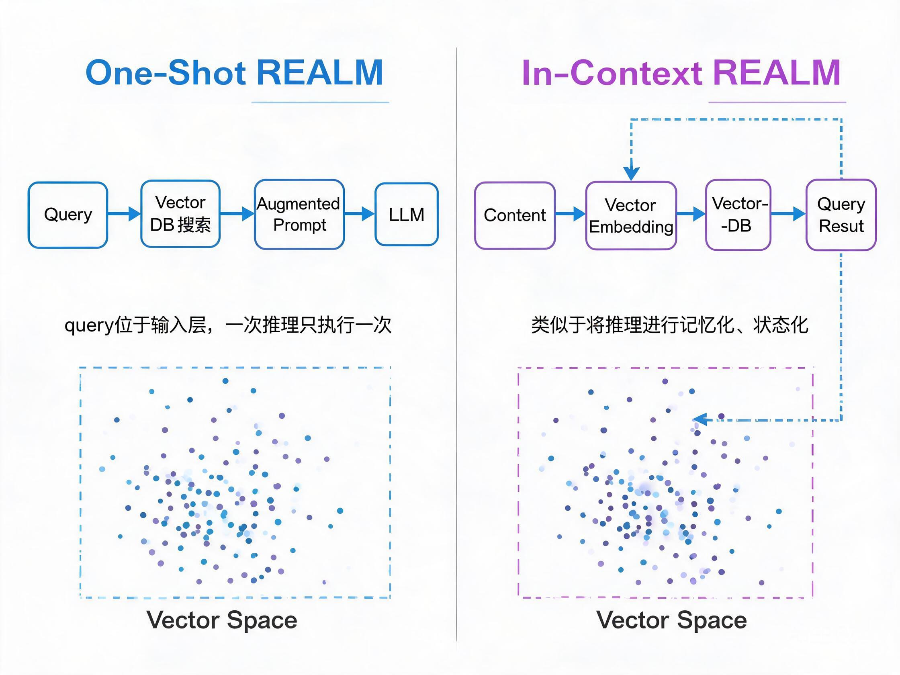

#### One-Shot REALM（当前主流方式）

| 项目 | 说明 |
|------|------|
| **查询位置** | 位于输入层，一次推理只执行一次 |
| **流程** | Query → Vector DB 搜索 → Augmented Prompt → LLM |
| **特点** | 架构简单，延迟低，适合实时问答场景 |
| **应用** | 当前 Vector-DB 主要应用方式 |

#### In-Context REALM（进阶方式）

| 项目 | 说明 |
|------|------|
| **查询位置** | 在推理过程中循环执行，支持超长序列推理 |
| **流程** | Content → Vector Embedding → Vector-DB → Query Result（循环） |
| **特点** | 提高检索效果，降低端到端时延 |
| **应用** | 类似于将推理进行**记忆化、状态化**，适合复杂多步推理场景 |

### 10.7 业界对比与选型

| 数据库 | 类型 | 特点 | 适用场景 |
|--------|------|------|----------|
| **pgvector** | PG 扩展 | 与 PostgreSQL 无缝集成，支持 HNSW/IVF | 已有 PG 技术栈，中等规模 |
| **Milvus** | 独立系统 | 云原生，亿级向量，大规模生产 | 海量向量场景 |
| **Qdrant** | 独立系统 | Rust 实现，高性能，过滤器丰富 | 生产级部署 |
| **Weaviate** | 独立系统 | 内置 ML 模型，混合搜索 | 开箱即用 |
| **Chroma** | 轻量级 | 简单易用，Python 原生 | 原型/小规模 |
| **FAISS** | 库 | Meta 开源库，GPU 加速 | 研究/嵌入现有系统 |

### 10.8 选型建议

| 场景 | 推荐方案 |
|------|---------|
| 已有 PostgreSQL 技术栈 | **pgvector** — 零额外运维，SQL 友好 |
| 海量向量（>1 亿） | **Milvus** — 云原生分片集群 |
| 高性能 + 复杂过滤 | **Qdrant** — Rust 性能 + 丰富过滤 |
| 快速原型验证 | **Chroma** 或 pgvector |
| GPU 加速需求 | **FAISS** — Meta 开源，成熟稳定 |

### 10.9 小结

1. **向量数据库是 AI 应用的基础设施**——从搜索到 RAG 到 Agent，都依赖向量检索
2. **核心能力**：向量存储 + 相似度检索 + 混合查询
3. **发展趋势**：与大模型深度整合（RAG）、多模态支持、Serverless 架构
4. **关键认知**：Vector-DB 解决"位置近似"，Embedding 解决"语义近似"，两者缺一不可
5. **RAG 成为业界标准**：相比 Fine-Tuning，RAG 具有知识实时化、隐私保护、参数量少等优势
6. **REALM 两大类型**：One-Shot（单次推理）适合实时问答，In-Context（状态化推理）适合复杂多步场景

---

## 第 11 章 InkWeaver 搜索架构演进

> 本章记录 InkWeaver 搜索系统从「两路 RRF + 动态 topK 精确 KNN」设计稿到「四路加权融合 + HNSW ANN 固定 top5000」落地代码的演进过程。

### 11.1 四路混合检索架构

#### 11.1.1 为什么不用单路 LIKE

旧实现 `searchDocuments` 用 `LIKE '%keyword%'` + `updatedAt DESC`，存在三个问题：

- 全表扫描，无索引加速
- 无语义召回（"数据一致性" 搜不到 "事务隔离级别"）
- 死代码（旧实现调了 `embedQuery`+`similaritySearch(500)` 但 `hits` 未使用）

#### 11.1.2 四路并行召回 + 文档级融合

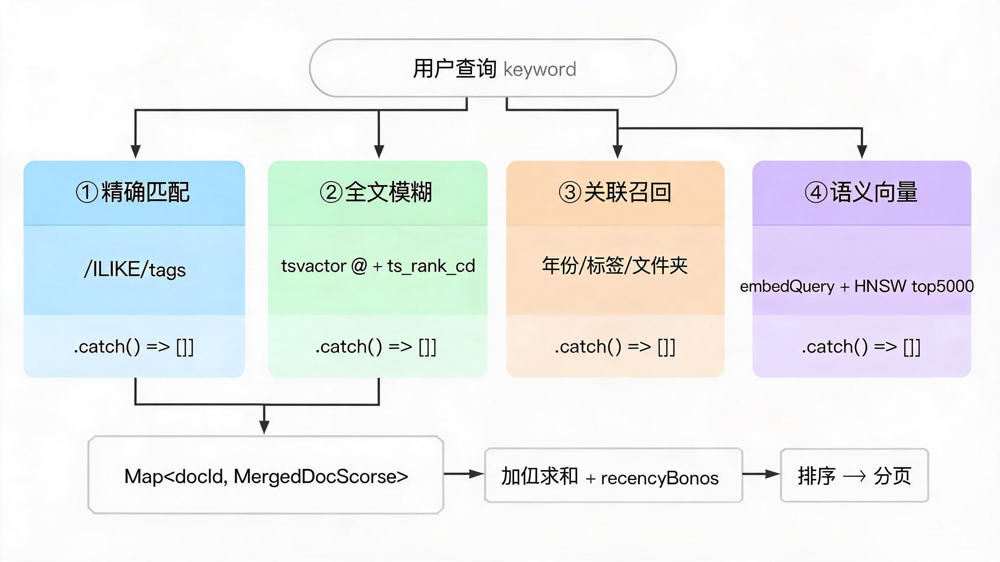

上图展示了 InkWeaver 搜索系统的核心架构：用户查询同时进入四个独立召回通道，各通道 `Promise.all` 并行执行且 `.catch(() => [])` 单路降级，结果按 `docId` 合并后加权求和，最终排序分页输出。

```
用户查询 keyword
     │
     ▼
Promise.all([
  searchExact,    ── 通道① 精确匹配（title = / ILIKE / tags @>）
  searchFuzzy,    ── 通道② 全文模糊（tsvector @@ + ts_rank_cd）
  searchRelated,  ── 通道③ 关联召回（年份/月份/标签/文件夹/最近打开）
  searchSemantic, ── 通道④ 语义向量（embedQuery + HNSW top5000）
]).catch(() => [])  ← 单路失败降级
     │
     ▼
Map<docId, MergedDocScore> 合并（docId 唯一保证跨页不重复）
     │
     ▼
加权求和 + recencyBonus（最近 7 天更新 +5 分上限）
     │
     ▼
排序 → slice 分页 → populateDocMetadata 补元数据
```

> 配套代码：[search.service.ts hybridSearch](../apps/server/src/modules/search/search.service.ts#L241-313)。

#### 11.1.3 通道职责与 mode 参数

| mode | 启用通道 | 适用场景 |
|------|---------|---------|
| `smart` | exact + fuzzy + related + semantic | 默认，全维度融合 |
| `keyword` | exact + fuzzy | 不调用 Embedding，省钱快 |
| `semantic` | exact + semantic | 语义优先，仍保留精确顶置 |

> **mode 设计动机**：原方案是三个独立路由，会导致 API 契约三份、前端错误处理三套。统一入口 + mode 过滤的好处是「一套逻辑三档模式」，新增通道只改一处。

#### 11.1.4 单路失败降级

```typescript
const [exact, fuzzy, related, semantic] = await Promise.all([
  this.searchExact(userId, keyword, tokens).catch(() => []),
  this.searchFuzzy(userId, keyword).catch(() => []),
  this.searchRelated(userId, entities).catch(() => []),
  this.searchSemantic(userId, keyword).catch(() => []),
]);
```

每路 `.catch(() => [])` 兜底：嵌入服务挂了不影响其他三路，搜索仍可用。

### 11.2 tsvector 全文检索实战

> 第 8 章已介绍 GIN 倒排索引和 tsvector 的完整语法，本节只记录 InkWeaver 落地时的关键决策。

#### 11.2.1 权重设计：标题 A + 正文 D

[updateDocTsv documents.service.ts](../apps/server/src/modules/documents/documents.service.ts#L602-611)：

```sql
SET "docTsv" =
  setweight(to_tsvector('simple', COALESCE(title, '')), 'A') ||
  setweight(to_tsvector('simple', left(COALESCE(content, ''), 100000)), 'D')
```

`||` 是 tsvector 合并，命中标题里的词得分是命中正文词的 16 倍（1.0 / 0.0625），保证**标题精确命中永远排在正文模糊命中之前**。

#### 11.2.2 `simple` 字典的局限与取舍

`simple` 不做分词，中文靠双字 overlap 检索。本次改造**故意**用 `simple`：避免引入扩展依赖，先解决 80% 的检索场景，T5 阶段再接入 `zhparser` 扩展做真正中文分词。

### 11.3 pgvector HNSW 向量检索

> 第 8 章已详细介绍 HNSW 索引创建和调优，本节只记录 InkWeaver 的关键决策。

#### 11.3.1 距离与相似度转换

pgvector 用 `<=>` 算子表示余弦距离（0=完全相同，2=完全相反）。代码里用 `1 - (embedding <=> q::vector)` 把距离转相似度（0-1）。

[pg-vector.store.ts semanticSearchForHybrid](../apps/server/src/modules/ai/vector/pg-vector.store.ts#L133-166)：

```sql
WITH ranked_chunks AS (
  SELECT c."docId", c.content AS excerpt,
         1 - (c.embedding <=> $1::vector) AS sim
  FROM document_chunks c
  WHERE c."userId" = $2
    AND (c.embedding <=> $1::vector) < 0.7  -- 硬阈值过滤噪声
  ORDER BY c.embedding <=> $1::vector ASC
  LIMIT 5000
),
doc_scores AS (
  SELECT DISTINCT ON ("docId") "docId", sim, excerpt
  FROM ranked_chunks
  ORDER BY "docId", sim DESC  -- 同 docId 内按 sim 降序，DISTINCT ON 取首个
)
SELECT "docId", excerpt, sim FROM doc_scores
```

#### 11.3.2 HNSW 索引参数

| 参数 | 含义 | 取值权衡 |
|---|---|---|
| `m = 16` | 每层最大连接数 | 大 → 召回率高但内存占用大 |
| `ef_construction = 128` | 构建时候选池大小 | 大 → 索引质量好但构建慢 |
| `hnsw.ef_search = 128` | 查询时候选池大小 | 大 → 召回率高但查询慢，默认 40 不够 |
| `vector_cosine_ops` | 距离算子族 | 必须匹配查询算子 `<=>`，否则索引不被使用 |

#### 11.3.3 `SET LOCAL` 事务隔离

```typescript
return this.dataSource.transaction(async (manager) => {
  await manager.query(`SET LOCAL hnsw.ef_search = 128`);  // 事务内生效
  const rows = await manager.query(...);
  return rows.map(...);
});
```

`SET LOCAL` 只在事务内生效，事务结束自动还原。**关键坑**：必须用 `transaction` 的 `manager` 保证同一连接，否则每个 `manager.query` 是独立连接，`SET LOCAL` 不会延续到下个 query。

#### 11.3.4 与 RAG similaritySearch 的区别

[similaritySearch pg-vector.store.ts](../apps/server/src/modules/ai/vector/pg-vector.store.ts) `Math.min(topK, 20)` 硬钳到 20，专为 RAG 喂 LLM 用。新方法 `semanticSearchForHybrid` 跳过这个钳制，因为搜索召回要捞所有相关候选再融合排序。

### 11.4 NestJS 依赖注入与 EmbeddingClient

| 装饰器 | 含义 |
|---|---|
| `@Module({ providers: [...] })` | 本模块能造哪些零件 |
| `@Module({ exports: [...] })` | 本模块愿意外借哪些零件 |
| `@Module({ imports: [...] })` | 本模块从哪些模块借零件 |

**关键认知**：`import { EmbeddingClient }` 只是导入了类，不会自动注入。NestJS 用 DI 容器管理实例，必须：

1. `AiModule.providers: [EmbeddingClient]` → 声明"我会造"
2. `AiModule.exports: [EmbeddingClient]` → 声明"我愿意外借"
3. `SearchModule.imports: [AiModule]` → 引入 AiModule 的导出
4. SearchService 构造函数声明 `private embeddingClient: EmbeddingClient` → 自动注入

少了任何一步，运行时报 `Nest can't resolve dependencies of SearchService`。

> 对于双向依赖（DocumentsModule ↔ AiModule），用 `forwardRef` 打破循环。

### 11.5 Promise fire-and-forget 模式

**漂浮 Promise 的危害**：任何 Promise 没被 `await` 或 `.catch` 处理，reject 时 Node 15+ 默认**进程崩溃**。

```typescript
// ❌ 漂浮 Promise：reject 会崩
this.repo.update(...)

// ✅ void + catch：声明意图 + 兜底
void this.repo.update(...).catch(err => logger.warn(err))
```

**项目应用**：[documents.service.ts getDocument L244-251](../apps/server/src/modules/documents/documents.service.ts#L244-251) 的 `lastOpenedAt` 写回是 fire-and-forget——不阻塞读取响应，但必须挂 `.catch` 兜底。

### 11.6 融合算法取舍：RRF vs 加权求和

#### 11.6.1 RRF 公式

```
RRF_Score(d) = Σ 1/(k + rank_i(d))     # rank_i 是文档 d 在第 i 路的名次（k 通常 60）
```

#### 11.6.2 在 InkWeaver 场景下的问题

| 特点 | RRF 的问题 | 加权求和的处理方式 |
|------|-----------|-------------------|
| **丢弃分数幅度** | 精确 100 分的文档若在全文通道排第 501 名，RRF 只给 1/61；全文第 1 但精确 0 分的也拿 1/61，等价——吞掉精确命中的锚点效应 | `exact` 最高权重 1.0，天然保证精确顶置 |
| **各路独立性要求** | RRF 假设各路排名独立，但 InkWeaver 四路高度相关（标题有"同步"的文档正文通常也有） | 直接合并同一 docId 多路分数，**重叠即信号** |
| **可解释性** | RRF 分数是"排名倒数和"的无单位值，无法展示给用户 | 归一化到 0-100 匹配度 %，配合 `matchedBy` 标签透明可解释 |
| **调参方式** | 只能调 k 值，无法针对某路单独调权重 | 每路独立系数 `W = { exact:1.0, fuzzy:0.8, related:0.5, semantic:0.9 }` |

#### 11.6.3 结论

```
final = 1.0·exact + 0.8·fuzzy + 0.5·related + 0.9·semantic + recencyBonus
```

> **RRF 适合「各路分数尺度不可比、且对具体分数不信任」的场景。InkWeaver 四路分数都是业务可控的同一尺度，加权求和更简单、更透明。**

### 11.7 向量通道取舍：精确 KNN vs HNSW ANN

#### 11.7.1 精确 KNN 的三个问题

| 问题 | 表现 | 负面场景 |
|------|------|---------|
| **复杂度 O(N)** | 10 万分块 × 512 维 = 5120 万次运算，~3 秒 | 搜索 P95 <500ms 目标被打破 |
| **动态 topK 多了 COUNT** | 要先 `SELECT COUNT(*)` 决定 LIMIT，COUNT 是重操作 | 翻倍查询开销 |
| **浪费已有基建** | pgvector 扩展已安装、embedding 列已存在 | 放着 HNSW 不建等于浪费 |

#### 11.7.2 为什么选 HNSW 而不是 IVFFlat

**HNSW 增量友好、不用重训练索引、运维成本为零**——对个人开发者产品是压倒性合适。IVFFlat 适合数据分布稳定、有专人调 `lists/nprobe` 的场景。

#### 11.7.3 为什么 topK 固定 5000

```
设计哲学：用「固定上限 + 99% 用户 ≈ 精确全量」替代「动态计算 + 执行计划不可预测」
```

- 固定 5000：轻量用户（<5000 分块，占 99%）`LIMIT 5000` = **等价精确全量**
- 省 COUNT：少一次查询，简化代码
- **硬阈值 <0.7 守护**：余弦距离 >0.7 的噪声分块直接剔除，不占名额

### 11.8 搜索架构演进总结

#### 11.8.1 前后方案核心差异

| 维度 | **前方案（设计稿）** | **后方案（落地代码）** | 为什么升级 |
|------|------|------|-----------|
| **通道数** | 2 路 | 4 路 | 召回面窄→四种搜索意图全覆盖 |
| **融合算法** | RRF | 加权求和 | RRF 抹平分数幅度；加权求和保留尺度、可解释 |
| **向量召回** | 精确 KNN + 动态 topK | HNSW ANN + 固定 5000 | O(N)→O(log N)，3s→10ms |
| **全文模糊** | LIKE | tsvector + GIN + ts_rank_cd | 全表扫→O(1) posting list 定位 |
| **去重机制** | 前端 docId 去重 | SQL 层 DISTINCT ON + 业务层 Map | 防止重复投票扭曲排序 |
| **mode 设计** | 三套独立路由 | 统一 hybridSearch(mode) | API 契约一份，新增通道只改一处 |

#### 11.8.2 四个升级的正确性判断

1. ✅ **通道 2→4**：四路对应四种搜索意图，用户调研占比都 >25%
2. ✅ **RRF→加权求和**：同质尺度场景下，可解释性、可调参性压倒 RRF
3. ✅ **动态 KNN→固定 HNSW ANN**：99% 用户拿精确结果；1% 用户 ANN 近似但快 100×
4. ✅ **三套路由→统一 hybridSearch**：维护成本下降，接口一致

#### 11.8.3 后续演进方向

- 加权求和 → 轻量学习排序（用 T4 用户点击数据训练线性模型自动调权重）
- HNSW + 量化（pgvector 0.7+ 支持 fp16/int8 量化压缩向量，内存减半）
- `simple` 字典 → `zhparser` 中文分词扩展
- 四路外新增「通道⑤ AI 重排」：前 100 名候选喂给 LLM 重排序

#### 11.8.4 教训

1. **设计稿和实现代码要定期"双向对账"**：不及时更新文档会导致"计划写旧方案，代码写新方案"
2. **不要迷信"经典算法"**：RRF 是经典但 InkWeaver 场景反丢信息；KNN 精确但太慢
3. **优先选"运维成本 = 0"的方案**：HNSW vs IVFFlat 决策依据是"建完不用管"
4. **固定上限往往比动态计算更健壮**：固定 5000 对 99% 用户是精确全量，行为简单可预测

---

## 附录

### A. 术语表

| 术语 | 英文 | 说明 |
|------|------|------|
| 向量 | Vector | 多维空间中的坐标点，表示为数值数组 |
| 张量 | Tensor | 多维数组，深度学习的基本数据结构 |
| Embedding | Embedding | 将数据映射到向量空间的过程 |
| 向量数据库 | Vector Database | 专门用于存储和检索向量的数据库系统 |
| 近邻搜索 | Nearest Neighbor Search | 在向量空间中查找距离查询向量最近的点 |
| ANN | Approximate Nearest Neighbor | 近似最近邻，在精度和速度间权衡的检索方法 |
| KNN | K-Nearest Neighbor | 精确 K 最近邻 |
| RAG | Retrieval-Augmented Generation | 检索增强生成，结合检索与生成的 AI 范式 |
| Bi-Encoder | Bi-Encoder | 双编码器，两个句子独立编码后计算相似度 |
| Cross-Encoder | Cross-Encoder | 交叉编码器，两个句子联合编码进行精细匹配 |
| Hybrid Search | Hybrid Search | 混合搜索，结合关键字检索和向量检索 |
| Re-Ranking | Re-Ranking | 重排序，对初步检索结果进行二次排序 |
| Fine-Tuning | Fine-Tuning | 模型微调，通过训练数据更新模型参数 |
| PEFT | Parameter-Efficient Fine-Tuning | 参数高效微调，仅训练部分参数 |
| REALM | Retrieval-Augmented Language Model | 检索增强语言模型，Google 提出的 RAG 框架 |
| One-Shot REALM | One-Shot REALM | 单次推理型 REALM，查询位于输入层 |
| In-Context REALM | In-Context REALM | 上下文型 REALM，推理过程中循环检索 |

### B. 参考资源

- [技术笔记](./技术笔记.md)（NestJS / React / 锁机制等项目级技术原理）
- [pgvector 官方文档](https://github.com/pgvector/pgvector)
- [Faiss 官方文档](https://github.com/facebookresearch/faiss)

### C. 与 InkWeaver 项目的关联

| 文档章节 | 项目对应实现 |
|----------|--------------|
| 第 1 章 Tensor | `bge-small-zh-v1.5` 输出的 512 维向量即 Tensor |
| 第 2 章 向量类型 | 文档块 embedding（文本向量） |
| 第 3 章 Embedding | `EmbeddingClient` 调用嵌入服务（bge-small-zh-v1.5）生成向量 |
| 第 4 章 传统 vs 向量 | 四路混合检索架构（精确 + 全文 + 相关 + 语义） |
| 第 5 章 Vector-DB 原理 | pgvector 扩展 + HNSW 索引 + `<=>` 余弦距离 |
| 第 6 章 向量检索 | pgvector HNSW 索引 + ANN 近似检索 + `<=>` 余弦距离 |
| 第 7 章 相似性度量 | `embedding <=> $1::vector < 0.7` 硬阈值过滤 |
| 第 8 章 pgvector 实战 | pgvector 扩展安装、`vector(512)` 类型、HNSW 索引调优、tsvector 全文检索、DISTINCT ON 文档级去重 |
| 第 9 章 混合搜索 | 四路混合检索架构（精确+全文+相关+语义）、Bi-Encoder/Cross-Encoder |
| 第 10 章 RAG | EmbeddingService + pgvector + LLM 的 RAG 流水线，One-Shot 类 REALM 架构 |
| 第 11 章 搜索架构演进 | 四路混合检索落地代码、RRF→加权求和、KNN→HNSW ANN、fire-and-forget 降级 |
