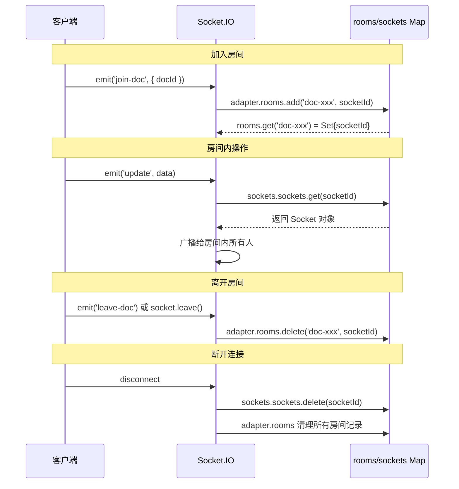

# 技术笔记：结合项目代码理解技术原理

本文件记录在 InkWeaver 项目开发过程中，通过阅读实际代码而深入理解的技术原理。每条笔记都关联项目中的具体文件和行号，方便后续查阅。

---

## 笔记 #1：NestJS 启动时序与 JWT 密钥校验

**日期**：2026-08-11
**触发场景**：修复 SRV-P1-05（JWT secret 回退硬编码值）时，发现 `assertStrongSecretsInProduction` 在 `JwtModule.register` 之后才执行，存在时序漏洞。

---

### 一、启动时序总览

```
Node.js 加载 main.ts
  │
  ├─ bootstrap() 被调用                              [main.ts:28]
  │     │
  │     ├─ await NestFactory.create(AppModule)       [main.ts:30]
  │     │     │
  │     │     │  ┌─ 阶段 1：模块初始化（同步阻塞）
  │     │     │  │
  │     │     │  │  NestJS 内部递归处理 AppModule.imports：
  │     │     │  │
  │     │     │  │  ┌─ ConfigModule.forRoot()          [app.module.ts:34]
  │     │     │  │  │   加载 .env，注册 ConfigService
  │     │     │  │  │
  │     │     │  │  ├─ BullModule.forRootAsync()       [app.module.ts:39]
  │     │     │  │  │   通过 ConfigService 解析 Redis 配置
  │     │     │  │  │
  │     │     │  │  ├─ TypeOrmModule.forRootAsync()    [app.module.ts:47]
  │     │     │  │  │   通过 ConfigService 解析数据库配置
  │     │     │  │  │
  │     │     │  │  ├─ UsersModule                    [app.module.ts:52]
  │     │     │  │  │   内部 import JwtModule.register()
  │     │     │  │  │   → getJwtModuleOptions() 立即执行
  │     │     │  │  │     [users.module.ts:48]
  │     │     │  │  │
  │     │     │  │  ├─ AuthModule                     [app.module.ts:52]
  │     │     │  │  │   内部 import JwtModule.registerAsync()
  │     │     │  │  │   → getJwtModuleOptions() DI 解析时执行
  │     │     │  │  │     [auth.module.ts:28-31]
  │     │     │  │  │
  │     │     │  │  ├─ DocumentsModule → JwtModule.register()
  │     │     │  │  ├─ AiModule → JwtModule.register()
  │     │     │  │  ├─ StorageModule → JwtModule.register()
  │     │     │  │  ├─ SearchModule
  │     │     │  │  ├─ NotificationsModule
  │     │     │  │  ├─ MailModule
  │     │     │  │  └─ SyncModule → JwtModule.register()
  │     │     │  │
  │     │     │  │  所有 providers 注册、DI 容器解析完成
  │     │     │  │  触发 OnModuleInit → OnApplicationBootstrap 钩子
  │     │     │  │
  │     │     │  └─ NestFactory.create() resolve
  │     │     │
  │     ├─ 阶段 2：全局增强注册（await 返回后）
  │     │     ├─ app.useGlobalFilters(...)            [main.ts:44]
  │     │     ├─ app.useGlobalPipes(...)              [main.ts:92]
  │     │     ├─ assertStrongSecretsInProduction()    [main.ts:101]
  │     │     ├─ app.listen(port)                     [main.ts:103]
  │     │     └─ logger.info("server started")
  │     │
  └─ bootstrap() 返回
```

**核心要点**：`NestFactory.create()` 是同步阻塞的——它 resolve 之前，`main.ts` 后续代码一行都不会执行。任何在模块初始化阶段的 `throw` 都会导致 bootstrap 失败。

---

### 二、模块注册方式详解

#### 三种 import 形式

| 形式 | 用途 | 执行时机 | 本项目示例 |
|------|------|---------|-----------|
| `forRoot()` / `forRootAsync()` | 全局配置，全应用只初始化一次 | 装饰器求值时 | `ConfigModule.forRoot()`、`BullModule.forRootAsync()`、`TypeOrmModule.forRootAsync()` |
| `register()` / `registerAsync()` | 局部配置，每个模块独立初始化一份 | `register`: 装饰器求值时<br>`registerAsync`: DI 解析时 | `JwtModule.register()` 在 4 个模块里各调 1 次 |
| 直接引用 Module 类 | 复用已初始化的实例，不重复创建 | 不触发初始化 | `DocumentsModule` import `AuthModule`、`HealthModule` import `ConfigModule` |

#### `register()` vs `registerAsync()` 关键区别

| | `register(options)` | `registerAsync({ useFactory, inject })` |
|---|---|---|
| **调用时机** | 装饰器求值时（极早） | DI 容器解析时（所有模块初始化之后） |
| **ConfigService 可用性** | ❌ 不可用，只能读 `process.env` | ✅ 可用，通过 `inject` 注入 |
| **本项目示例** | `users.module.ts:48`、`sync.module.ts:35` | `auth.module.ts:28-31` |

```typescript
// users.module.ts:48 — 装饰器求值时立即调用，ConfigService 不可用
JwtModule.register(getJwtModuleOptions())

// auth.module.ts:28-31 — DI 解析时才调用，ConfigService 可用
JwtModule.registerAsync({
  imports: [ConfigModule],
  useFactory: (configService: ConfigService) => getJwtModuleOptions(configService),
  inject: [ConfigService],
})
```

#### 功能模块 vs 基础设施模块

| 类型 | 示例 | 需要 forRoot/register？ | 原因 |
|------|------|------------------------|------|
| **基础设施模块** | ConfigModule、TypeOrmModule、JwtModule、BullModule | ✅ 需要 | 需要外部配置（密钥、连接串）才能工作 |
| **功能模块** | UsersModule、DocumentsModule、HealthModule | ❌ 不需要 | 自身已包含完整 controllers/providers，配置通过 DI 从其他模块获得 |

#### 直接引用的"复用"机制

当多个模块 import 同一个模块类（如 UsersModule 和 DocumentsModule 都 import AuthModule），NestJS 只初始化一次，第二次引用直接返回已创建的实例。这是 NestJS 模块单例的基础。

---

### 三、生命周期钩子 vs 请求管线

#### 生命周期钩子：管应用生死

```
1. constructor()              ← Provider 实例创建
2. onModuleInit()             ← 所有 Provider 注册完成
3. onApplicationBootstrap()   ← 应用已就绪
4. onApplicationShutdown()    ← 收到 SIGTERM/SIGINT
```

- 触发时机：应用启动/关闭时各触发一次
- 适用场景：数据库预热、连接第三方服务、注册定时任务、释放资源
- 本项目：未实现任何钩子

#### 请求管线：管每次请求流转

```
HTTP 请求到达
  │
  ├─ ① 全局中间件（app.use）          [main.ts:39-40]
  │     bodyParser.json()、/uploads 静态文件
  │
  ├─ ② 全局守卫 → 控制器守卫          本项目：AuthGuard [auth.guard.ts]
  │     全局先于控制器，返回 true 才继续
  │
  ├─ ③ 全局拦截器(before) → 控制器 → 路由  本项目未配置
  │     before 阶段：外→内
  │
  ├─ ④ 全局管道 → 控制器 → 路由       [main.ts:92-98]
  │     ValidationPipe 处理 @Body/@Param 参数
  │
  ├─ ⑤ 路由处理器执行
  │
  ├─ ⑥ 路由拦截器(after) → 控制器 → 全局
  │     after 阶段：内→外（洋葱模型）
  │
  ├─ ⑦ 全局过滤器 → 控制器 → 路由     [main.ts:44-79]
  │     内→外执行，全局过滤器是最后一道防线
  │
  └─ HTTP 响应返回
```

**两者关系**：生命周期钩子管**应用的生死**，请求管线管**请求的流转**。

---

### 四、main.ts vs app.module.ts

| | main.ts | app.module.ts |
|---|---|---|
| **角色** | 代码入口（Node.js 从这里开始执行） | 配置入口（声明应用需要哪些模块） |
| **类比** | `main()` 函数 | `application.conf` |
| **做什么** | 调用 `NestFactory.create()` → 注册全局增强 → `app.listen()` | 声明 imports、controllers、providers 的依赖关系 |
| **何时执行** | 最开始，Node.js 加载后立即执行 | 在 `NestFactory.create()` **内部**被解析 |

没有 main.ts，AppModule 不会自己启动——它只是一个带 `@Module` 装饰器的类。

---

### 五、ConfigService 深度理解

#### `app.get(ConfigService)` vs `new ConfigService()`

| | `app.get(ConfigService)` | `new ConfigService()` |
|---|---|---|
| 创建时机 | NestJS DI 容器内部创建 | 手动创建 |
| 单例 | ✅ 所有模块共享 | ❌ 每次 `new` 创建独立实例 |
| 数据来源 | 从 `ConfigModule.forRoot()` 加载的 `.env` 读取 | 从 `process.env` 直接读取 |
| 与 DI 容器关系 | 是 DI 容器的一部分 | 完全独立，不被 DI 容器识别 |

#### `assertStrongSecretsInProduction` 现在的定位

当前 `getJwtModuleOptions()` 已在密钥缺失时直接 `throw`，`assertStrongSecretsInProduction` 中 JWT_SECRET 相关的弱密钥检查已冗余。但该函数仍可用于检查其他配置（DB、Redis 等），保留做整体健康检查。

#### 为什么不把 assert 提前到 `create` 之前

理论上可以用 `ConfigModule.load()` 提前加载配置并校验，但会：
1. 让启动流程更复杂
2. 破坏 NestJS 的封装原则（绕过模块系统直接读 `process.env`）
3. 当前方案（消费点 throw）不依赖任何执行顺序，更健壮

---

### 六、Q&A 合集

**Q：`bootstrap()` 由谁调用？**
由 Node.js 执行。`main.ts:108` 的 `bootstrap().catch(...)` 是普通函数调用。NestJS 是被调用的库，不控制调用时机。

**Q：每个 Module 都会调用 `bootstrap()` 吗？**
不会。`bootstrap()` 只在 `main.ts` 里被调用一次，是应用入口。

**Q：嵌套 import 会怎样？再走一遍？**
不会。NestJS 深度优先遍历模块图，每个模块只初始化一次。如 `AppModule → DocumentsModule → AuthModule` 的顺序：AuthModule 先完成 → DocumentsModule 完成 → AppModule 继续。循环依赖用 `forwardRef(() => ...)` 打破（项目中 `DocumentsModule ↔ AiModule` 就用了）。

**Q：`registerAsync` 能让 assert 在 getJwtModuleOptions 之前执行吗？**
不能。`registerAsync` 只是把 `getJwtModuleOptions` 从装饰器求值推迟到 DI 解析，但两者都仍在 `NestFactory.create()` 内部，都在 `assertStrongSecretsInProduction` 之前。要让 assert 先执行，必须在 `NestFactory.create()` 之前校验，但这会破坏封装。

---

### 教训

1. **安全校验必须在密钥被使用之前执行**：`assertStrongSecretsInProduction` 在密钥被使用之后才检查，属于"事后检查"模式。应在密钥消费点直接阻断（当前 `getJwtModuleOptions` throw 方案）
2. **`register()` vs `registerAsync()` 的选择**：需要依赖注入时必须用 `registerAsync()`，否则只能在装饰器阶段拿到静态值
3. **`NestFactory.create()` 是同步阻塞的**：它 resolve 之前，`main.ts` 中后续代码都不会执行。任何在模块初始化阶段的 throw 都会导致 bootstrap 失败
4. **装饰器求值时机**：`@Module({...})` 里的 `imports` 数组中，静态方法（如 `forRoot()`、`register()`）会在装饰器被求值时**立即执行**
5. **功能模块不需要 forRoot/register**：它们的配置通过依赖注入从其他模块获得，不需要外部传配置
6. **单例不等于只初始化一次**：`forRoot()` 全应用只初始化一次；`register()` 每个模块独立初始化一份；直接引用复用已有实例

---

## 笔记 #2：TOCTOU 竞态与数据库锁机制

**日期**：2026-08-12
**触发场景**：修复 SRV-P1-06（sync push TOCTOU 竞态）时，深入理解协作编辑场景下的并发控制策略。

---

### 一、问题本质：什么是 TOCTOU？

TOCTOU（**Time-of-Check to Time-of-Use**）是一种经典的并发漏洞类型：

```
检查资源状态 (Check) → [时间窗口，状态可能被其他操作修改] → 使用资源 (Use)
```

在这段时间窗口内，资源状态被其他并发操作修改，导致之前的检查结论失效。

#### 在 Sync Push 场景的具体表现

Yjs 同步机制回顾：
- 客户端每次发送更新（Update）时，附带 `baseUpdateId`（表示"基于服务端第 N 个版本做的修改"）
- 服务端检查逻辑：`serverLatestUpdateId > baseUpdateId` → 返回 **409 Conflict** 让客户端先同步

竞态发生条件：
1. Client A（base=5）和 Client B（base=5）**同时**发送更新
2. 两个请求几乎同时执行 `SELECT MAX(updateId)`，都读到 `latest = 5`
3. 两个请求都判断：`5 > 5`? **NO** → 都认为"无冲突"
4. 两个请求都执行 INSERT，生成 ID 6 和 7

后果：
- Client B 基于版本 5 的更新，实际上与 Client A 的更新是**并发冲突**
- 但服务端错误接受了两者，没有返回 409
- Yjs CRDT 虽然能合并并发更新，但 **baseUpdateId 的乐观锁契约被破坏**

---

### 二、时序图：竞态如何发生

#### 修复前（TOCTOU 竞态）

```
时间 →
────────────────────────────────────────────────────────────────
Client A (baseId=5)    Server DB          Client B (baseId=5)
────────────────────────────────────────────────────────────────
① 查询 latestId ──────► 返回 5
                                            ② 查询 latestId ──────► 返回 5
③ 检查: 5 > 5? NO ✓
                                            ④ 检查: 5 > 5? NO ✓
⑤ 保存更新 → ID: 6
                                            ⑥ 保存更新 → ID: 7
                                            
←─────────── 两个请求都通过了冲突检测！───────────
```

#### 修复后（事务 + 悲观锁）

```
时间 →
────────────────────────────────────────────────────────────────
Client A (baseId=5)    Server DB          Client B (baseId=5)
────────────────────────────────────────────────────────────────
① 开启事务
② SELECT ... FOR UPDATE ──► 获取锁
                                            等待锁释放 ⏳
③ 查询 latestId = 5
④ 检查: 5 > 5? NO ✓
⑤ 保存 → ID: 6
⑥ 提交事务，释放锁
                                            🔒 获取锁成功
                                            ⑦ 查询 latestId = 6
                                            ⑧ 检查: 6 > 5? YES ❌
                                            ⑨ 回滚，返回 409 Conflict
```

**关键**：`SELECT ... FOR UPDATE` 让 B 在 A 提交后才能读取数据，此时 latestId 已变为 6，正确检测到冲突。

---

### 三、解决方案对比

| 方案 | 原理 | 优点 | 缺点 | 适用场景 |
|------|------|------|------|---------|
| **悲观锁** | 先加锁再操作，串行化执行 | 简单直接，保证强一致性 | 锁竞争，可能阻塞 | 写多、冲突率高（协作编辑） |
| **乐观锁** | 假设无冲突，冲突时回滚重试 | 无锁，高并发性能好 | 需重试逻辑，实现复杂 | 写少、冲突率低（用户资料） |
| **唯一约束 + 重试** | 利用 DB 唯一键约束保证原子性 | 无需显式锁 | 需处理唯一键冲突异常 | 可区分业务冲突的场景 |

#### 为什么选择悲观锁？

**协作编辑场景特点**：
- 高频写操作（每个按键都是一次更新）
- 中等冲突率（多人同时编辑同一文档）
- 需要强一致性（不能丢失任何更新）

在这种场景下：
1. 悲观锁的开销（~5ms/次）远低于乐观锁的重试成本
2. 文档级粒度锁，不同文档完全并行，不影响吞吐量
3. 实现简单，逻辑清晰，易于维护

---

### 四、关键代码实现

#### DataSource 注入

```typescript
// sync.controller.ts
import { Repository, DataSource, EntityManager } from 'typeorm';

@Controller('sync')
export class SyncController {
  constructor(
    @InjectRepository(SyncUpdate)
    private syncUpdateRepository: Repository<SyncUpdate>,
    // ... 其他依赖
    private readonly dataSource: DataSource,  // ← 新增注入
  ) {}
}
```

#### 事务化改造

```typescript
@Post('/push')
async push(@Body() dto: PushDto, @Request() req: ExpressRequest) {
  const { docId, updates, clientId, baseUpdateId } = dto;
  const userId = getUserId(req.user);

  await this.documentsService.assertDocumentActive(docId, userId);
  assertValidSyncUpdates(updates);

  // 🔑 关键：事务包裹
  const { savedUpdates, latestSavedUpdate } = await this.dataSource.transaction(
    async (manager: EntityManager) => {
      // ① 加锁 + 查询最新更新 ID
      const latestUpdate = await manager.findOne(SyncUpdate, {
        where: { docId },
        order: { updateId: 'DESC' },
        select: ['updateId'],
        lock: { mode: 'pessimistic_write' },  // ← SELECT ... FOR UPDATE
      });

      const serverLatestUpdateId = latestUpdate?.updateId || 0;

      // ② 冲突检测
      if (baseUpdateId !== undefined && serverLatestUpdateId > baseUpdateId) {
        throw new HttpException(
          { docId, latestUpdateId: serverLatestUpdateId, message: 'Client is behind server version' },
          HttpStatus.CONFLICT,
        );
      }

      // ③ 保存所有更新
      const savedUpdates: SyncUpdate[] = [];
      for (const update of updates) {
        const syncUpdate = manager.create(SyncUpdate, {
          docId,
          update,
          timestamp: Date.now(),
          clientId,
        });
        const saved = await manager.save(syncUpdate);
        savedUpdates.push(saved);
      }

      return {
        savedUpdates,
        latestSavedUpdate: savedUpdates[savedUpdates.length - 1]?.updateId || serverLatestUpdateId,
      };
    },
  );

  // ④ 副作用在事务外执行（避免长事务）
  this.syncGateway.broadcastDocUpdates(docId, updates, updateIds, clientId);
  this.storageUsageService.scheduleRecalculateByDocId(docId);
  this.snapshotService.scheduleSnapshot(docId);

  return { success: true, updateIds, latestUpdateId: latestSavedUpdate };
}
```

#### `lock: 'pessimistic_write'` 做了什么？

TypeORM 会将其转换为 SQL：
```sql
SELECT "updateId" 
FROM "sync_update" 
WHERE "docId" = $1 
ORDER BY "updateId" DESC 
LIMIT 1 
FOR UPDATE  -- 🔒 排他锁，其他事务无法读取/修改这行
```

锁会在 `COMMIT` 或 `ROLLBACK` 时释放。

---

### 五、性能分析：会成为瓶颈吗？

#### 核心结论：在绝大多数协作场景下不会

**阻塞粒度**：文档级（不同文档完全并行）
**事务耗时**：仅 5-10ms（1次 SELECT + 1次 INSERT）

#### 吞吐量估算

| 同时编辑同一文档的人数 | 最后一人的等待时间 | 用户感知 |
|---|---|---|
| 5 人 | ~50ms | **完全无感知** |
| 20 人 | ~200ms | 轻微延迟，可接受 |
| 50 人 | ~500ms | 明显卡顿 |
| 100 人 | ~1000ms | 严重阻塞 |

**实际场景**：5 人同时编辑一个文档已是高频协作，百人同时编辑属于极端活动场景。

#### 为什么副作用在事务外？

```typescript
// 这些操作不参与原子性，放在事务外
syncGateway.broadcastDocUpdates(...);     // WebSocket 广播
storageUsageService.scheduleRecalculate...();  // 存储统计
snapshotService.scheduleSnapshot(...);    // 快照生成
```

**原因**：
1. 广播涉及 WebSocket I/O，可能耗时
2. 快照、存储统计是异步调度，不需要事务保护
3. 长事务占用数据库连接和锁资源，降低并发能力
4. 数据持久化（INSERT）成功后，后续操作失败不影响数据一致性

---

### 六、扩展知识：TypeORM 锁类型

| 锁类型 | SQL 语句 | 行为 |
|--------|---------|------|
| `read` | `LOCK IN SHARE MODE` | 共享锁，允许其他事务读取 |
| `pessimistic_write` | `FOR UPDATE` | 排他锁，阻止其他事务读取/修改 |
| `no_key_update` | `FOR NO KEY UPDATE` | 不阻塞其他事务的 `FOR KEY SHARE` |
| `pessimistic_partial_write` | `FOR SHARE` (PostgreSQL) | 部分排他锁 |

**选择依据**：
- 只需要"读-判-写"原子性 → `pessimistic_write`
- 多个事务可以同时读取，需要防止并发修改 → `read`（共享锁）

---

### 教训

1. **"读-判-写"模式必须原子化**：任何涉及"读取状态 → 检查条件 → 执行操作"的逻辑，如果三个步骤不在同一事务中，就存在 TOCTOU 风险
2. **锁的粒度决定性能**：文档级锁（非全局锁）是协作编辑的关键设计——不同文档的编辑请求完全并行
3. **副作用与事务分离**：耗时操作（广播、缓存、快照）应在事务提交后执行，避免长事务
4. **Yjs CRDT ≠ 业务层无需锁**：CRDT 解决了数据合并问题，但业务层的冲突检测（baseUpdateId）仍需要数据库锁保证原子性
5. **悲观锁在高并发写场景下反而更优**：乐观锁在冲突率高时需要大量重试，反而比直接加锁等待更慢

---

## 笔记 #3：Socket.IO 房间管理与权限回收

**日期**：2026-08-13
**触发场景**：修复文档删除后 WebSocket 房间权限回收问题时，深入理解 Socket.IO 的内部架构和房间管理机制。

---

### 一、Socket.IO 核心架构

```
Socket.IO Server (this.server)
  │
  ├── namespaces (命名空间)
  │   └── /sync (项目的文档同步命名空间)
  │       │
  │       ├── adapter (适配器)
  │       │   └── rooms: Map<string, Set<string>>
  │       │       └── Map<roomName, Set<socketId>>
  │       │           key: "doc-xxx"
  │       │           value: Set { "socket-aaa", "socket-bbb" }
  │       │
  │       └── sockets (活跃客户端)
  │           └── sockets: Map<string, Socket>
  │               └── Map<socketId, Socket>
  │                   key: "socket-aaa"
  │                   value: Socket 对象
  │
  └── 其他内置对象...
```

### 二、两个关键 Map 的区别

| Map | 结构 | 用途 | 清理时机 |
|-----|------|------|----------|
| `adapter.rooms` | `Map<roomName, Set<socketId>>` | 记录房间包含的 socket ID | socket 加入/离开房间时更新 |
| `sockets.sockets` | `Map<socketId, Socket>` | 记录当前活跃的 Socket 对象 | socket 断开连接时删除 |

**为什么要分两层？**
- 房间成员用 ID 存储（轻量），Socket 对象可能已断开
- 活跃 socket 用对象存储（重量级），只包含当前在线的客户端

### 三、房间操作的两种方式

#### 方式 1：底层 API（手动遍历）

```typescript
async evictFromDocRoom(docId: string): Promise<void> {
  if (!this.server) return;
  const roomName = `doc-${docId}`;
  
  // Step 1: 从 rooms Map 获取 socket ID 集合
  const room = this.server.sockets.adapter.rooms.get(roomName);
  if (!room || room.size === 0) return;
  
  // Step 2: 遍历每个 socket ID，从 sockets Map 获取活跃 Socket
  const socketIds = Array.from(room);
  for (const socketId of socketIds) {
    const socket = this.server.sockets.sockets.get(socketId);
    if (socket) {
      socket.leave(roomName);
    }
  }
}
```

**优点**：逻辑清晰，可扩展性强（可在遍历时加过滤条件）
**缺点**：代码较长

#### 方式 2：高级 API（fetchSockets）

```typescript
async evictFromDocRoom(docId: string): Promise<void> {
  if (!this.server) return;
  const roomName = `doc-${docId}`;
  
  // 一行获取房间内所有活跃 socket
  const sockets = await this.server.in(roomName).fetchSockets();
  
  for (const socket of sockets) {
    socket.leave(roomName);
  }
}
```

**`fetchSockets()` 内部实现**（简化）：
```typescript
async fetchSockets() {
  const ids = Array.from(this.adapter.rooms.get(this.roomName) ?? new Set());
  const result = [];
  for (const id of ids) {
    const socket = this.sockets.sockets.get(id);
    if (socket) result.push(socket);  // 自动过滤已断开的
  }
  return result;
}
```

**优点**：代码简洁
**缺点**：需要 `await`（异步 IO），不方便在不需要 Promise 的场景使用

### 四、Socket.IO 房间生命周期



### 五、权限回收的最佳实践

#### 当前实现（权限回收方案）

```typescript
// sync.gateway.ts — 踢出方法
evictFromDocRoom(docId: string): void {
  // 底层 API 实现
}

// documents.service.ts — 删除时调用
async softDeleteDocument(docId: string, userId: string): Promise<void> {
  const document = await this.getDocument(docId, userId);
  await this.applySoftDelete(document);
  this.storageUsageService.scheduleRecalculate(userId);
  // 主动踢出房间
  this.syncGateway.evictFromDocRoom(docId);
}
```

#### 调用时机

| 操作 | 调用位置 | 说明 |
|------|----------|------|
| 软删单个文档 | `softDeleteDocument` | 用户删除文档 |
| 批量删除文件夹 | `softDeleteDocumentsInFolder` | 清空文件夹 |
| 永久删除 | `hardDeleteDocument` | 回收站清理 |

### 六、性能考量

**遍历成本**：`evictFromDocRoom` 遍历房间内所有 socket，复杂度 O(n)。对于文档协作场景（通常 < 20 人/文档），耗时可忽略不计。

**异步 vs 同步**：当前实现用同步方式（无 `await`），`fetchSockets()` 需要异步。同步方式在不需要等待结果的场景下更简洁。

**大规模场景**：如果单个文档可能有上千并发用户，建议改用 Redis Adapter + 异步批量操作。

---

## 笔记 #4：Token 双重哈希验证模式（SHA-256 快筛 + bcrypt 慢验）

**日期**：2026-08-14
**触发场景**：修复 Refresh Token 验证性能问题（全量 bcrypt 扫描）时，设计并实现了"快筛 + 慢验"的双重哈希验证方案。

---

### 一、问题背景

`validateRefreshToken` 在验证 refresh token 时，会拉取该用户全部活跃会话，逐条执行 `bcrypt.compare`。bcrypt 设计为慢哈希（~100ms/次），当用户有大量会话时（如多设备登录或被恶意灌入），单次 token 刷新可能需要数十秒甚至超时。

### 二、双重哈希策略

```
用户提交 refreshToken
    │
    ├── Step 1: SHA-256 快筛（索引查询）
    │     │
    │     │  createHash('sha256').update(refreshToken).digest('hex')
    │     │
    │     │  SELECT * FROM sessions
    │     │  WHERE userId = ? AND refreshTokenLookup = ?  -- O(1) 索引命中
    │     │
    │     └── 命中记录数通常为 1 条（极少可能碰撞）
    │
    └── Step 2: bcrypt 慢验（安全校验）
          │
          │  bcrypt.compare(refreshToken, candidate.refreshTokenHash)
          │
          └── 仅对命中行执行 1 次 bcrypt，确保密码学安全
```

### 三、两种哈希的角色分工

| 维度 | SHA-256（快筛） | bcrypt（慢验） |
|------|-----------------|----------------|
| **设计目标** | 快速、确定的摘要计算 | 抗暴力破解的慢哈希 |
| **耗时** | < 1ms | ~100ms（cost=10） |
| **输出确定性** | 相同输入 → 相同输出 | 相同输入 → 不同输出（随机盐） |
| **存储用途** | 数据库索引列 `refreshTokenLookup` | 安全存储列 `refreshTokenHash` |
| **角色** | 门卫点名（名单核对） | 安检员当面验身 |
| **安全性** | 不可逆但易碰撞（空间有限） | 加盐、慢计算、抗彩虹表 |

### 四、兼容性设计

历史数据迁移策略：

1. **`refreshTokenLookup` 设为 nullable**：旧会话记录没有 lookup 值，不阻塞。
2. **回退逻辑**：当 SHA-256 索引查不到时，回退全量扫描 `refreshTokenLookup IS NULL` 的旧记录。
3. **自动回填**：旧会话首次验证成功后，将 SHA-256 哈希写回 `refreshTokenLookup`，后续验证即可走索引。

```typescript
// 回退：查找 lookup 为空的历史会话
const legacySessions = await this.sessionRepository.find({
  where: { userId, refreshTokenLookup: IsNull(), ... }
});

// 命中后回填
session.refreshTokenLookup = lookup;  // 写入索引列
await this.sessionRepository.save(session);
```

### 五、性能对比

| 场景 | 修改前 | 修改后 |
|------|--------|--------|
| 1 个活跃会话 | 1 次 bcrypt (~100ms) | 1 次索引 + 1 次 bcrypt (~100ms) |
| 100 个活跃会话 | 最多 100 次 bcrypt (~10s) | 1 次索引 + 1 次 bcrypt (~100ms) |
| 1000 个活跃会话 | 最多 1000 次 bcrypt (~100s) | 1 次索引 + 1 次 bcrypt (~100ms) |

关键洞察：**性能从 O(N) bcrypt 降为 O(1) 索引定位 + 1 次 bcrypt**，且安全性没有任何降低。

### 六、通用模式总结

"快筛 + 慢验"模式适用于以下场景：

- **Token 验证**：用快速哈希做索引定位，用慢哈希做安全校验
- **密码登录**：先按用户名查找，再做 bcrypt 比对（已在使用）
- **API Key 验证**：用 SHA-256 哈希做索引，用 HMAC 做完整性校验

核心原则：将 **精确匹配** 与 **安全校验** 解耦，用精确匹配缩小攻击面，用安全校验确保不可伪造。

---

## 笔记 #5：深嵌套树遍历——迭代 + 预检查上限模式

**日期**：2026-08-17
**触发场景**：修复文件夹递归删除无深度限制的性能风险时，将递归删除改为 BFS 迭代 + 预检查上限。

---

### 一、问题背景

`deleteFolderWithContent` 使用递归遍历子文件夹树：

```typescript
private async deleteFolderWithContent(folderId: string, userId: string): Promise<void> {
    const childFolders = await this.foldersRepository.find({ where: { userId, parentId: folderId } });
    for (const child of childFolders) {
        await this.deleteFolderWithContent(child.id, userId); // 每层压栈一帧
    }
    await this.documentsService.softDeleteDocumentsInFolder(userId, folderId);
    await this.foldersRepository.delete({ id: folderId, userId });
}
```

#### 1.1 JS 调用栈与栈帧

JavaScript 引擎（V8/JSCore）使用**调用栈（Call Stack）**管理函数执行。每当一个函数被调用，引擎会在调用栈上压入一个**栈帧（Stack Frame）**：

```
调用栈（自顶向下，栈底在下方）
┌─────────────────────────────────────┐
│ deleteFolderWithContent(A)          │ ← 栈帧 1
│   - 参数: folderId='A', userId      │
│   - 局部: childFolders, for 循环变量 │
│   - 返回地址: 调用方的 for 循环位置   │
│   - await 挂起点位置                 │
├─────────────────────────────────────┤
│ deleteFolderWithContent(B)          │ ← 栈帧 2
│   - 参数: folderId='B', userId      │
│   - 局部: childFolders, for 循环变量 │
│   - 返回地址: 上一层 for 循环位置     │
│   - await 挂起点位置                 │
├─────────────────────────────────────┤
│ deleteFolderWithContent(C)          │ ← 栈帧 3
│   - ...                             │
├─────────────────────────────────────┤
│ ...                                 │ ← 更深的栈帧
└─────────────────────────────────────┘
```

**每个栈帧占用的内存**：
- 参数（folderId、userId 等）：每个 ~80 字节（v8 堆对象引用）
- 局部变量（childFolders 数组引用等）：~80 字节
- 函数内部状态（for 循环索引、await 挂起点）：~50 字节
- 返回地址和帧指针：~16 字节
- **单帧总计：约 200-300 字节**

**Node.js 默认栈大小**：V8 默认 **约 1.4MB**（可通过 `--stack-size` 参数调整）。按每帧 250 字节估算，**5600 层嵌套就会爆栈**。

#### 1.2 为什么 await 递归特别危险

`async/await` 的递归有一个额外的问题：**每个 await 点都会挂起当前帧并保存完整状态**。当 `deleteFolderWithContent(A)` `await` 调用 `deleteFolderWithContent(B)` 时：

```
时间线：
t0: deleteFolderWithContent(A) 开始
    → 查子文件夹，发现 B
    → await deleteFolderWithContent(B)  ← 栈帧 1 挂起，控制流转给 B

t1: deleteFolderWithContent(B) 开始
    → 查子文件夹，发现 C
    → await deleteFolderWithContent(C)  ← 栈帧 2 挂起，控制流转给 C

... 每层都挂起一个栈帧 ...

tN: deleteFolderWithContent(最深层) 完成
    → 返回上一层，栈帧开始逐个弹出
```

**关键问题**：await 不会减少栈深度——它只是把帧"冻结"在栈上，直到 Promise resolve。如果 await 涉及数据库 I/O，每层还有额外的 **Promise 对象内存（~100 字节）** 和 **Microtask 队列占用**。

#### 1.3 预检查 vs 事后发现

**递归（事后发现）的执行流**：

```
用户请求删除文件夹 A（含 500 层嵌套，共 600 个文件夹）
  │
  ├── deleteFolderWithContent(A) → 开始
  │     ├── deleteFolderWithContent(B) → 开始
  │     │     ├── deleteFolderWithContent(C) → 开始
  │     │     │     ├── ...（递归 600 层）
  │     │     │     │     ├── deleteFolderWithContent(第600层) → 开始
  │     │     │     │     │     ├── softDeleteDocumentsInFolder(第600层) ✅ 执行
  │     │     │     │     │     ├── foldersRepository.delete(第600层) ✅ 执行
  │     │     │     │     │     └── return
  │     │     │     │     ├── softDeleteDocumentsInFolder(第599层) ✅ 执行
  │     │     │     │     ├── foldersRepository.delete(第599层) ✅ 执行
  │     │     │     │     └── return
  │     │     │     │     └── ...
  │     │     │     └── ...
  │     │     └── ...
  │     └── deleteFolderWithContent(第1层)
  │           ├── softDeleteDocumentsInFolder(第1层) ✅ 执行
  │           ├── foldersRepository.delete(第1层) ✅ 执行
  │           └── return
  │
  └── 最终发现：600 个已删除，但如果在第 501 层报错...
        → 数据库不一致：1-500 已删，501-600 未删
        → 无法回滚：没有事务包裹
```

**问题**：
1. **到第 501 层才知道超限**：前 500 个文件夹已删除，不可恢复
2. **错误发生在执行过程中**：部分成功、部分失败，数据库处于不一致状态
3. **无回滚机制**：每个 delete 是独立请求，没有事务包裹

**BFS 迭代（预检查）的执行流**：

```
用户请求删除文件夹 A（含 500 层嵌套，共 600 个文件夹）
  │
  ├── 阶段 1：收集（纯读，零写操作）
  │     BFS 遍历 → folderIdsToDelete.push(id)
  │     第 501 个时：
  │       → if (folderIdsToDelete.length > 500)
  │       → throw BadRequestException("超过上限")
  │       → 直接返回错误
  │
  └── 数据库状态：完全未变 ✅
```

**优势**：
1. **收集阶段完成时就知道是否超限**：还没开始写数据，零影响
2. **超限零操作**：不删除任何文件夹，数据库状态不变
3. **可预测性**：相同输入始终有相同结果，不会出现"部分成功"

**风险汇总**：
- **栈溢出**：Node.js 默认栈 1.4MB，5600+ 层嵌套会直接 `RangeError: Maximum call stack size exceeded`
- **无上限预检查**：删除到第 501 个才报错，前 500 个已删除，数据库不一致
- **无防环**：循环引用（如 `A→B→A`）时无限递归

### 二、解决方案：BFS 迭代 + 预检查上限

```typescript
private static readonly MAX_DELETE_FOLDERS = 500;

private async deleteFolderWithContent(folderId: string, userId: string): Promise<void> {
    // 阶段 1：迭代收集所有待删除 ID（BFS，不占调用栈）
    const folderIdsToDelete: string[] = [];
    const visited = new Set<string>();
    const queue = [folderId];

    while (queue.length > 0) {
        const currentId = queue.shift()!;
        // 防环：出队时检查，已处理的直接跳过
        if (visited.has(currentId)) continue;
        visited.add(currentId);
        folderIdsToDelete.push(currentId);

        // 预检查：超过上限立即拒绝，不执行任何删除
        if (folderIdsToDelete.length > MAX_DELETE_FOLDERS) {
            throw new BadRequestException(`待删除文件夹数量超过上限（${MAX_DELETE_FOLDERS}）`);
        }

        const children = await this.foldersRepository.find({
            where: { parentId: currentId, userId },
            select: ['id'],
        });
        for (const child of children) {
            // 防环：入队时检查，未访问过才入队
            if (!visited.has(child.id)) {
                queue.push(child.id);
            }
        }
    }

    // 阶段 2：逆序删除（子先父后）
    for (let i = folderIdsToDelete.length - 1; i >= 0; i--) {
        const id = folderIdsToDelete[i]!;
        await this.documentsService.softDeleteDocumentsInFolder(userId, id);
        await this.foldersRepository.delete({ id, userId });
    }
}
```

### 三、迭代 vs 递归对比

| 维度 | 递归 + visited | BFS 迭代 |
|------|---------------|----------|
| 遍历速度 | O(n) | O(n) |
| 防循环 | ✅ 可以 | ✅ 双重检查 |
| 栈溢出风险 | ❌ 深嵌套必爆栈 | ✅ 无风险（仅 1 个栈帧） |
| 上限检查时机 | ❌ 删完才知道超限 | ✅ **收集阶段**就拦截 |
| 操作原子性 | ❌ 可能部分删除 | ✅ 超限零操作 |
| 代码复杂度 | 简单 | 略复杂 |

**关键洞察**：迭代的优势不在"快"，而在**可控**——从"可能崩"变为"预检查拒绝"。

### 四、两阶段设计

将"收集"和"执行"分离为两个阶段：

1. **收集阶段（纯读）**：BFS 遍历只做 SELECT，不做任何写操作。超限直接抛异常，数据库零影响。
2. **执行阶段（纯写）**：逆序遍历收集好的 ID 列表，子文件夹先于父文件夹被删除。

这种分离设计保证了**操作原子性**——要么全删，要么全不删。

### 五、防环双重检查

```
visited.has(currentId) → continue     // 出队时：已处理的跳过
!visited.has(child.id) → queue.push   // 入队时：未访问的才入队
```

两层检查确保：
- 即使 BFS 过程中有并发写入导致队列重复，也不会重复处理
- 即使存在循环引用脏数据，遍历也能正常终止
- `visited` Set 同时服务于防环和"已处理"语义

### 六、通用模式总结

"BFS 迭代 + 预检查上限"模式适用于：

- **树结构级联删除**：文件夹树、组织架构树、分类树
- **递归改迭代**：任何深度不确定的 DFS 场景（权限继承、配置覆盖）
- **批量操作预检查**：先计算影响范围，超限则拒绝，不执行任何写操作

核心原则：**先读后写、先检查后执行**——在收集阶段完成所有风险判断，再在执行阶段完成所有变更，确保操作的原子性和可预测性。

---

### 教训

1. **WebSocket 房间需要"加入"和"踢出"对称操作**：不能只加不减，否则会导致权限漏洞
2. **Socket.IO 的两层 Map 设计**：`rooms` 存 ID、`sockets` 存对象，是"轻量索引 + 重量级对象"的经典设计
3. **`fetchSockets()` 是底层逻辑的封装**：理解底层实现有助于在需要时进行优化
4. **权限回收应在业务操作时触发**：文档删除 → 踢出房间，形成"数据一致性 + 会话一致性"
5. **防御性检查成本为零但价值高**：`if (socket)` 这样的 null 检查，即使理论上不会触发，也是良好的编码习惯

---

---

## 笔记 #6：React Hooks 闭包陷阱与异步并发控制

**日期**：2026-08-17
**触发场景**：修复前端一系列并发与状态管理问题（搜索竞态、Token 刷新竞态、闭包旧值等）过程中，深入理解 `useState` 在异步回调中值不可靠的根因，以及请求序号、共享刷新锁等并发控制模式的设计哲学。

---

### 一、React 闭包陷阱：Stale Closure 根因

#### 1.1 问题现象

```tsx
const [settings, setSettings] = useState<UserSettings>(initialValue);

const handleFastClick = async () => {
  console.log('Read settings at click time:', settings); // 快照值
  setSettings({ ...settings, darkMode: true }); // 乐观更新
  await api.update({ darkMode: true });
  console.log('Settings after API call:', settings); // ⚠️ 仍然是旧值！
};
```

用户在第一次 `await` 完成前再次触发点击，第二次调用看到的 `settings` 可能是第一次调用之前的值。回滚时使用闭包 `settings` 而非 ref 快照，会覆盖掉期间已成功的另一次保存。

#### 1.2 根因：函数是对象，闭包是"焊死的指针"

在 JavaScript 中，**函数不仅是代码，更是一个带状态的对象**：

| 概念 | 说明 |
|------|------|
| **词法环境（Lexical Environment）** | 函数被创建时所在的作用域，包含所有变量的绑定（指针） |
| **闭包（Closure）** | 函数对象内部保存的、指向其创建时刻词法环境的引用 |
| **变量绑定（Binding）** | 变量在内存中的唯一地址，绑定本身不可变，但值可变 |

函数创建时，它将词法环境中每个变量的**内存地址**"焊"在了自己的内部。这个绑定是**不可变**的——函数不会因为外部环境变化而去更新自己的指针。

#### 1.3 渲染时序详解

```
T1 (Render 1):
  count_1  → 内存地址 0x001, 值=0
  handleClick_v1 → 保存: count 指针 → 0x001
  用户点击 → 调用 handleClick_v1 → 输出 count@0x001 = 0 → 进入 await

T2 (Render 2, await 尚未结束):
  count_2  → 内存地址 0x002, 值=1  (新变量！)
  handleClick_v2 → 保存: count 指针 → 0x002
  handleClick_v1 因为在 await 中，JS 引擎让它暂时存活（GC 延迟）

T3 (await 返回):
  handleClick_v1 恢复执行
  它根据自己保存的指针 0x001 查找变量
  → 访问的是 count_1 = 0（而非 count_2 = 1）
```

**关键结论**：`await` 就像一个"时空裂缝"，将函数的执行上下文冻结在了过去。当它重新苏醒时，外面的世界（组件状态）已经变了，但它手中握有的依然是旧世界的内存地址。

#### 1.4 解决方案：useRef 作为跨渲染共享信箱

`useRef.current` 的值：
- 不受 React 重渲染影响
- 所有版本的函数（handleClick_v1, v2, v3...）都指向同一个 ref 对象
- 通过 `ref.current = newValue` 可以跨越渲染周期传递最新值

```tsx
const settingsSnapshotRef = useRef<UserSettings>(initialValue);

const saveSettings = async (partial) => {
  const snapshot = settingsSnapshotRef.current; // 总是能拿到最新值
  // ... API 失败时回滚
  setSettings(snapshot); // ✅ 回滚到保存前的真实状态
};
```

---

### 二、请求序号机制：并发结果错序的终极解法

#### 2.1 问题：搜索请求错序

用户输入 "hel" → 输入 "hello"：

| 请求 | 关键词 | 发出时间 | 网络延迟 | 返回时间 |
|------|--------|----------|----------|----------|
| A | "hel" | T1 | 500ms | T3（慢） |
| B | "hello" | T2 | 100ms | T2+100ms（快） |

B 先返回 → 结果正确。A 后返回 → **用旧结果覆盖了新结果** ❌

#### 2.2 为什么不用防抖（Debounce）

防抖只能**减少请求数量**，不能**消除结果错序**：

| 方案 | 减少请求 | 保证结果顺序 |
|------|----------|-------------|
| 防抖（Debounce） | ✅ | ❌ 慢请求依然会覆盖快请求的结果 |
| 请求序号（Request ID） | ❌ | ✅ 旧请求结果直接丢弃 |
| 防抖 + 请求序号 | ✅ | ✅ 工业级最佳组合 |

#### 2.3 请求序号的实现原理

```tsx
const searchRequestIdRef = useRef(0);

const handleSearch = async (searchQuery) => {
  const requestId = ++searchRequestIdRef.current; // 自增序号
  try {
    const response = await api.search(searchQuery);
    // 核心检查：只有最新请求（序号最大）才能更新状态
    if (requestId === searchRequestIdRef.current) {
      setResults(response.documents);
    }
  } catch (error) {
    // 同样的检查逻辑
    if (requestId === searchRequestIdRef.current) {
      setSearchError(error.message);
    }
  } finally {
    if (requestId === searchRequestIdRef.current) {
      setSearching(false);
    }
  }
};
```

**为什么比 AbortController 更简单**：
- 不需要服务端支持请求取消
- 不需要处理中断异常的特殊逻辑
- 只需要一个 ref 自增整数

#### 2.4 URL 变化 ≠ 页面刷新

在 React Router（SPA）中，URL 变化不会触发 HTML 重载：
- React Router 拦截 `popstate`/`pushState` 事件
- 只更新路由状态（`useSearchParams`）
- 触发使用该状态的组件 `useEffect`
- 旧的 `await` 请求依然在后台运行

---

### 三、共享刷新锁：多实例 Token 竞态解决方案

#### 3.1 问题场景

现代前端应用中，同时存在以下情况：
- 多浏览器标签页
- 微前端架构（多个子应用共享 localStorage）
- 多 axios 实例（默认 `apiClient` + 特殊场景 `rawClient`）

当 JWT Token 过期时，多个实例可能**同时**收到 401 错误并触发刷新。

#### 3.2 Refresh Token Rotation 的陷阱

现代安全实践中，用 `refresh_token` 换取新 Token 时，后端通常会：
1. 签发新的 `access_token` 和 `refresh_token`
2. **立即作废旧的 `refresh_token`**

这意味着如果两个并发刷新请求（R1, R2）同时发出：
- R1 成功 → 旧 `refresh_token` 被作废
- R2 紧接着用旧 `refresh_token` 刷新 → **失败** ❌
- 部分用户被强制登出

#### 3.3 共享刷新锁设计

```
模块级变量（所有实例共享）:
├── sharedIsRefreshing: boolean     ← 互斥锁
└── sharedRefreshQueue: Array       ← 等待队列
```

**执行流程**：
1. 第一个 401 请求 → 设 `sharedIsRefreshing = true` → 发起唯一的刷新请求
2. 后续 401 请求 → 检测到锁已占用 → 加入 `sharedRefreshQueue` 等待
3. 刷新成功 → `processRefreshQueue(token)` → 所有等待请求获得新 Token 并重试
4. 刷新失败 → `processRefreshQueue(error)` → 所有等待请求收到统一错误

#### 3.4 为什么不直接强制登出

| 维度 | 强制登出 | 静默刷新 + 请求排队 |
|------|----------|---------------------|
| 用户体验 | 工作成果丢失（文档、表单） | 完全无感知 |
| 多标签页安全 | 一个 Tab 登出 → 全部会话失效 | 各 Tab 透明协同 |
| 生产力场景 | 灾难性（编辑器、代码工具） | 无缝对接 |
| 适用场景 | 简单只读应用 | 复杂交互型应用 |

---

### 四、递归 vs 迭代：算法选择取决于场景

#### 4.1 `deleteFolder` 用 BFS 迭代的原因

| 维度 | 说明 |
|------|------|
| **核心需求** | 检测循环引用（A→B→A） |
| **深度限制** | 500 层上限，超限零操作 |
| **执行策略** | 两阶段：收集（纯读）→ 执行（纯写） |
| **栈溢出风险** | BFS 只用一个栈帧，DFS/递归每层占一帧 |
| **原子性** | 收集阶段超限直接拒绝，数据库零影响 |

#### 4.2 `updateFolder` 用 DFS 递归的原因

| 维度 | 说明 |
|------|------|
| **核心需求** | 快速定位目标节点，修改后立即停止 |
| **数据规模** | 文档文件夹通常 < 1000 节点，无栈溢出风险 |
| **树结构** | 有向无环图（DAG），不存在循环引用风险 |
| **代码可读性** | 递归实现比 BFS 队列逻辑更简洁 |
| **尽早退出** | 找到目标后立即 return，不遍历剩余节点 |

**算法选择原则**：
- 需要**检测环路** → BFS + `visited` Set
- 需要**快速定位** → DFS（递归）尽早退出
- 数据量**极大**（>5000 层）→ 必须用迭代，避免栈溢出
- 需要**原子操作** → 两阶段设计（收集 → 执行）

---

### 教训

1. **`await` 会冻结函数的时间**：异步回调中永远不要信任闭包中的 state 值，使用 `useRef` 架设跨渲染的信息桥梁
2. **请求序号比 AbortController 更通用**：不需要服务端支持取消，简单的自增整数即可解决并发结果错序
3. **Token 刷新必须串行化**：多实例环境下，必须用模块级变量充当互斥锁和等待队列
4. **算法选择看场景**：递归简洁但有栈溢出风险；迭代安全但代码复杂。根据数据规模和需求（是否要检测环、是否要预检查上限）做出选择

---

---

## 笔记 #7：React vs Vue 架构深度对比——从设计哲学到实战选型

**日期**：2026-08-17 | **更新**：2026-08-17
**触发场景**：修复 `useProfilePage` 中 `saveSettings` 回滚使用闭包旧值的问题过程中，深入对比 React 与 Vue 在"异步回调读取状态"上的根本差异，进而系统梳理两者的设计哲学、渲染管线、性能特征和选型决策。

---

### 一、设计哲学之根

#### 1.1 两种世界观

| 维度 | React | Vue 3 |
|------|-------|-------|
| **核心理念** | `UI = f(state)` — 组件是**纯函数** | 状态是活的对象，UI 是**观察者** |
| **数学类比** | 函数式：相同输入 → 相同输出 | 响应式：状态变化 → 自动传播 |
| **数据流** | 单向数据流 + 不可变更新 | 双向绑定 + 可变引用 |
| **状态模型** | **快照式**（Snapshot） | **代理式**（Proxy） |
| **核心隐喻** | 渲染是"重绘"（重新执行函数） | 渲染是"订阅"（追踪状态变化） |

#### 1.2 状态模型的本质差异

**React 快照模型**：
```
组件函数 = 渲染时的一次性执行
         ↓
每次 useState 读取 = 当前渲染周期的快照
         ↓
setState → 销毁旧快照 → 创建新快照 → 重新执行函数
```

**Vue 代理模型**：
```
ref/reactive = 持久存在的代理对象
         ↓
每次 .value 读取 = 实时获取最新值（经过 Proxy）
         ↓
.value = newData → Proxy set 拦截 → 通知订阅者 → 触发更新
```

---

### 二、状态模型与"闭包陷阱"

#### 2.1 React 闭包陷阱（Stale Closure）

**核心问题**：组件函数在每次渲染时被**完整重新执行**，旧函数实例在 `await` 后仍引用旧快照。

```tsx
function SaveButton({ settings }) {
  const handleSave = async () => {
    // ① 此处 settings 是 Render_1 时的快照
    const original = settings; 
    
    // ② 发起异步请求
    await api.save(settings);
    
    // ③ Render_2 已发生，settings 已更新
    //    但此处的 settings 仍是 Render_1 的快照！
    console.log(settings); // ❌ 旧值
  };
}
```

**时序详解**：
```
T1 (Render 1):
  settings_v1 = { theme: 'dark' }  → 内存地址 0x001
  handleSave_v1 → 保存 settings 指针 → 0x001
  用户点击 → handleSave_v1 执行 → 进入 await

T2 (Render 2):
  settings_v2 = { theme: 'light' } → 内存地址 0x002
  handleSave_v2 → 保存 settings 指针 → 0x002
  handleSave_v1 因在 await 中，JS 引擎暂时保留它

T3 (await 返回):
  handleSave_v1 恢复执行
  它按自己保存的指针 0x001 查找
  → 访问 settings_v1 = { theme: 'dark' } ← 旧值！
```

**解决方案**：用 `useRef` 架设跨渲染的信息桥梁
```tsx
const settingsRef = useRef(settings);
settingsRef.current = settings; // 每次渲染更新引用

const handleSave = async () => {
  const currentSettings = settingsRef.current; // 永远拿最新值
  await api.save(currentSettings);
};
```

#### 2.2 Vue 为什么**没有**闭包陷阱

```javascript
const settings = ref({ theme: 'dark' });

const handleSave = async () => {
  // settings.value 永远通过 Proxy 指向最新值
  console.log(settings.value); // { theme: 'dark' }
  await api.save(settings.value);
  
  // 若期间 settings 被其他地方修改为 { theme: 'light' }
  console.log(settings.value); // { theme: 'light' } ✅ 最新值！
};
```

**关键原因**：
1. `setup()` 只执行**一次**，`handleSave` 函数对象不会被重建
2. `settings` 是 Proxy 对象，`.value` 的 `get` 拦截器每次都返回**当前最新值**
3. 不存在"旧函数引用旧变量"的问题

#### 2.3 ⚠️ Vue 也并非完全没有陷阱

Vue 的响应式也有其独有的陷阱，与 React 的闭包陷阱是**对等的、不同性质的**问题：

**陷阱 1：响应式解构丢失**
```javascript
const state = reactive({ user: 'Alice', count: 0 });

// ❌ 解构后失去响应性
const { user } = state; 
// 修改 state.user 不会影响 user 变量

// ✅ 正确做法
const { user } = toRefs(state);
```

**陷阱 2：`watch` 的依赖声明**
```javascript
// ❌ watch 的第一个参数必须是一个 getter 函数或 ref
watch(state, (newVal) => { /* 不会触发 */ }); 

// ✅ 正确写法
watch(() => state.user, (newVal) => { /* 正确触发 */ });
```

**陷阱 3：`computed` 的缓存陷阱**
```javascript
// ❌ 在 computed 中修改响应式数据会导致无限循环
const derived = computed(() => {
  state.count++; // 触发 computed 重新计算 → 无限递归
  return state.count * 2;
});
```

**结论**：两个框架都有"正确使用姿势"的学习成本，只是表现形式不同。

---

### 三、渲染管线深度对比

#### 3.1 React 渲染管线（Fiber 架构）

```
setState() / useState setter
    ↓
① 调度器 (Scheduler)
   - 决定是否立即渲染还是延后
   - 支持优先级（同步/高/低/空闲）
   - 支持时间切片（Concurrent Mode）
    ↓
② 协调器 (Reconciler)
   - 重新执行所有组件函数
   - 生成新的 Fiber 节点树
   - 标记需要更新的节点（flags）
   - 可中断、可恢复
    ↓
③ Diff 算法
   - 双树对比（新旧 Fiber 树）
   - 列表 diff 使用最长递增子序列优化
   - Key 机制决定复用/创建/删除
    ↓
④ 提交器 (Committer)
   - 将变更应用到真实 DOM
   - 执行 ref 更新、生命周期钩子
```

**关键特征**：
- 函数组件每次渲染**完整执行**
- 生成新的虚拟 DOM / Fiber 节点
- **需要 Diff 算法**找出最小变更集
- 开发者用 `useMemo`/`React.memo` 手动跳过不必要的计算/渲染
- Concurrent Mode 支持**时间切片**，避免长任务阻塞主线程

#### 3.2 Vue 3 渲染管线（Proxy + Patch）

```
ref.value = newValue
    ↓
① Proxy 拦截
   - set 拦截器捕获赋值
   - 触发 dep.notify()
    ↓
② 依赖收集 (Dep)
   - 遍历所有订阅者（effects）
   - 将它们加入调度队列
    ↓
③ 调度器 (Scheduler)
   - 去重：同一 effect 只调度一次
   - 批处理：微任务队列中合并多个更新
   - nextTick：在 DOM 更新后执行回调
    ↓
④ 组件更新
   - 只触发真正依赖变化属性的组件
   - 组件内部通过 Patch 算法更新
   - Patch 仍需 Diff（但粒度更小）
    ↓
⑤ DOM 更新
   - 直接操作受影响的节点
   - 不需要全局 Diff
```

**关键特征**：
- `setup()` 只执行**一次**
- 通过 Proxy 自动追踪依赖关系
- **增量更新**：只有依赖变化的组件会重渲染
- Patch 过程中**仍需 Diff**（组件内部的子树对比），但不是全量 Diff
- 开发者通常**不需要手动优化**（框架自动处理）

#### 3.3 "Vue 不需要 Diff"的澄清

之前的说法有误。Vue 虽然在**组件级别**实现了精准更新（跳过不相关的组件），但在**组件内部**的模板更新时，仍然需要 Patch/Diff 过程：

```
Vue Patch 过程：
┌─────────────────────────────────────┐
│  组件 A（依赖 changedProp）          │
│  ├─ 模板渲染                         │
│  │   ├─ 静态节点（跳过）             │
│  │   ├─ 动态节点（Diff 对比）        │
│  │   └─ 列表节点（Diff + Key 对比）  │
│  └─ 只有 Diff 出差异的节点才更新 DOM │
└─────────────────────────────────────┘

React Diff 过程：
┌─────────────────────────────────────┐
│  组件 A（总是重新执行）              │
│  ├─ 函数执行 → 生成新 VNode 树       │
│  ├─ Diff：新旧 VNode 树对比          │
│  │   ├─ 静态节点（对比后跳过）       │
│  │   ├─ 动态节点（对比后更新）       │
│  │   └─ 列表节点（LIS + Key 对比）  │
│  └─ 只有 Diff 出差异的节点才更新 DOM │
└─────────────────────────────────────┘
```

**两者最终都只更新必要的 DOM 节点**，区别在于：
- Vue：**先筛选组件**（依赖追踪）→ 组件内部 Diff
- React：**先执行函数**（全量）→ 全量 Diff

---

### 四、性能开销量化对比

#### 4.1 开销分布矩阵

| 阶段 | React | Vue 3 | 说明 |
|------|-------|-------|------|
| **DOM 节点更新** | 仅差异 ✅ | 仅差异 ✅ | 最终效果相同 |
| **组件函数执行** | 每次渲染全量执行 | 仅首次执行 | React 有额外计算 |
| **VNode/Fiber 创建** | 每次全量创建 | 复用已有 | React 有内存分配 |
| **Diff 算法** | 全树对比 | 组件内局部对比 | React 范围更大 |
| **Proxy 拦截** | 无此开销 | 每次读/写拦截 | Vue 有运行时成本 |
| **依赖收集** | 无此机制 | 自动建立映射 | Vue 有追踪成本 |
| **时间切片** | ✅ 原生支持 | ❌ 需手动实现 | React 独有优势 |

#### 4.2 基准测试数据（The Benchmark 2024）

| 操作 | React 19 | Vue 3.4 | 分析 |
|------|----------|---------|------|
| 创建 1000 项 | **1.0x** | 1.2x | React Fiber 初始化更快 |
| 全量替换 1000 项 | **1.0x** | 0.8x | 无 Proxy 开销，React 略快 |
| 单项更新 | 1.0x | **0.5x** | Vue 精准更新优势 |
| 单项删除 | 1.0x | **0.6x** | Vue 精准更新优势 |
| 内存占用 | **1.0x** | 0.9x | Vue 略优 |

**结论**：
- **小规模局部更新**（1~10 项）：Vue 快 50%~100%（精准更新）
- **大规模全量操作**：React 略快（无 Proxy 拦截）
- **超大数据量**（10w+ 行）：两者都需要虚拟滚动，性能接近

#### 4.3 真实场景的性能陷阱

**React 陷阱**：不必要的函数/对象创建导致子组件无意义重渲染
```tsx
// ❌ 反模式：每次渲染创建新引用
const Parent = ({ items }) => (
  items.map(item => <Child onClick={() => handle(item.id)} style={{ color: 'red' }} />)
);

// ✅ 正解：useCallback/useMemo 稳定引用
const stableHandler = useCallback((id) => handle(id), [handle]);
const stableStyle = useMemo(() => ({ color: 'red' }), []);
```

**Vue 陷阱**：将大型数据结构放入响应式，导致全量依赖收集
```javascript
// ❌ 反模式：全量响应式 10000 行数据
const store = reactive({
  hugeList: new Array(10000).fill(0).map((_, i) => createItem(i))
});
// 每次修改任一属性都要走 Proxy 拦截链

// ✅ 正解：shallowRef + 手动 trigger
const hugeList = shallowRef(createHugeList());
function updateItem(id, data) {
  const idx = hugeList.value.findIndex(i => i.id === id);
  if (idx >= 0) {
    hugeList.value[idx] = { ...hugeList.value[idx], ...data };
    triggerRef(hugeList); // 手动触发更新
  }
}
```

---

### 五、开发体验对比

#### 5.1 六维度对比表

| 维度 | React | Vue 3 |
|------|-------|-------|
| **异步读状态** | ❌ 闭包陷阱 + `useRef` 桥接 | ✅ `.value` 永远最新 |
| **派生状态** | `useMemo` + 手动依赖声明 | `computed` 自动追踪 |
| **重渲染控制** | `React.memo` + `useCallback` | 框架自动处理 |
| **跨组件共享** | Context + Provider 嵌套 | `reactive` 对象引用 |
| **副作用管理** | `useEffect` + 依赖数组 | `watch` / `watchEffect` |
| **类型安全** | 成熟（React.FC, Generics） | 成熟（defineComponent + TS） |
| **学习曲线** | 陡峭（Hooks 体系复杂） | 平缓（Proxy 更直观） |

#### 5.2 并发与异步处理

**React 18 并发特性**：
```tsx
// Suspense 边界：数据获取与渲染解耦
<Suspense fallback={<Loading />}>
  <Dashboard /> {/* 内部的 use  Hook 会自动 Suspense */}
</Suspense>

// Transition：标记非紧急更新
const [isPending, startTransition] = useTransition();
startTransition(() => {
  setSearchQuery(input); // 低优先级，可被中断
});
```

**Vue 3 异步处理**：
```vue
<!-- Suspense + defineAsyncComponent -->
<Suspense>
  <template #default>
    <AsyncDashboard />
  </template>
  <template #fallback>
    <Loading />
  </template>
</Suspense>
```

React 在**并发控制**上更成熟，Vue 在**响应式直觉**上更友好。

---

### 六、生态与未来趋势

#### 6.1 生态对比

| 维度 | React | Vue 3 |
|------|-------|-------|
| **跨端** | React Native（成熟、生态大） | UniApp / Taro（弱）、原生支持有限 |
| **服务端** | RSC（Server Components）| Nuxt 3（Full Stack Framework） |
| **状态管理** | Redux Toolkit / Zustand / Jotai | Pinia（官方推荐）/ Vuex |
| **构建工具** | Next.js / Remix | Nuxt / Vite |
| **编译时优化** | 有限（React Compiler 实验中） | Vapor Mode（目标消除 VNode） |
| **社区规模** | ~35% npm 下载量 | ~20% npm 下载量 |

#### 6.2 未来方向

**React**：
- **Server Components (RSC)**：组件在服务端执行，减少客户端 JS
- **React Compiler**：自动 memoization，消除 `useMemo`/`useCallback`
- **Actions API**：简化表单数据提交
- **Concurrent Features**：更精细的优先级调度

**Vue 3**：
- **Vapor Mode**：编译时生成直接 DOM 操作代码，消除 VNode 开销
- **响应式语法糖**：`$ref()` 编译时转换，开发体验更自然
- **原生增强**：更多利用 Web Components
- **Nuxt Hub**：一站式全栈解决方案

---

### 七、实战选型决策树

#### 7.1 选型流程

```
是否需要跨端（Mobile）？
├── 是 → React + React Native
└── 否 → 继续评估

团队技术栈？
├── 熟悉函数式 / TypeScript 深度 → React
├── 熟悉模板语法 / 渐进式框架 → Vue 3
└── 初学者 / 小团队 → Vue 3（学习曲线更平缓）

项目规模？
├── 大型（>50 开发者）→ 两者均可，看团队熟悉度
├── 中型（10~50）→ Vue 3（开发效率更高）
└── 小型（<10）→ Vue 3（开箱即用）

性能要求？
├── 超大数据量（虚拟滚动 1w+ 行）→ React（时间切片优势）
├── 复杂交互（拖拽、动画）→ 两者均可
├── 简单展示 → 两者均可，Vue 略快
└── SEO 优先 → React (RSC) 或 Vue (Nuxt SSR)
```

#### 7.2 选型建议

| 场景 | 推荐 | 理由 |
|------|------|------|
| 企业级大型应用 | React | 生态成熟、工具链完善、跨端支持 |
| 中后台管理系统 | Vue 3 | 开发效率高、开箱即用、UI 库丰富 |
| 内容型网站 | React (RSC) / Vue (Nuxt) | 服务端渲染、SEO 优化 |
| 移动端混合应用 | React Native | 成熟的跨端方案 |
| 快速原型 / MVP | Vue 3 | 学习曲线平缓、开发速度快 |
| 数据密集型应用 | React | 时间切片避免卡顿 |

---

### 八、对本项目的启示

本项目 SyncBox-AI 选择了 React 技术栈，结合本次审查经验：

1. **闭包陷阱防范**：异步回调中永远不要信任闭包 state，使用 `useRef` 搭建跨渲染桥梁
2. **性能优化意识**：合理使用 `useMemo`/`React.memo` 稳定引用，避免不必要的重渲染
3. **并发控制**：使用 `searchRequestIdRef` 请求序号解决搜索竞态，`sharedIsRefreshing` 解决 Token 刷新竞态
4. **类型安全**：充分利用 TypeScript 泛型和条件类型，在编译期捕获状态管理错误

---

### 教训

1. **框架选择不是宗教**：React 和 Vue 在性能、开发体验、生态上各有千秋，没有绝对的好坏
2. **闭包陷阱是 React 独有的心智负担**：但 Vue 也有响应式解构、watch 依赖声明等学习成本
3. **性能优化的关键在使用方式**：反模式（不必要的对象创建、全量响应式）在两个框架中都会导致性能问题
4. **理解底层原理比选择框架更重要**：无论用 React 还是 Vue，理解闭包、代理、Diff 等底层机制是写出高质量代码的前提
5. **选型要结合团队实际**：框架的学习曲线、团队熟悉度、生态匹配度比框架本身的性能更重要

---

*更多技术笔记将在项目开发过程中持续补充*
