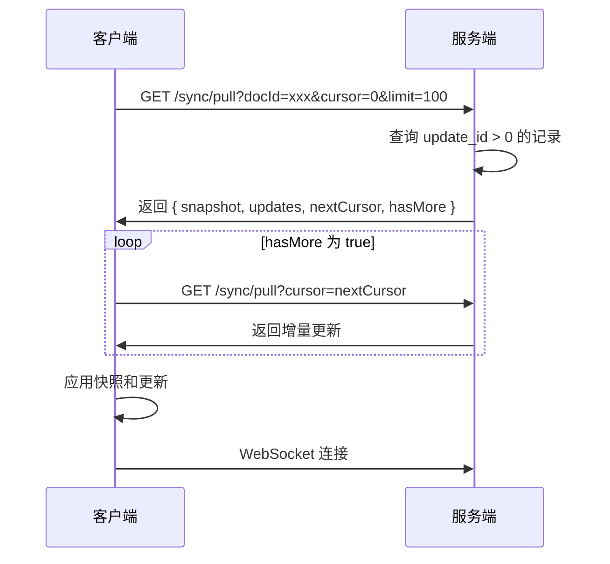
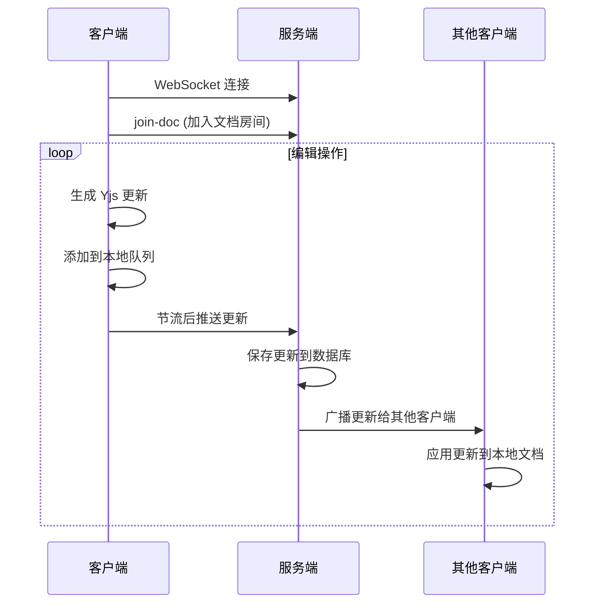
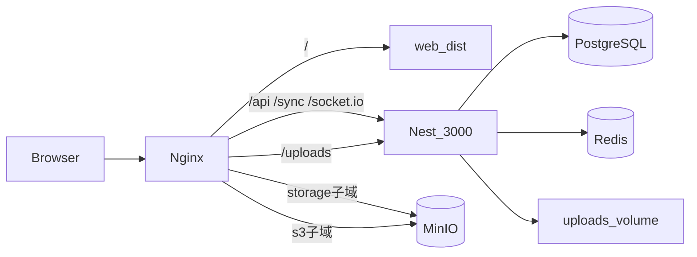

# SyncBox-AI 系统设计文档

## 目录

1. [架构概述](#1-架构概述)
2. [目录结构](#2-目录结构)
3. [依赖边界](#3-依赖边界)
4. [模块职责](#4-模块职责)
5. [同步引擎设计](#5-同步引擎设计)
6. [数据库与缓存设计](#6-数据库与缓存设计)
7. [构建与运行](#7-构建与运行)
8. [技术栈](#8-技术栈)

---

## 1. 架构概述

SyncBox-AI 采用 Monorepo 架构，基于 Yjs CRDT 实现实时同步，支持多端协作编辑和离线同步。

**核心特点：**
- **本地优先**：支持离线编辑，网络恢复后自动同步
- **实时协作**：WebSocket 实现毫秒级延迟的实时协同
- **跨平台**：支持 H5 Web、React Native 移动端
- **可扩展**：模块化设计支持水平扩展

---

## 2. 目录结构

```
SyncBox-AI/
├── apps/                          # 应用层
│   ├── web/                       # PC Web 应用（主桌面客户端）
│   ├── h5/                        # H5 移动 Web 应用
│   ├── mobile/                    # React Native 移动应用
│   ├── admin/                     # 管理后台
│   └── server/                   # 后端服务
├── packages/                      # 共享包层
│   ├── shared/                    # 共享工具和类型
│   ├── api/                       # API 接口定义和实现
│   ├── services/                  # 业务逻辑服务
│   ├── sync-engine/               # 同步引擎
│   ├── db-adapter/                # 数据库适配器
│   ├── adapters/                  # 平台适配器
│   ├── editor-core/               # 编辑器核心接口
│   ├── editor-web/                # Web 编辑器实现
│   ├── editor-mobile/             # 移动端编辑器实现
│   ├── platform/                  # 平台抽象层
│   ├── ui/                        # 共享 UI 组件
│   └── assets/                    # 共享静态资源
├── docs/                          # 文档（架构设计 / 部署迁移 / 问题解决 / 其他）
├── deploy/                        # 部署脚本与 Nginx
├── package.json                   # 根项目配置
├── pnpm-workspace.yaml            # pnpm 工作空间配置
├── turbo.json                     # Turbo 配置
└── tsconfig.json                  # 根 TypeScript 配置
```

---

## 3. 依赖边界

### 约束规则
| 层级 | 规则 |
|------|------|
| apps → packages | apps 只能依赖 packages，避免 app 之间相互引用 |
| shared | 不依赖任何 app，保持纯净的纯 TS 代码 |
| sync-engine | 仅依赖 shared，平台实现通过接口注入 |
| ui | 不依赖具体业务，只做基础组件 |

### 依赖关系图

```
┌─────────────────────────────────────────────────────────────┐
│                     应用层 (Apps)                          │
│  ┌──────────────┐  ┌──────────────┐  ┌──────────────┐  │
│  │     H5       │  │   Mobile     │  │    Admin     │  │
│  └──────┬───────┘  └──────┬───────┘  └──────┬───────┘  │
│         │                 │                 │              │
└─────────┼─────────────────┼─────────────────┼──────────────┘
          │                 │                 │
┌─────────┼─────────────────┼─────────────────┼──────────────┐
│         ▼                 ▼                 ▼              │
│  ┌──────────────┐  ┌──────────────┐  ┌──────────────┐  │
│  │ editor-web   │  │editor-mobile │  │     UI       │  │
│  │  (TipTap)    │  │  (TenTap)    │  │  Components  │  │
│  └──────┬───────┘  └──────┬───────┘  └──────┬───────┘  │
│         │                 │                 │              │
│         └─────────────────┼─────────────────┘              │
│                           ▼                               │
│                  ┌──────────────┐                        │
│                  │editor-core   │                        │
│                  │  (接口定义)   │                        │
│                  └──────┬───────┘                        │
└─────────────────────────┼───────────────────────────────────┘
                          │
                    ┌─────▼──────┐
                    │   shared   │
                    │ (工具/类型) │
                    └────────────┘
```

---

## 4. 模块职责

### 4.1 应用层 (apps/)

| 包名 | 职责 | 技术栈 | 端口 |
|------|------|--------|------|
| @inkweaver/web | PC Web 客户端（侧栏、回收站、完整个人中心） | React 19 + Vite + Dexie + Yjs | 3003 |
| @inkweaver/h5 | H5 移动 Web 客户端（轻量壳层） | React + Vite | 3001 |
| @inkweaver/mobile | React Native 移动应用 | React Native + Expo | - |
| @inkweaver/admin | 管理后台 | React + Vite | 3002 |
| @inkweaver/server | 后端 API 服务 | NestJS + TypeORM + PostgreSQL | 3000 |

**Web 与 H5**：二者技术栈相近，`apps/web` 为 PC 主客户端（Layout/回收站/多 Tab Profile）；`apps/h5` 面向移动浏览器。共享 `packages/editor-web`、`sync-engine`、`services`。根脚本：`pnpm dev:web`、`pnpm build:web`。

### 4.2 共享包层 (packages/)

| 包名 | 职责 | 特点 |
|------|------|------|
| @inkweaver/shared | 共享工具函数、类型定义、常量 | 平台无关，无外部依赖 |
| @inkweaver/api | API 接口的抽象定义和实现 | 封装 axios 请求 |
| @inkweaver/services | 业务逻辑服务 | 认证、文档服务 |
| @inkweaver/sync-engine | 同步引擎，处理本地和云端数据同步 | 平台无关的 CRDT 同步逻辑 |
| @inkweaver/db-adapter | 数据库适配器 | Web 使用 IndexedDB，Native 使用 SQLite |
| @inkweaver/adapters | 平台适配器 | 存储适配器等 |
| @inkweaver/editor-core | 编辑器核心接口和类型定义 | 平台无关 |
| @inkweaver/editor-web | Web 平台编辑器实现 | TipTap |
| @inkweaver/editor-mobile | 移动端编辑器实现 | TenTap + WebView |
| @inkweaver/platform | 平台抽象层 | 平台检测和适配 |
| @inkweaver/ui | 跨平台可复用的基础 UI 组件 | 与业务无关 |
| @inkweaver/assets | 共享静态资源 | 图片、字体、样式 |

---

## 5. 同步引擎设计

### 5.1 架构总览

```
┌─────────────────┐    WebSocket/HTTP    ┌─────────────────┐
│   H5 客户端      │ ←──────────────────→ │   Server 后端    │
│                 │                      │                 │
│ • syncService   │                      │ • sync.gateway  │
│ • WebSocket管理  │                      │ • sync.controller│
│ • 智能节流       │                      │ • snapshot.service│
└─────────────────┘                      └─────────────────┘
         │                                          │
         └───────────── sync-engine ───────────────┘
                            │
                    ┌─────────────────┐
                    │  核心同步引擎    │
                    │                 │
                    │ • CRDT冲突处理   │
                    │ • 批量推送重试   │
                    │ • 缓存管理      │
                    │ • 错误处理      │
                    └─────────────────┘
```

### 5.2 核心数据结构

**服务端数据库表：**

| 表名 | 字段 | 说明 |
|------|------|------|
| sync_updates | id (自增主键)、doc_id、update (二进制)、created_at | 存储所有 CRDT 更新 |
| doc_snapshots | doc_id、snapshot (二进制)、version、updated_at | 存储文档全量快照 |

**客户端本地存储：**

- **文档快照**：docId → 快照二进制、最后 update_id、最后访问时间
- **操作队列**：每条记录包含 id、docId、update 二进制、重试次数、创建时间
- **同步元数据**：最后成功拉取的游标 lastSyncCursor

### 5.3 同步流程

#### 首次加载流程



#### 实时同步流程



### 5.4 冲突处理

| 步骤 | 操作 |
|------|------|
| 1 | 客户端推送更新时携带 baseUpdateId |
| 2 | 服务端检查 baseUpdateId 是否等于最新 update_id |
| 3 | 相等：接受更新，存储并广播 |
| 4 | 不相等：HTTP `POST /api/sync/push` 与 WebSocket 均返回 **409**，body 含 `latestUpdateId`、`docId` |
| 5 | 客户端 `pull` 增量更新，合并到本地 Y.Doc |
| 6 | 使用新 `baseUpdateId` 重试 push（最多 1 次）；WS `conflict` 事件触发 `syncDocument` |

**推送节流**：编辑页 Yjs `update` 写入 pending 经 `createPushThrottle`（约 400ms）合并。

### 5.5 通知、邮件与分享 API（摘要）

| 端点 | 说明 |
|------|------|
| `GET /api/notifications` | 通知列表 + 未读数 |
| `PATCH /api/notifications/:id/read` | 单条已读 |
| `POST /api/notifications/read-all` | 全部已读 |
| `POST /api/auth/forgot-password` | SMTP 发送重置邮件（未配置 SMTP 返回 503） |
| `POST /api/auth/reset-password` | 邮件 token 重置密码 |
| `POST /api/documents/:id/share-link` | 生成公开分享 token（需 `isPublic`） |
| `GET /api/documents/shared/:token` | 匿名只读标题与 HTML 内容 |

### 5.6 异步邮件（BullMQ）

| 组件 | 路径 | 说明 |
|------|------|------|
| 入队 | `MailDispatchService` | HTTP 只 `queue.add`，不 `await` SMTP |
| Worker | `MailProcessor` | `@Processor('mail')`，渲染 Handlebars 后发送 |
| 模板 | `modules/mail/templates/*.hbs` | 如 `password-reset.hbs` |
| 依赖 | Redis | `BullModule.forRootAsync`；`/readyz` 检查 Redis |
| 本地开发 | `docker-compose.yml` | postgres + redis + mailhog（SMTP 1025） |

### 4.7 Yjs 内容投影（搜索 / 分享 / 列表）

编辑主路径为 Yjs CRDT（`yDoc.getText('content')` + `metadata.title`）。搜索、分享只读页、列表摘要读取 PostgreSQL `documents.title/content`，需双轨投影：

```
编辑 (TipTap) → Yjs local → sync push/WS
                              ↓
              DocumentProjectionService（服务端 debounce 1.5s）
                              ↓
              documents.title / documents.content
                              ↑
              DocumentEditPage debounce → updateDocument（客户端兜底）
```

| 组件 | 路径 |
|------|------|
| 服务端投影 | `apps/server/src/modules/sync/document-projection.service.ts` |
| 写回 PG | `documents.service.ts` → `projectSearchableContent` |
| 触发点 | `sync.controller` / `sync.gateway` push 成功后 `scheduleProjection` |
| 客户端兜底 | `apps/web/src/pages/DocumentEditPage.tsx` |

### 4.8 认证与会话

| 能力 | 实现 |
|------|------|
| HTTP 鉴权 | `AuthGuard` + JWT |
| Token 刷新 | `POST /api/auth/refresh`；`packages/api` 401 刷新队列 |
| 启动校验 | `AuthRoute` → `authService.ensureSession()` |
| WebSocket | `sync.gateway` 握手校验 JWT；`join-doc` / `update` 校验文档归属 |

JWT 配置统一：`apps/server/src/config/jwt.config.ts` → `getJwtModuleOptions()`。

### 4.9 生产部署拓扑

详见 [部署运维.md](../部署迁移/部署运维.md)。概要：Nginx 托管 Web dist；REST/WebSocket 反代 Nest；PostgreSQL + Redis + SMTP；可选 MinIO 子域。

### 4.10 单机生产拓扑（单域 + MinIO 子域）

适用于一台 ECS 跑全栈（见 `docker-compose.prod.yml`）：



| 入口 | 说明 |
|------|------|
| 主域 `@` / `www` | 静态 Web + 同源 API/WS |
| `storage.*` | MinIO Web 控制台 |
| `s3.*` | MinIO S3 API（Cyberduck/rclone） |
| 应用上传 | 宿主机 `/opt/inkweaver/uploads`，非 MinIO 桶 |

配置模板：`deploy/nginx/inkweaver.cn.conf`（将 `server_name` 改为你的域名）。

---

## 6. 数据库与缓存设计

### 6.1 多级缓存策略

```
应用层缓存 (Redis，后期可选) → User 表存储用量缓存 → 数据库连接池
异步任务队列 (Redis BullMQ，邮件等，当前必需)
```

**说明**：用户会话存 PostgreSQL `sessions` 表，非 Redis。

### 6.2 缓存失效策略

- **TTL**：设置合理的过期时间（生产环境 5 分钟，开发环境 1 分钟）
- **写时失效**：数据变更时立即失效相关缓存
- **读时刷新**：读取时检查数据是否过期

### 6.3 客户端缓存策略

| 类型 | 清理规则 |
|------|----------|
| 文档快照 | `packages/db-adapter` Web IndexedDB：`enforceSnapshotCachePolicy()` LRU 20 篇 / 总快照 ≤ 200MB |
| 内存 Y.Doc | `packages/sync-engine`：`MAX_CACHE_SIZE = 20` |
| 操作队列 | 同步成功后立即删除对应记录 |
| 长期离线 | 每个文档最多保留 5000 条记录或 50MB |

---

## 7. 构建与运行

### 7.1 根项目命令

```json
{
  "scripts": {
    "dev": "turbo run dev",
    "dev:server": "turbo run dev --filter=@inkweaver/server",
    "dev:h5": "turbo run dev --filter=@inkweaver/h5",
    "dev:mobile": "turbo run start --filter=@inkweaver/mobile",
    "build": "turbo run build",
    "build:packages": "turbo run build --filter=@inkweaver/*",
    "lint": "turbo run lint",
    "typecheck": "turbo run typecheck",
    "format": "prettier . --write"
  }
}
```

### 7.2 包构建配置

每个包使用 tsup 进行构建：

```json
{
  "scripts": {
    "build": "tsup --config tsup.config.ts",
    "dev": "tsup src/index.ts --format cjs,esm --dts --watch",
    "lint": "eslint .",
    "typecheck": "tsc -p tsconfig.json --noEmit"
  }
}
```

### 7.3 包导出配置

为支持多平台，每个包配置 exports 字段：

```json
{
  "main": "./dist/index.cjs",
  "types": "./dist/index.d.ts",
  "exports": {
    ".": {
      "types": "./dist/index.d.ts",
      "react-native": "./dist/index.cjs",
      "import": "./dist/index.mjs",
      "require": "./dist/index.cjs",
      "default": "./dist/index.cjs"
    }
  }
}
```

---

## 8. 技术栈

### 8.1 构建工具

| 工具 | 用途 |
|------|------|
| Turbo | Monorepo 构建系统 |
| pnpm | 包管理器 |
| tsup | TypeScript 包打包工具 |
| Vite | 前端构建工具 |

### 8.2 前端框架

| 框架 | 用途 |
|------|------|
| React 18 | UI 框架 |
| React Router | 路由管理 |
| React Native | 移动端框架 |
| Expo | React Native 开发工具链 |

### 8.3 后端

| 技术 | 用途 |
|------|------|
| NestJS | Node.js 框架 |
| TypeORM | ORM 框架 |
| PostgreSQL | 数据库 |

### 8.4 同步与编辑器

| 技术 | 用途 |
|------|------|
| Yjs | CRDT 同步引擎 |
| TipTap | Web 编辑器 |
| TenTap | 移动端编辑器 |

---

**文档版本**: 1.6  
**创建时间**: 2026-05-07  
**最后更新**: 2026-06-12